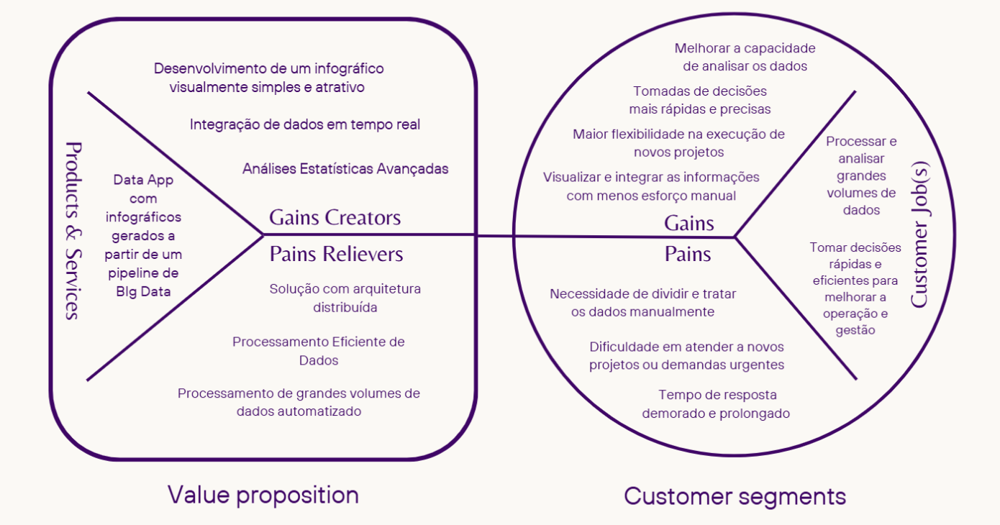

# Análise de Negócios

&emsp;&emsp; A análise de negócios é essencial para o sucesso do nosso projeto com a CPTM. Este documento tem como objetivo apresentar as necessidades e desafios enfrentados pela empresa, além de identificar oportunidades de melhoria nos processos de gerenciamento de ocorrências e falhas.
Com uma análise bem estruturada, buscamos transformar dados em insights práticos, ajudando a CPTM a otimizar suas operações e oferecer serviços de melhor qualidade aos usuários. Essa colaboração é fundamental para atingirmos nossos objetivos e garantir resultados eficazes e sustentáveis.

## 1. Canvas Proposta de Valor

&emsp;&emsp; O Value Proposition Canvas é uma ferramenta que auxilia empresas a entenderem melhor como seus produtos e serviços geram valor para os clientes. Ele é composto por dois principais componentes: o Segmento de Clientes (Customer Segments) e a Proposta de Valor (Value Proposition). O lado do Segmento de Clientes descreve as principais atividades e desafios dos clientes (Jobs, Gains, e Pains), enquanto o lado da Proposta de Valor aborda como os produtos e serviços da empresa podem atender a esses desafios, aliviar as dores e proporcionar ganhos aos clientes.

Imagem XX - Value Proposition Canvas

Fonte: Autoria própria.

1. **Segmento de Clientes (Customer Segments)**

Customer Jobs: Define as principais tarefas ou "jobs" que o cliente precisa executar. No contexto desta empresa, os clientes buscam:
- Processar e analisar grandes volumes de dados.
- Tomar decisões rápidas e eficientes para melhorar a operação e gestão.

Pains: Aponta os problemas enfrentados pelos clientes ao realizar suas tarefas, como:
- Necessidade de dividir e tratar dados manualmente.
- Dificuldade em atender a novos projetos ou demandas urgentes.
- Tempo de resposta demorado e prolongado.

Gains: Refere-se aos benefícios que os clientes esperam alcançar ao realizar suas tarefas, tais como:
- Melhorar a capacidade de analisar os dados.
- Tomar decisões mais rápidas e precisas.
- Maior flexibilidade na execução de novos projetos.
- Visualizar e integrar as informações com menos esforço manual.

2. **Proposta de Valor (Value Proposition)**

Products & Services: Apresenta os principais produtos e serviços oferecidos, como:
- Data App com infográficos gerados a partir de um pipeline de Big Data.

Pains Relievers: Lista as funcionalidades que ajudam a minimizar ou eliminar as dores dos clientes, incluindo:
- Solução com arquitetura distribuída.
- Processamento eficiente de dados.
- Processamento automatizado de grandes volumes de dados.

Gains Creators: Indica as características que ajudam a criar valor e trazer benefícios para o cliente, como:
- Desenvolvimento de um infográfico visualmente simples e atrativo.
- Integração de dados em tempo real.
- Análises estatísticas avançadas.

&emsp;&emsp; Este Value Proposition Canvas demonstra como buscamos entender as necessidades e desafios específicos da CPTM no tratamento de grandes volumes de dados e na tomada de decisões estratégicas. A proposta de valor foi desenhada para maximizar seus ganhos e mitigar os principais problemas encontrados, oferecendo uma solução robusta e eficiente que integra visualizações de dados, processamento em tempo real e uma arquitetura distribuída. Com essa abordagem, nós não só agregamos valor diretamente às operações dos clientes, como também contribui para a agilidade e precisão nas tomadas de decisão, fortalecendo sua posição no mercado como uma parceira tecnológica confiável.

## 2. Total Addressable Market, Service Addressable Market, e Service Obtainable Market

&emsp;&emsp; TAM, SAM e SOM são ferramentas essenciais para análise de mercado e planejamento estratégico. Segundo a Dima Services Agency (link), o TAM (Total Addressable Market) representa o mercado potencial total, o SAM (Serviceable Addressable Market) corresponde ao mercado alcançável e o SOM (Serviceable Obtainable Market) indica a parcela que pode ser efetivamente conquistada, considerando recursos e concorrência.

### Diferenças e Relações entre TAM, SAM e SOM

&emsp;&emsp; A diferença entre esses conceitos está na abrangência: o TAM reflete a oportunidade máxima de mercado, considerando todo o mercado potencial para um produto ou serviço, sem restrições. O SAM, por sua vez, ajusta esse valor ao mercado atingível pela empresa, levando em conta limitações práticas como localização geográfica, perfil do cliente e características do produto ou serviço. Já o SOM define a fatia realista que a empresa pode conquistar, com base em sua capacidade competitiva, recursos disponíveis e eficácia operacional. Essas métricas se complementam para orientar decisões estratégicas e metas operacionais.

### Análise de Mercado da CPTM

&emsp;&emsp; A Companhia Paulista de Trens Metropolitanos (CPTM) é fundamental no transporte público da Grande São Paulo, conectando milhões de passageiros diariamente. Esta análise de TAM, SAM e SOM considera informações públicas e dados levantados nos encontros presenciais com a equipe da CPTM.

### TAM (Mercado Total Endereçável):

&emsp;&emsp; O TAM inclui a população dos 18 municípios atendidos pela CPTM, totalizando 16.689.150 pessoas (IBGE). Considerando uma média de R$5,00 por bilhete para duas viagens diárias:

*TAM = 16.689.150 × R$5,00 × 2 = R$166.891.500,00 por dia.*

### SAM (Mercado Disponível e Endereçável):

&emsp;&emsp; Foi considerado que 54% dos lares no Sudeste possuem carro ou moto (IPEA), reduzindo o público-alvo em 46% da população total:

*SAM = 7.677.009 × R$5,00 × 2 = R$76.770.090,00 por dia.*

### SOM (Mercado Obtível):

&emsp;&emsp; A média diária de usuários da CPTM é de 3,2 milhões de passageiros (Resumo Financeiro CPTM):

*SOM = 3.200.000 × R$5,00 × 2 = R$32.000.000,00 por dia.*

 

&emsp;&emsp; Compreender o TAM, SAM e SOM permite que a CPTM alinhe expectativas e planeje de forma realista seu crescimento e operação. O TAM destaca a oportunidade máxima, enquanto o SAM e o SOM refletem cenários práticos e alcançáveis. Essa análise orienta a tomada de decisão, ajudando a empresa a definir metas claras e explorar iniciativas, como o Bilhete Único e programas sociais.

## 3. Matriz de Risco

&emsp;&emsp; A matriz de risco é uma ferramenta importante para identificar e avaliar os riscos que podem impactar um projeto. Ela nos ajuda a visualizar a probabilidade de um evento ocorrer e o impacto que ele pode ter, facilitando a priorização das ações a serem tomadas. 

&emsp;&emsp; Utilizando essa matriz, conseguimos mapear os riscos de forma que a equipe tome decisões planeadas sobre como mitigá-los, o que é fundamental para garantir que o projeto siga com o mínimo de empecilhos. 

Imagem XX - Matriz de Risco

Fonte: Autoria própria.

*Plano de Ação para os Riscos:*
*Falta de Familiaridade com AWS*  
**Prevenção:** Realizar treinamentos internos e autoestudo sobre AWS na primeira sprint, focando nas principais ferramentas utilizadas no projeto. 
**Reação:** Consultar especialistas externos ou a própria AWS em caso de dificuldades específicas, focando resolver em até 48 horas.  
**Responsável:** Daniel Mendez. 
**Impacto Quantitativo:** 5/5.

*Atraso do Fornecimento de Informações*  
**Prevenção:** Estabelecer um cronograma de entregas claro com os stakeholders quinzenalmente e revisar o fluxo de comunicação para garantir o cumprimento de prazos estabelecidos no backlog.  
**Reação:** Notificar imediatamente os envolvidos e ajustar o cronograma de atividades para compensar os atrasos.  
**Responsável:** Enzo.  
**Impacto Quantitativo:** 4/5.

*Problemas na Formatação e Envio dos Dados*  
**Prevenção:** Definir padrões de formatação e validar os dados antes do envio para evitar inconsistências.  
**Reação:** Realizar uma verificação manual e, se necessário, corrigir ou reenviar os dados no formato correto.  
**Responsável:** Luiza.  
**Impacto Quantitativo:** 4/5.

*Dificuldades na Interpretação dos Dados*  
**Prevenção:** Participar de workshops e treinamentos focados na análise de dados para aprimorar as habilidades da equipe.  
**Reação:** Buscar auxílio de mentores ou especialistas em análise de dados para resolver dúvidas específicas.  
**Responsável:** Thiago.  
**Impacto Quantitativo:** 3/5.

*Atraso na Entrega de Resultados*  
**Prevenção:** Implementar um sistema de acompanhamento de progresso semanal e um plano de contingência para eventuais atrasos.  
**Reação:** Priorizar as atividades mais críticas para reduzir o impacto do atraso nos resultados finais.  
**Responsável:** Samuel.  
**Impacto Quantitativo:** 5/5.

*Baixa Capacidade para Exploração de Dados*  
**Prevenção:** Otimizar o ambiente de análise com ferramentas adicionais, como bibliotecas de dados e recursos computacionais.  
**Reação:** Redirecionar o trabalho para dados mais críticos, visando aumentar a eficiência com os recursos disponíveis em até 72 horas.  
**Responsável:** Thiago.  
**Impacto Quantitativo:** 3/5.

*Falta de Colaboração da CPTM*  
**Prevenção:** Manter uma comunicação constante com a CPTM através do orientador e realizar reuniões quinzenais, alinhando expectativas e prazos desde o início.  
**Reação:** Solicitar uma reunião com os responsáveis da CPTM para reavaliar as responsabilidades e fortalecer a cooperação.  
**Responsável:** Daniel Zular.  
**Impacto Quantitativo:** 4/5.

*Falhas no Serviço de AWS*  
**Prevenção:** Implementar redundância em serviços críticos e monitoramento constante do ambiente AWS.  
**Reação:** Ativar os serviços de backup e reconfigurar o ambiente em uma região alternativa, se necessário.  
**Responsável:** Daniel Mendez.  
**Impacto Quantitativo:** 5/5.

*Via Não Funcionar*  
**Prevenção:** Testar a viabilidade de comunicação entre as vias com antecedência e identificar rotas alternativas.  
**Reação:** Utilizar outros canais ou tecnologias para garantir o fluxo de dados e minimizar a interrupção.  
**Responsável:** Enzo.  
**Impacto Quantitativo:** 4/5.

*Baixa Colaboração com Stakeholders*  
**Prevenção:** Realizar reuniões periódicas com os stakeholders para garantir alinhamento e engajamento constante.  
**Reação:** Designar um responsável de comunicação para restabelecer o contato e entender as expectativas dos stakeholders.  
**Responsável:** Luiza.  
**Impacto Quantitativo:** 3/5.

# 4. Plano de Comunicação

&emsp;&emsp; O plano de comunicação é um componente essencial para o sucesso da implementação do Data App na CPTM. Ele visa garantir que todos os stakeholders estejam informados de maneira eficaz ao longo do processo, utilizando canais adequados e uma abordagem clara e eficiente. Este plano define os responsáveis e os métodos de comunicação a serem utilizados, incluindo reuniões, e-mails e plataformas online, com uma frequência ajustada conforme a necessidade do grupo. A execução desse plano não só facilita a fluidez da comunicação, como também ajuda a monitorar o progresso e ajustar estratégias conforme necessário, assegurando o alcance e cumprimento do plano de trabalho. 

## Objetivo

&emsp;&emsp; Estabelecer e consolidar a comunicação com todos os stakeholders envolvidos no projeto, garantindo alinhamento, colaboração e execução dentro do padrão estabelecido para o módulo. O plano abrange a troca de informações essenciais, como progresso do projeto, dúvidas, requisição de documentos e validação de entregas. 
 

## Identificação dos Stakeholders

&emsp;&emsp; Uma etapa essencial para qualquer projeto é o mapeamento de seus stakeholders. Eles são pessoas, grupos ou organizações que têm interesse ou estão envolvidos em um projeto, podendo ser impactados pelas decisões, resultados ou execução do projeto (Brandão, 2024). 

Os stakeholders podem ser classificados em dois tipos:  
- **Internos**: Membros da equipe, gerentes, diretores.  
- **Externos**: Clientes, fornecedores, parceiros, governos, comunidades.  

Considerando a definição apresentada, os stakeholders do projeto e seus tipos são:  
- **Gerente de Projeto**: José Romualdo - Interno  
- **Líder Técnico**: Afonso Brandão - Interno  
- **Usuários Finais**: CPTM (analistas, gestores, etc.) - Externo  
- **Equipe de Desenvolvimento**: Daniel Mendez, Daniel Zular, Enzo Boccia, Luiza Santana, Samuel Nascimento, Thiago Goulart - Interno  
- **Owner (Cliente Principal)**: Sara - Externo  

### Stakeholders Identificados

| **Stakeholder**         | **Tipo**   | **Interesse**                               | **Expectativa**                                          | **Impacto**                                                           | **Influência** (1-5) |
|--------------------------|------------|---------------------------------------------|----------------------------------------------------------|------------------------------------------------------------------------|-----------------------|
| Gerente do Projeto       | Interno    | Coordenação geral e acompanhamento do progresso | Atualizações regulares e entregas pontuais               | Pode influenciar nas decisões e agir sobre pedidos do Owner            | 5                     |
| Líder Técnico            | Interno    | Supervisão técnica e orientação             | Suporte ao projeto                                        | Influencia decisões técnicas e desenvolvimento da equipe               | 4                     |
| Equipe de Desenvolvimento| Interno    | Criação do DataApp                          | Direcionamento claro, execução eficaz e colaboração       | Desenvolve e toma decisões relacionadas ao escopo do projeto           | 3                     |
| Owner (Cliente Principal)| Externo    | Relatórios claros para tomada de decisão    | Entregáveis alinhados às necessidades da CPTM            | Solicita funcionalidades e ajustes, podendo influenciar fortemente      | 5                     |
| Usuários Finais          | Externo    | Acesso a dados e relatórios                 | Interface intuitiva, dados atualizados e confiáveis      | Usam a solução final diariamente                                      | 2                     |

## Justificativa para a Classificação de Influência dos Stakeholders

&emsp;&emsp;A influência dos stakeholders no desenvolvimento do projeto foi classificada de 1 a 5, com o objetivo de medir o poder de cada parte interessada em afetar as decisões e o andamento do trabalho. A nota 1 é atribuída a stakeholders com baixa influência, cuja capacidade de impactar as escolhas estratégicas ou operacionais do projeto é quase inexistente. Esses stakeholders têm uma participação mínima nas decisões do projeto e não alteram muito seu desenvolvimento. A nota 2 foi dada àqueles com influência limitada, cujas opiniões são ouvidas, mas não têm poder suficiente para alterar decisões importantes. Sua participação tende a ser mais consultiva, sem provocar mudanças significativas no andamento do projeto. A nota 3 foi atribuída aos stakeholders com influência moderada, cuja opinião é considerada nas decisões, mas não têm poder suficiente para definir o curso das ações de forma abrangente. Sua influência é relevante em áreas específicas, mas sem impactar diretamente o desenvolvimento geral do projeto. A nota 4 foi dada aos stakeholders com influência considerável, cujas decisões ou sugestões têm peso significativo nas direções do projeto. Esses stakeholders podem influenciar mudanças importantes no escopo, nas prioridades ou nas abordagens adotadas, sendo fundamentais em decisões críticas que impactam o andamento do projeto. Por fim, a nota 5 foi atribuída aos stakeholders com alta influência, cujas ações e decisões têm um efeito significativo no desenvolvimento do projeto. Sua capacidade de influenciar as escolhas estratégicas e operacionais é essencial para garantir que o projeto seja executado com sucesso, moldando decisões e ajustes ao longo de todo o processo. 

## Mensagens-Chave

- **Progresso do Projeto**: Atualizações sobre etapas concluídas, próximos passos e desafios enfrentados.  
- **Dúvidas e Sugestões**: Comunicação aberta para resolver questionamentos e discutir melhorias.  
- **Requisição de Documentos**: Solicitação de informações e materiais relevantes para o desenvolvimento.  
- **Validação do Progresso**: Feedback regular sobre os resultados entregues e próximos passos.  

## Canais de Comunicação

| **Canal**                     | **Público-Alvo**         | **Objetivo**                                   | **Frequência** |
|-------------------------------|--------------------------|-----------------------------------------------|----------------|
| Reuniões Presenciais (Reviews)| Todos os stakeholders   | Alinhar progresso e validar entregas          | Quinzenal      |
| Reuniões Diárias (Daily/Dev)  | Equipe de Desenvolvimento | Sincronizar tarefas, atualizar desenvolvimento e resolver bloqueios | Diária         |
| Slack                         | Devs, Líder Técnico e Gerente | Comunicação rápida e discussões técnicas      | Contínuo       |
| E-mail/Slack                  | Owner, Gerente e Líder Técnico | Troca de informações e documentos             | Contínuo       |

## Plano de Implementação

&emsp;&emsp; O plano de comunicação já está implementado e tem sido a base do funcionamento do projeto desde seu início. O procedimento padrão envolve: 

1. **Planejar a Comunicação**: Identificar o público-alvo, definir mensagens-chave e objetivos específicos.  
2. **Utilizar os Canais**: Estabelecer os canais apropriados para cada tipo de interação.  
3. **Definir Cronograma de Comunicação**: Especificar prazos e frequência de contatos.  
4. **Monitorar a Execução**: Verificar impacto e alcance das ações realizadas.  

## Medidas de Sucesso

| **Indicador**              | **Meta**                             |
|----------------------------|---------------------------------------|
| Participação em Reviews    | ≥ 80% de presença dos stakeholders   |
| Engajamento no Slack       | Resposta a mensagens dentro de 4h    |
| Entrega Validada           | ≥ 90% de aceitação nos Reviews       |
| Resolução de Dúvidas       | ≥ 80% de resolução no prazo acordado |
| Satisfação dos Stakeholders| ≥ 80% de satisfação nas interações e métodos de comunicação |
| Clareza na Comunicação     | ≥ 75% de troca direta e clara, sem redundâncias |

## Feedback e Ajustes

- **Efetividade da Comunicação**: Avaliar regularmente se as mensagens estão sendo compreendidas e atingindo os objetivos.  
- **Coleta de Feedback**: Realizar sessões formais (durante Reviews) e informais (via Slack) para ouvir as partes interessadas.  
- **Análise de Impacto**: Revisar o impacto e efetividade das ações comunicativas no desempenho do projeto e ajustá-las quando necessário.  

&emsp;&emsp; A implementação bem-sucedida do plano de comunicação depende de um monitoramento contínuo e ajustes constantes, com o objetivo de verificar a efetividade das mensagens, coletar feedback e analisar o impacto das ações tomadas. Este processo garante que as informações circulem de maneira fluida, promovendo um senso de colaboração entre a equipe de desenvolvimento, os gestores e os usuários finais. 

## 5 Análise Financeira

### 5.1 Introdução

&emsp;&emsp; A análise financeira é essencial para avaliar a viabilidade de projetos e sua adequação aos objetivos organizacionais. Permite a identificação de custos, projeções e benefícios esperados, sendo uma ferramenta estratégica para a tomada de decisão (DAMODARAN, 2012). Este documento analisa os custos do projeto de Big Data para a CPTM, com foco no investimento inicial (12 meses) e na manutenção durante um período de 12 meses após a entrega realizada pelo grupo Xpress-Inteli, totalizando 24 meses ao todos. É importante destacar que o projeto desenvolvido pelo grupo Xpress-Inteli trata-se de um MVP (Minimum Viable Product) e uma POC (Proof of Concept), cujo objetivo foi demonstrar que a solução de Big Data, construída a partir das exigências fornecidas pelo parceiro, é funcional e viável.

&emsp;&emsp;O custo do MVP foi zero, uma vez que a iniciativa foi conduzida como parte do esforço acadêmico do grupo. Com isso, a equipe interna da CPTM terá a base necessária para desenvolver sua própria solução in-house, utilizando os aprendizados e os resultados obtidos na POC para criar uma plataforma personalizada e adaptada às suas demandas operacionais, portanto, esse documento é uma projeção de custos.

### 5.2 Implementação (12 meses)

&emsp;&emsp;Para a implementação inicial do projeto de Big Data da CPTM, estima-se um período de 12 meses. Esse prazo é fundamentado na complexidade do desenvolvimento de soluções tecnológicas robustas, que envolvem múltiplas etapas, como a configuração da infraestrutura de armazenamento e processamento de dados, a integração de sistemas existentes, o desenvolvimento de interfaces e dashboards personalizados, além da fase de testes e ajustes.

&emsp;&emsp;Estudos de casos semelhantes em grandes organizações indicam que projetos de Big Data exigem um tempo médio entre 9 e 18 meses para implementação completa, dependendo do escopo e do nível de maturidade tecnológica da empresa. Considerando que o projeto se baseará em uma POC validada, o período de 12 meses é viável e suficiente para que a equipe da CPTM desenvolva uma solução interna in-house, garantindo sua adequação às necessidades operacionais específicas e alinhamento com as melhores práticas de mercado.

&emsp;&emsp;Durante esse período, será possível capacitar a equipe interna, realizar as adaptações necessárias e assegurar que a solução esteja plenamente funcional antes da implantação final.

&emsp;&emsp;O período estabelecido é apenas uma média, já que, variáveis como capital disponível, equipe qualificada e o escopo criado podem variar a partir das futuras demandas e exigências que a CPTM poderá estabelecer. Isso impacta diretamente no tempo do projeto, podendo ser construído em um maior ou menor tempo.

#### 5.2.1 Arquitetura

&emsp;&emsp; A arquitetura completa utilizada no projeto elaborado pela Xpress pode ser observada no UML (Unified Modeling Language) elaborado pela equipe. Para a análise financeira, serão levadas em consideração apenas as ferramentas que teriam custos iniciais/poderiam gerar custos a CPTM que são: 

- Amazon Simple Storage Service (S3): Armazenamento escalável e seguro, ideal para grandes volumes de dados.
Amazon EC2 (Elastic Compute Cloud): Capacidade computacional escalável para executar aplicações de alta performance.

*Custo Mensal da Arquitetura:* 
---

- Amazon EC2: U$D 141,47 (R$ 848,82 com câmbio de R$ 6/USD).
- As demais ferramentas terão custo a partir de um momento que o volume de dados utilizado pela CPTM seja muito alto. Portanto, não vamos considerar nenhum outro valor para as demais ferramentas AWS. 
- Vale ressaltar que os valores foram retirados da Calculadora de Preços da AWS na qual consta que apenas o Amazon EC2 gerou custo.

Tabela de Custos - Arquitetura Implementação

| Ferramenta    | Custo Mensal (R$) | Custo 12 Meses (R$) |
|---------------|-------------------|---------------------|
| Amazon EC2    | 848,82           | 10.185,84          |

#### 5.2.2 Equipe

*Diferença entre Júnior, Pleno e Sênior* 
---

&emsp;&emsp;Os níveis Júnior, Pleno e Sênior representam diferentes estágios de maturidade e experiência profissional dentro de uma carreira. Conforme descrito no artigo da Catho, essas classificações indicam o grau de autonomia, responsabilidade e domínio técnico esperado de um profissional.

- Júnior: Este é o nível inicial, indicado para profissionais com pouca ou nenhuma experiência na área. O colaborador júnior requer supervisão constante e orientação em suas tarefas. Normalmente, um profissional permanece nesse nível por um período de 2 a 3 anos, tempo necessário para adquirir conhecimentos básicos e entender os processos da empresa.
- Pleno: O profissional pleno já possui uma experiência intermediária, com domínio maior das atividades de sua área. Ele é capaz de trabalhar com menor supervisão e assumir projetos de complexidade moderada. A transição para o nível pleno costuma ocorrer após cerca de 4 a 6 anos de experiência no mercado.
- Sênior: No nível sênior, o profissional já é altamente experiente, com amplo domínio técnico e capacidade de liderar equipes e projetos complexos. Ele também é responsável por orientar colaboradores mais novos. Para atingir esse nível, é comum que o profissional acumule pelo menos 8 a 10 anos de experiência.

&emsp;&emsp;Esses níveis não apenas orientam a carreira, mas também ajudam as empresas a estruturarem seus quadros de profissionais e distribuírem responsabilidades de forma eficiente.

*Diferença entre Salário e Remuneração* 
---

&emsp;&emsp;O salário e a remuneração, embora frequentemente utilizados como sinônimos, possuem conceitos distintos. De acordo com o artigo da Pontotel, o salário refere-se à quantia fixa estabelecida em contrato que o empregado recebe em troca de seu trabalho. Esse valor é definido de forma mensal, por hora ou por tarefa, e geralmente não inclui benefícios ou adicionais.

&emsp;&emsp;Por outro lado, a remuneração é o total de ganhos do colaborador, englobando o salário base e outros elementos como benefícios (vale-transporte, vale-refeição, entre outros), bonificações, comissões, adicional de insalubridade ou periculosidade, horas extras e outros valores pagos pela empresa. A remuneração, portanto, é um conceito mais amplo que o salário.

&emsp;&emsp;Para esta análise financeira, considerou-se o salário, utilizando como referência a média salarial do estado de São Paulo no ano de 2024, conforme dados fornecidos pela empresa Glassdoor (links em referências), para cada cargo necessário tanto para a implementação inicial do projeto quanto para sua manutenção.

&emsp;&emsp;Além disso, para determinar o custo real da contratação CLT para a CPTM, foi utilizada a Calculadora de Contratação Empregado CLT da empresa Ozai. Essa ferramenta foi fundamental para incluir encargos como INSS, FGTS, 13º salário e férias proporcionais no cálculo total, garantindo maior precisão na estimativa dos custos associados ao projeto.

*Profissionais Envolvidos e suas Funções para a Implementação Inicial*

&emsp;&emsp;Os profissionais envolvidos e suas funções são:

- Engenheiro de Dados Sênior: Responsável por projetar, construir e manter a arquitetura de dados necessária para o projeto. Trabalha na modelagem de dados e na otimização de processos para garantir alta performance e escalabilidade. Salário estimado: R$ 14.083/mês.
- Engenheiro de Dados Júnior: Apoia a equipe no desenvolvimento e manutenção de pipelines de dados, realizando tarefas técnicas sob supervisão. Trabalha na limpeza, transformação e integração de dados. Salário estimado: R$ 5.508/mês.

Analista de Dados Pleno: Realiza análises avançadas nos dados, utilizando técnicas estatísticas e ferramentas de BI para identificar padrões e insights úteis. Salário estimado: R$ 6.883/mês.
---

- Analista de Dados Júnior: Suporte à análise de dados, responsável pela coleta, organização e geração de relatórios básicos. Salário estimado: R$ 3.970/mês.
- Desenvolvedor Back-End Pleno: Desenvolve APIs e sistemas no lado do servidor para processar e armazenar os dados do projeto, garantindo a segurança e a integridade do sistema. Salário estimado: R$ 7.000/mês.
- Desenvolvedor Back-End Júnior: Auxilia no desenvolvimento de sistemas de back-end, garantindo a funcionalidade básica e dando suporte à equipe plena. Salário estimado: R$ 4.321/mês.
- Desenvolvedor Front-End Pleno: Cria interfaces visuais e dashboards para que os dados sejam apresentados de forma clara e acessível aos usuários finais. Salário estimado: R$ 7.500/mês.

Tabela de Custos - Equipe de Implantação do Projeto

| Cargo                | Média Salarial (R$/mês) | Média Salarial (R$/12 meses) | Custo Contratação (R$/mês) | Custo Contratação (R$/12 meses) |
|----------------------|-------------------------|------------------------------|----------------------------|----------------------------------|
| Eng. Dados Sênior    | 14.083                 | 168.996                      | 22.675,19                 | 272.102,28                      |
| Eng. Dados Júnior    | 5.508                  | 66.096                       | 8.868,49                  | 106.421,88                      |
| Analista Dados Pleno | 6.883                  | 82.596                       | 11.082,39                 | 132.988,68                      |
| Analista Dados Júnior| 3.970                  | 47.640                       | 6.392,14                  | 76.705,68                       |
| Dev Back-End Pleno   | 7.000                  | 84.000                       | 11.270,78                 | 135.249,36                      |
| Dev Back-End Júnior  | 4.321                  | 51.852                       | 6.957,29                  | 83.487,48                       |
| Dev Front-End Pleno  | 7.500                  | 90.000                       | 12.075,83                 | 144.909,96                      |

Tabela de Custos - Equipe de Implantação do Projeto Total

| Tipo de Custo        | Valor Mensal Total (R$) | Valor Anual Total (R$) |
|----------------------|-------------------------|-------------------------|
| Média Salarial       | 49.265                 | 591.180                 |
| Custo Contratação    | 79.321,11              | 951.865,32              |

Tabela de Custos - Investimento Total Implementação

|                    | Equipe (R$) | Arquitetura (R$) | Total (R$)    |
|--------------------|-------------|------------------|---------------|
| Valor (R$)        | 951.865,32  | 10.185,84        | 962.051,16    |

### 5.3 Planejamento de Custo de Manutenção (12 meses)

&emsp;&emsp;Para a elaboração do Planejamento de Custo de Manutenção na análise financeira, foi considerado um período de 12 meses. Esse prazo é justificado pela necessidade de garantir a continuidade das operações do projeto de Big Data ao longo de um ciclo anual completo, permitindo a identificação e o atendimento de demandas sazonais, além de assegurar a estabilidade e o suporte técnico para o sistema implementado.

&emsp;&emsp;O período de 12 meses também proporciona uma visão financeira abrangente, considerando custos recorrentes e potenciais ajustes ou otimizações necessários no sistema. Dessa forma, o planejamento contempla tanto os custos fixos relacionados à equipe reduzida para manutenção quanto os custos de infraestrutura tecnológica, garantindo uma estimativa sólida e realista para a sustentabilidade do projeto.

#### 5.3.1 Arquitetura

&emsp;&emsp;Foi considerada a mesma da implementação inicial, pois é a única que está estipulada dentro do escopo. Claro, a CPTM pode acoplar novas ferramentas ao projeto após a sua implementação tornando a arquitetura mais robusta, personalizada e consequentemente mais custosa.

- Amazon EC2: Capacidade computacional escalável para executar aplicações de alta performance. R$ 848,82/mês. Para 12 meses: R$10.185,84.

Tabela de Custos - Arquitetura Manutenção

| Ferramenta    | Custo Mensal (R$) | Custo 12 Meses (R$) |
|---------------|-------------------|---------------------|
| Amazon EC2    | 848,82           | 10.185,84          |

#### 5.3.2 Equipe de Manutenção

*Justificativa da Redução da Equipe na Manutenção do Projeto*
---

&emsp;&emsp;Para a implementação inicial do projeto de Big Data, foi necessária uma equipe completa composta por 1 Engenheiro de Dados Sênior, 1 Engenheiro de Dados Júnior, 1 Analista de Dados Pleno, 1 Analista de Dados Júnior, 1 Desenvolvedor Back-End Pleno, 1 Desenvolvedor Back-End Júnior e 1 Desenvolvedor Front-End Pleno. Essa composição visou atender a todas as etapas do desenvolvimento, desde o planejamento e construção da arquitetura de dados até a criação de pipelines, análises avançadas e interfaces de apresentação.

&emsp;&emsp;No entanto, após a conclusão da implementação, o projeto entra em uma fase de manutenção, onde a demanda por trabalho diminui significativamente. Essa redução se dá por três principais motivos:

- Consolidação da Arquitetura: Durante a implementação, a arquitetura de dados, pipelines e integrações são projetados e otimizados. Na fase de manutenção, essas estruturas já estão estabilizadas, reduzindo a necessidade de múltiplos engenheiros de dados.
- Automatização e Operacionalização: Grande parte dos processos, como a extração, transformação e carga de dados (ETL), bem como as análises básicas, são automatizados no sistema. Isso elimina a necessidade de analistas adicionais para tarefas operacionais, sendo necessário apenas um Analista de Dados Pleno para monitorar e ajustar as análises avançadas.
- Simplificação do Desenvolvimento Contínuo: Após o lançamento inicial, as mudanças no sistema se tornam incrementais, exigindo menos esforço de desenvolvimento. Um Desenvolvedor Back-End Pleno e um Desenvolvedor Front-End Pleno são suficientes para atender às demandas de ajustes e pequenas melhorias.

&emsp;&emsp;Com essa redução, a equipe de manutenção se torna mais enxuta, composta por 1 Engenheiro de Dados Sênior, 1 Analista de Dados Pleno, 1 Desenvolvedor Back-End Pleno e 1 Desenvolvedor Front-End Pleno. Essa formação garante eficiência e sustentabilidade financeira para a operação do projeto sem comprometer a qualidade e a funcionalidade do sistema.

Tabela de Custos - Equipe de Manutenção do Projeto

| Cargo                | Média Salarial (R$/mês) | Média Salarial (R$/12 meses) | Custo Contratação (R$/mês) | Custo Contratação (R$/12 meses) |
|----------------------|-------------------------|------------------------------|----------------------------|----------------------------------|
| Eng. Dados Sênior    | 14.083                 | 168.996                      | 22.675,19                 | 272.102,28                      |
| Analista Dados Pleno | 6.883                  | 82.596                       | 11.082,39                 | 132.988,68                      |
| Dev Back-End Pleno   | 7.000                  | 84.000                       | 11.270,78                 | 135.249,36                      |
| Dev Front-End Pleno  | 7.500                  | 90.000                       | 12.075,83                 | 144.909,96                      |

Tabela de Custos Totais - Equipe de Manutenção do Projeto

| Tipo de Custo        | Valor Mensal Total (R$) | Valor Anual Total (R$) |
|----------------------|-------------------------|-------------------------|
| Média Salarial       | 35.466                 | 425.592                 |
| Custo Contratação    | 57.104,19              | 685.250,28              |

Tabela de Custos - Investimento Total Manutenção

|                | Equipe (R$) | Arquitetura (R$) | Total (R$)    |
|----------------|-------------|------------------|---------------|
| Valor (R$)     | 685.250,28  | 10.185,84        | 695.436,12    |

#### 5.4 Impactos Intangíveis para a CPTM

&emsp;&emsp;Como a CPTM é uma empresa pública, os impactos intangíveis de uma solução baseada em Big Data devem ser analisados considerando os benefícios para a população paulistana que utiliza seus serviços. A seguir, estão listados os principais impactos intangíveis:

&emsp;&emsp;4.1 Melhoria na Qualidade do Serviço

- Redução de atrasos: A análise em tempo real de dados operacionais permite prever falhas e otimizar a circulação dos trens, reduzindo atrasos e tornando o serviço mais confiável.
- Pontualidade: Trens mais pontuais aumentam a previsibilidade, permitindo que os passageiros planejem melhor suas rotinas diárias.

&emsp;&emsp;4.2 Aumento da Satisfação dos Usuários

- Experiência do Passageiro: Melhorias na pontualidade e confiabilidade do serviço geram uma experiência mais satisfatória para o usuário.
- Percepção de Modernidade: A adoção de tecnologias avançadas, como Big Data, melhora a percepção da CPTM como uma empresa moderna e eficiente.

&emsp;&emsp;4.3 Maior Inclusão Social

- Acesso mais Confiável: Usuários em regiões periféricas têm acesso a serviços mais confiáveis, reduzindo as desigualdades de transporte.
- Acessibilidade: Dados sobre padrões de uso podem ser usados para otimizar serviços em horários e regiões específicas, ampliando a inclusão.

&emsp;&emsp;4.4 Contribuição para a Mobilidade Urbana

- Integração com Outros Modais: Big Data pode ajudar a integrar a CPTM com outros modais de transporte público, como ônibus e metrô, promovendo uma mobilidade mais eficiente.
- Redução do Uso de Veículos Privados: A melhoria no serviço ferroviário pode incentivar mais pessoas a optarem pelo transporte público, contribuindo para a diminuição do trânsito e da poluição.

&emsp;&emsp;4.5 Segurança Pública

- Monitoramento em Tempo Real: Big Data pode ser usado para monitorar estações e trens em tempo real, melhorando a segurança para os passageiros.
- Prevenção de Riscos: Identificação de padrões que possam indicar áreas ou horários de maior risco, permitindo intervenções mais rápidas.

&emsp;&emsp;4.6 Redução do Estresse da População

- Menor Impacto Psicológico: Com trens mais confiáveis e previsíveis, os passageiros enfrentam menos estresse relacionado a atrasos e lotação.
- Mais Tempo para os Usuários: Com deslocamentos mais rápidos e pontuais, as pessoas têm mais tempo para atividades pessoais e profissionais.

&emsp;&emsp;4.7 Reforço da Imagem da CPTM

- Credibilidade: A adoção de tecnologias avançadas demonstra compromisso da empresa com a modernização e a qualidade do serviço.
- Prestígio: A CPTM pode ser vista como uma referência nacional em inovação no transporte público.

### 5.5 Conclusão

Tabela de Custos - Valor Total Implementação e Manutenção

|                | Implementação (R$) | Manutenção (R$) | Total (R$)      |
|----------------|---------------------|-----------------|-----------------|
| Valor (R$)     | 962.051,16          | 695.436,12      | 1.657.487,28    |

&emsp;&emsp;Com base na análise financeira realizada, o custo total estimado para a implementação e manutenção do projeto de Big Data da CPTM é de R$ 1.657.487,28, sendo R$ 962.051,16 destinados à implementação inicial e R$ 695.436,12 para a manutenção durante os primeiros 12 meses. Esses valores são uma referência inicial e podem variar em função de ajustes no escopo do projeto, negociações com fornecedores e possíveis alterações nas políticas de contratação. Ainda assim, a estimativa fornece uma base sólida para o planejamento financeiro e estratégico da empresa, permitindo que a CPTM esteja preparada para o desembolso necessário.

&emsp;&emsp;Além dos benefícios financeiros diretos, o projeto traz impactos intangíveis significativos que não podem ser ignorados. A redução de atrasos e a melhoria da pontualidade resultam em maior satisfação dos usuários e reforçam a percepção da CPTM como uma empresa moderna e comprometida com a qualidade dos serviços prestados. Adicionalmente, o projeto contribui para a mobilidade urbana de São Paulo ao incentivar o uso do transporte público, reduzir o trânsito e promover a inclusão social. A maior confiabilidade do serviço também ajuda a diminuir o estresse da população usuária e amplia a segurança nos deslocamentos.

&emsp;&emsp;Portanto, além de oferecer uma estimativa financeira clara, este estudo destaca os ganhos sociais e estratégicos que a implementação de um projeto de Big Data pode proporcionar, posicionando a CPTM como referência em inovação no transporte público e fortalecendo sua relevância para a população paulistana.

### 6. ROI

&emsp;&emsp;O ROI (Retorno sobre Investimento) é uma métrica essencial para análises financeiras, pois mede a eficiência de um investimento. Ele pode ser aplicado em diferentes contextos, como projetos, contratação de pessoal, aquisições, entre outros. Abaixo explico como incluir o ROI em uma análise financeira:

### Fórmula do ROI:

&emsp;&emsp;O ROI é mais útil em:

- Avaliação de Projetos: Comparar diferentes investimentos (ex.: implementar tecnologia ou contratar mais funcionários).
- Justificativa de Custos: Mostrar à diretoria como os custos são compensados por ganhos futuros.
- Acompanhamento de Resultados: Medir a eficiência do projeto após a implementação.

#### 6.1 Contexto

&emsp;&emsp;A Siemens implementou a "Internet de Trens" no trajeto entre Moscou e São Petersburgo, utilizando tecnologias de IoT e Big Data, resultando em uma redução de 56% nos atrasos diários. Esse sucesso incentivou mais pessoas a utilizarem o transporte ferroviário, aumentando significativamente o número de passageiros. Baseado nesse cenário, aplicamos a lógica a um projeto hipotético da CPTM (Companhia Paulista de Trens Metropolitanos), utilizando dados fornecidos.

#### 6.2 Premissas e Dados Utilizados
- Usuários Diários da CPTM: 1,6 milhões.
- Aumento na Clientela: 2,5%, devido à redução de 56% nos atrasos diários.
- Preço por Passagem: R$5,00.
- Custo Total do Projeto: R$1.657.487,28.
- Ano com 365 dias: Para o cálculo da receita adicional anual.

#### 6.3 Cálculos Realizados

#### 6.4 Resultados
- ROI: 7,2% — O projeto é moderadamente rentável.
- Payback: O custo total do projeto seria recuperado em aproximadamente 11 meses.

#### 6.5 Conclusão

&emsp;&emsp;A solução demonstra como a implementação de tecnologias baseadas em IoT e Big Data pode gerar ganhos expressivos em receita e retorno no setor ferroviário. Este caso hipotético reforça a eficiência financeira e operacional de projetos que utilizam dados para melhorar a experiência do cliente e a confiabilidade do sistema.

## Referências

Dima Services Agency. (2023). TAM SAM SOM: What Do They Mean & How Do You Calculate Them? Disponível em: https://www.dimaservices.agency/2023/06/tam-sam-som-what-do-they-mean-how-do-you-calculate-them.

Companhia Paulista de Trens Metropolitanos. (n.d.). Tabela de Varejo. Disponível em: https://www.cptm.sp.gov.br/negocios/Documents/TABELA%20VAREJO%20vFinal.pdf.

Companhia Paulista de Trens Metropolitanos. (n.d.). Território Ferroviário. Disponível em: https://www.cptm.sp.gov.br/a-companhia/Pages/Territorio-Ferrovi%C3%A1rio-CPTM.aspx.

Companhia Paulista de Trens Metropolitanos. (n.d.). Programa de Parceiros. Disponível em: https://www.cptm.sp.gov.br/a-companhia/Pages/Programa-de-Parceiros.aspx.

Instituto Brasileiro de Geografia e Estatística (IBGE). (n.d.). Cidades e Estados: Caieiras. Disponível em: https://www.ibge.gov.br/cidades-e-estados/sp/caieiras.html.

Instituto de Pesquisa Econômica Aplicada (IPEA). (n.d.). Posse de veículos no Sudeste. Disponível em: https://portalantigo.ipea.gov.br/portal/index.php?option=com_alphacontent&ordering=3&limitstart=11370&limit=10#:~:text=O%20Estado%20de%20S.,chegando%20a%2054%25%20das%20resid%C3%AAncias..

Companhia Paulista de Trens Metropolitanos. (n.d.). Resumo Financeiro. Disponível em: https://empresaspublicas.imprensaoficial.com.br/balancos/cptm/resumo_CPTM.pdf.

GLASSDOOR. Salários de Engenheiro de Dados Sênior (São Paulo). Disponível em: https://www.glassdoor.com.br/Sal%C3%A1rios/s%C3%A3o-paulo-engenheiro-de-dados-senior-sal%C3%A1rio-SRCH_IL.0,9_IM1009_KO10,36.htm#:~:text=Perguntas%20frequentes%20sobre%20sal%C3%A1rios%20do,de%20R%24%2014.083%20por%20m%C3%AAs. Acesso em: 5 dez. 2024.

GLASSDOOR. Salários de Engenheiro de Dados Júnior (São Paulo). Disponível em: https://www.glassdoor.com.br/Sal%C3%A1rios/s%C3%A3o-paulo-engenheiro-de-dados-junior-sal%C3%A1rio-SRCH_IL.0,9_IM1009_KO10,36.htm#:~:text=A%20m%C3%A9dia%20salarial%20do%20cargo,nessa%20localiza%C3%A7%C3%A3o%20(S%C3%A3o%20Paulo).. Acesso em: 5 dez. 2024.

GLASSDOOR. Salários de Analista de Dados Pleno (São Paulo). Disponível em: https://www.glassdoor.com.br/Sal%C3%A1rios/s%C3%A3o-paulo-analista-de-dados-pleno-sal%C3%A1rio-SRCH_IL.0,9_IM1009_KO10,33.htm#:~:text=A%20remunera%C3%A7%C3%A3o%20total%20mensal%20estimada,salarial%20mensal%20de%20R%24%206.883.. Acesso em: 5 dez. 2024.

GLASSDOOR. Salários de Analista Júnior (São Paulo). Disponível em: https://www.glassdoor.com.br/Sal%C3%A1rios/s%C3%A3o-paulo-analista-junior-sal%C3%A1rio-SRCH_IL.0,9_IM1009_KO10,25.htm#:~:text=Sal%C3%A1rios%20de%20Analista%20Junior%20(S%C3%A3o%20Paulo)&text=A%20remunera%C3%A7%C3%A3o%20total%20mensal%20estimada,salarial%20mensal%20de%20R%24%203.970.. Acesso em: 5 dez. 2024.

GLASSDOOR. Salários de Desenvolvedor Back-End Pleno (São Paulo). Disponível em: https://www.glassdoor.com.br/Sal%C3%A1rios/s%C3%A3o-paulo-desenvolvedor-back-end-pleno-sal%C3%A1rio-SRCH_IL.0,9_IM1009_KO10,38.htm#:~:text=Sal%C3%A1rios%20de%20Desenvolvedor%20Back%20End%20Pleno%20(S%C3%A3o%20Paulo)&text=A%20remunera%C3%A7%C3%A3o%20total%20mensal%20estimada,salarial%20mensal%20de%20R%24%207.000.. Acesso em: 5 dez. 2024.

GLASSDOOR. Salários de Desenvolvedor Back-End Júnior (São Paulo). Disponível em: https://www.glassdoor.com.br/Sal%C3%A1rios/s%C3%A3o-paulo-s%C3%A3o-paulo-desenvolvedor-back-end-junior-sal%C3%A1rio-SRCH_IL.0,19_IC2479061_KO20,49.htm#:~:text=A%20m%C3%A9dia%20salarial%20do%20cargo,(S%C3%A3o%20Paulo%2C%20SP).. Acesso em: 5 dez. 2024.

GLASSDOOR. Salários de Desenvolvedor Front-End Pleno (São Paulo). Disponível em: https://www.glassdoor.com.br/Sal%C3%A1rios/s%C3%A3o-paulo-desenvolvedor-front-end-pleno-sal%C3%A1rio-SRCH_IL.0,9_IM1009_KO10,39.htm#:~:text=A%20m%C3%A9dia%20salarial%20do%20cargo,nessa%20localiza%C3%A7%C3%A3o%20(S%C3%A3o%20Paulo).. Acesso em: 5 dez. 2024.

OZAI. Custo de Contratação Empregado CLT. Disponível em: <www.ozai.com.br/custo-de-contratacao/>. Acesso em: 5 dez. 2024.

PONTOTEL. Diferença entre salário e remuneração. Disponível em: https://www.pontotel.com.br/salario-e-remuneracao/#:~:text=Se%20o%20sal%C3%A1rio%20%C3%A9%20o,ir%C3%A1%20receber%20pelo%20trabalho%20executado. Acesso em: 5 dez. 2024.

CATHO. Diferença entre Júnior, Pleno e Sênior. Disponível em: https://www.catho.com.br/carreira-sucesso/junior-pleno-senior/. Acesso em: 5 dez. 2024.

AMANTES DA FERROVIA. O futuro do transporte ferroviário. Disponível em: https://amantesdaferrovia.com.br/blog/o-futuro-do-transporte-ferroviario. Acesso em: 5 dez. 2024.

