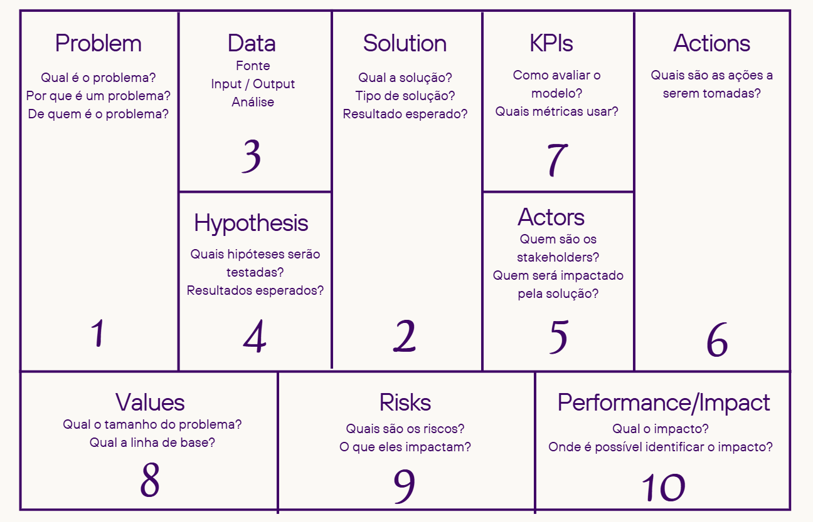
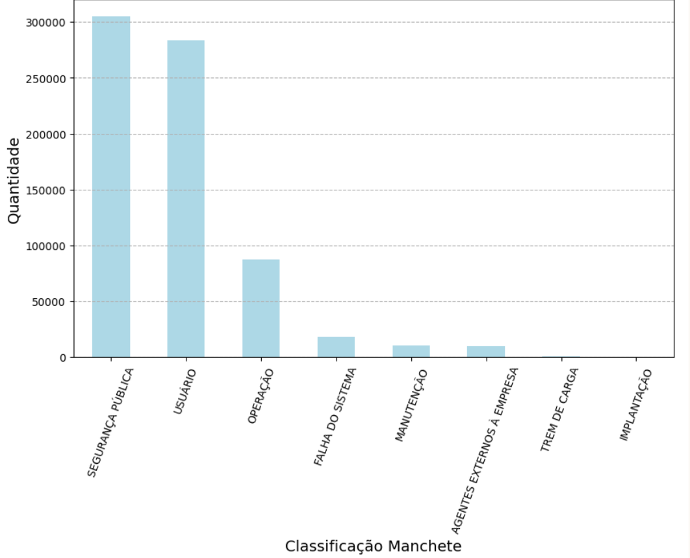
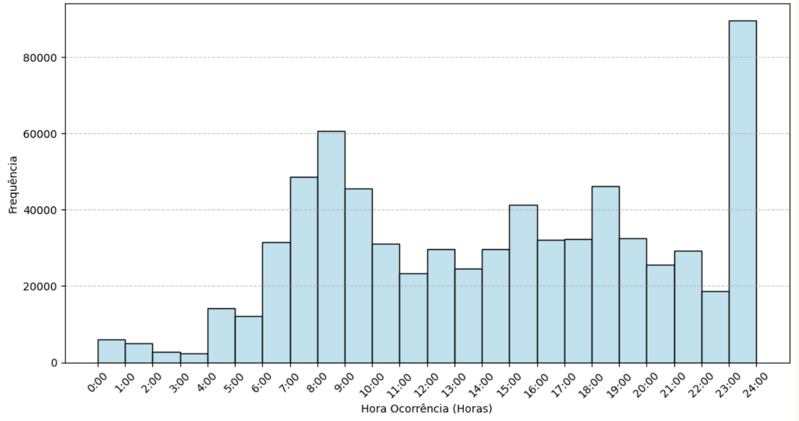
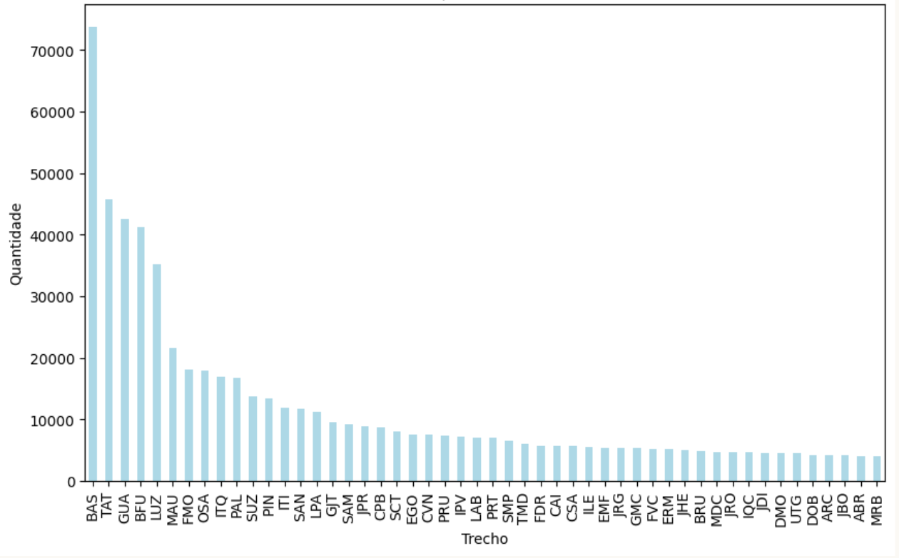

# Data Product Canvas

&emsp;&emsp; O Data Product Canvas é uma ferramenta visual que facilita o planejamento e o desenvolvimento de produtos baseados em dados. Abaixo vamos apresentar os principais componentes do canvas, que incluem a definição de público-alvo, os problemas a serem resolvidos e as métricas de sucesso esperadas. 

&emsp;&emsp; Utilizando o Data Product Canvas, buscamos alinhar a visão do produto com as necessidades dos usuários e as capacidades da equipe. Essa abordagem colaborativa não só ajuda a esclarecer os objetivos do projeto, mas também proporciona uma estrutura para avaliar as oportunidades e os desafios associados ao desenvolvimento de produtos baseados em dados. Com isso, conseguimos garantir que as decisões sejam fundamentadas em uma compreensão sólida do valor que o produto pode entregar. 

Imagem XX - Data Product Canvas

Fonte: Autoria própria.

## 1. Problema

&emsp;&emsp; A CPTM enfrenta um desafio significativo: a falta de recursos adequados para analisar grandes volumes de dados. Essa limitação dificulta o processo de tomada de decisões, especialmente em situações críticas, como a manutenção de trens em caso de falhas e a gestão da operação. Por exemplo, sem uma análise eficaz dos dados, pode-se levar mais tempo para identificar falhas ou prever manutenções necessárias, resultando em atrasos e riscos à segurança dos passageiros.

## 2. Solução

&emsp;&emsp; Como solução, desenvolveremos um Data App que oferece visualizações interativas a partir de um pipeline de Big Data. Essa aplicação permitirá que os usuários explorem os dados de forma intuitiva, facilitando a análise e a extração de insights relevantes.

## 3. Dados (e Estrutura)

&emsp;&emsp; Os dados utilizados no Data App foram cedidos pela CPTM. Eles passaram por um processo de análise e exploração inicial em notebooks jupyter que podem ser encontradas <a href="https://github.com/Inteli-College/2024-2B-T10-SI08-G01/tree/main/src/dados">aqui</a>.

&emsp;&emsp; A estrutura proposta para o armazenamento desses dados será baseada em uma arquitetura em camadas, onde os dados brutos serão armazenados em um data lake. Para melhor entendimento da arquitetura, clique <a href="https://ripe-apartment-751.notion.site/Arquitetura-12dabaa3a4d7805eb17aeaf5284de14a">aqui</a>.

## 4. Hipótese

&emsp;&emsp; Seguindo a análise dos dados realizada, alguns gráficos foram gerados e, com foco na planilha `BIG_DATA_FT_OCORRÊNCIAS`, as seguinte hipóteses foram levantadas:

Imagem XX - Gráfico de Quantidade de Ocorrências por Diferentes Classificações (manchetes) 

Fonte: Autoria própria.

- A categoria "Segurança Pública" concentra a maior parte das ocorrências registradas.

- As categorias “Segurança Pública” e “Usuário” representam aproximadamente 80% do total de falhas reportadas.

Imagem XX - Gráfico da Distribuição da Hora da Ocorrência

Fonte: Autoria própria.

- As ocorrências são mais frequentes durante os horários de pico, o que sugere uma relação direta com o aumento de fluxo de usuários e, consequentemente de ocorrências.

- As ocorrências não descritas durante o dia tendem a ser relatadas no fim do dia por volta das 23h, possivelmente devido à finalização dos registros.

Imagem XX - Gráfico da Quantidade de Ocorrências por Trecho

Fonte: Autoria própria.

- Os trechos que apresentam maior número de ocorrências são aqueles que possuem baldeação, indicando uma possível vulnerabilidade.

- A curva decrescente de ocorrências ao longo dos trechos sugere uma concentração de incidentes em locais específicos, como trechos que concentram um maior fluxo de passageiros.

## 5. Atores

&emsp;&emsp; Como atores, também podemos explorar o perfil dos usuários, sendo esses no contexto desse projeto as personas elaboradas pelo grupo, uma gestora de análise de ocorrências e falhas e um gerente de operações, e que podem ser acessadas com mais detalhes <a href="https://github.com/Inteli-College/2024-2B-T10-SI08-G01/blob/main/document/docs/analise-de-ux.md">aqui</a>.

## 6. Ações (e casos de uso)

&emsp;&emsp; Como ações, podemos pensar em alguns casos:

1. **Jornada do Usuário:** um mapeamento das etapas que um usuário percorre ao interagir com um produto ou serviço. No caso desse projeto, de forma bem resumida seria o acesso a plataforma -> seleção de dados sobre falhas e/ou ocorrências -> vizualização de infográficos -> análise e geração de insights -> tomada de decisão.

2. **User Story:** uma descrição breve de uma funcionalidade do produto do ponto de vista do usuário. Ela segue o formato: "Como [usuário], eu quero [ação] para que [benefício]", ajudando a equipe de desenvolvimento a entender necessidades e priorizar tarefas. Algumas foram desenvolvidas e podem ser encontradas <a href="https://github.com/Inteli-College/2024-2B-T10-SI08-G01/blob/main/document/docs/analise-de-ux.md">aqui</a>.

3. **Casos de Uso:** como o produto ou serviço será utilizado na prática. Nesse contexto, aqui estão alguns cenários:

- Monitoramento contínuo dos trens para acompanhar o tempo de manutenção preventiva: O sistema será utilizado para análise dos eventos de falhas e planejamento das manutenções programadas. Por exemplo, os dados sobre o tempo de operação dos trens serão visualizados para identificar quando um trem se aproxima do intervalo ideal para manutenção preventiva. A equipe de manutenção poderá utilizar esses gráficos para planejar as manutenções, evitando falhas inesperadas e contribuindo para uma operação mais eficiente. Uma funcionalidade de alertas automaticos quando um trem atinge um número específico de horas de operação pode ser uma futura adição pela própria CPTM.
  
- Acompanhamento de métricas de desempenho, como a identificação e resolução de ocorrências: O sistema coleta dados sobre falhas e ocorrências de problemas no trajeto dos trens. Por exemplo, se um trem apresenta falhas recorrentes em um determinado trecho, a equipe de operação identifica a incidencia no gráficos, podendo tomar ações corretivas, como verificar as condições da via ou os equipamentos específicos, garantindo que o problema seja resolvido rapidamente para evitar impactos na operação. Assim como no caso anterior, a CPTM também pode implementar um sistema de alerta automático sobre essas falhas e ocorrências, sem precisar checar manualmente os gráficos.

- Apoio para o desenvolvimento de um manual de procedimentos para resposta a padrões previamente identificados: Com base na análise de dados históricos de falhas, o sistema pode ajudar a criar um manual de procedimentos, definindo ações específicas para diferentes tipos de falhas ou ocorrências. Por exemplo, caso o sistema identifique que uma falha ocorre sempre após um evento específico de temperatura ou horário, o manual pode sugerir ações de precaução para minimizar o risco de falha, garantindo uma resposta rápida nessas situações..

- Realização de simulações com base nos dados do Data App para melhorar o tempo de resposta a falhas: A CPTM pode realizar simulações com dados históricos e cenários hipotéticos com base no gráficos para testar a eficácia das respostas a falhas e ocorrências. Por exemplo, podem simular uma falha em um trecho específico e ver como diferentes equipes de resposta (manutenção, operação) planejariam agir para identificar os pontos de melhoria no tempo de resposta, ajustando as práticas para garantir uma resolução eficiente.

## 7. KPIs

&emsp;&emsp; Os indicadores-chave de desempenho (KPIs) são métricas que serão usados para medir o sucesso do produto, alinhando-os às expectativas do parceiro. As selecionadas para avaliar esse projeto são:

1. **Precisão na Detecção de Ocorrências e Falhas**: Medida pela taxa de acerto nas detecções realizadas pelo sistema. Essencial para garantir que o sistema esteja operando com precisão.
2. **Tempo de Resolução de Ocorrências**: Monitorado através do tempo médio de resolução, buscando uma redução no tempo de resposta, melhorando a eficiência operacional.
3. **Custo de Computação na Nuvem**: Avaliado pelo custo médio por análise realizada, garantindo que a solução seja financeiramente viável e escalável.
4. **Custo de Manutenção por Ocorrência**: Busca-se uma redução nos custos associados a cada ocorrência detectada, garantindo que a slução seja sustentável a longo prazo.
5. **Impacto dos Insights na Tomada de Decisão**: Medido pela porcentagem de decisões baseadas em dados. Isso demonstra a efetividade das análises fornecidas pelo sistema.

_Alguns desses indicadores, que medem o tempo de resposta e porcentagem de decisão, por exemplo, são  dependentes de um relatório gerado pelos usuários que registre essas métricas. Para uma avaliação ainda mais estratégica, seria interessante incluir KPIs voltados para a satisfação do usuário e adaptação a mudanças no sistema, obtendo uma visão de longo prazo sobre o impacto da solução._

## 8. Valores

&emsp;&emsp; Os valores que o projeto representa são fundamentais para o sucesso do Data App. Essa proposta de valor pode ser relacionada ao Value Proposition Canvas, onde buscamos entender como a solução se alinha com as necessidades e desejos dos usuários, o VPC desenvolvido para esse projeto pode ser acessado <a href="https://github.com/Inteli-College/2024-2B-T10-SI08-G01/blob/main/document/docs/analise-de-negocios.md">aqui</a>.

## 9. Riscos

&emsp;&emsp; Desde o desenvovimento à implementação do projeto, é inevitável que enfrentemos alguns riscos, mas para ter um controle e um plano de ação, mapeamos a matriz de risco desse projeto que pode ser acessada <a href="https://github.com/Inteli-College/2024-2B-T10-SI08-G01/blob/main/document/docs/analise-de-negocios.md">aqui</a>. Porém, existem alguns riscos que valem ser destacados nesse dosucmento, sendo eles:

- **Alto Volume de Dados x Falta de Dados**: Enquanto um excesso de dados pode dificultar a análise, a falta de dados relevantes pode comprometer a eficácia das decisões.
- **Sobrecarga da Infraestrutura**: A demanda por processamento intenso pode levar à sobrecarga da infraestrutura ou falhas nos serviços e tecnologias utilizadas.
- **Problemas na Formatação e Envio dos Dados**: Erros na coleta ou no envio dos dados podem resultar em informações imprecisas tanto para os desenvolvedores quanto para os usuários finais.
- **Dificuldades na Interpretação dos Dados**: A complexidade dos dados pode levar a interpretações errôneas, seja no inicio da elo, entre os desenvolvedores, seja no fim entre os usuários finais, impactando negativamente as tomadas de decisões.

## 10. Performance & Impacto

&emsp;&emsp; Por fim, o que visamos com implementação do Data App  é a otimização dos processos operacionais da CPTM, com foco na melhoria das decisões relacionadas a falhas e ocorrências. Isso deve resultar na redução de custos operacionais e no aumento da produtividade. Além disso, espera-se uma melhoria significativa no tempo de resposta para solucionar falhas, bem como um aprimoramento na identificação de padrões e na previsão de fatores que possam influenciar as ocorrências.

&emsp;&emsp; Em resumo, com o fundemento do data product canvas, o desenvolvimento do Data Apps se mostra melhor mapeado. Através da identificação clara de problemas, soluções, e métricas de sucesso, conseguimos alinhar os interesses da equipe com as necessidades dos usuários. O uso de uma arquitetura em camadas para armazenamento de dados, bem como a definição de KPIs, proporcionará uma base sólida para a análise contínua e a melhoria dos processos.

# Arquitetura da Solução 

## Introdução 

&emsp;&emsp;A arquitetura de software é a base sobre a qual os sistemas modernos são construídos. Ela define como os diferentes componentes do sistema se conectam e interagem, estabelecendo fundamentos para desenvolvimento, segurança e manutenção. Uma boa arquitetura garante que o sistema seja escalável, flexível e capaz de se adaptar a mudanças tecnológicas e de mercado, integrando novos requisitos de forma eficiente. Os componentes dessa arquitetura desde aqueles que gerenciam a interface com o usuário até os que organizam a lógica interna, os dados e a segurança, desempenham funções essenciais e trabalham juntos para que o sistema funcione de forma coesa. Cada componente é projetado para executar uma função específica, mantendo o software eficiente e capaz de evoluir conforme as necessidades dos negócios e dos usuários.

  

Imagem XX - Arquitetura da Solução

Fonte: Autoria própria.

## 1. Processamento de Dados

&emsp;&emsp;A primeira etapa do arquivo envolve o processamento de dados com o Jupyter Notebook. Aqui, as tabelas iniciais, incluindo, mas não se limitando a, Ocorrências e Falhas, são processadas e manipuladas dentro do notebook. Uma vez processados, os dados são exportados em formato Parquet. O formato Parquet é excelente para o armazenamento de grandes quantidades de dados e para a posterior recuperação. Isso ocorre porque os dados são armazenados de forma compacta e estruturada, facilitando a recuperação na etapa seguinte do pipeline.

## 2. Armazenamento de Dados

&emsp;&emsp;Com os dados em formato Parquet, após o processamento, são encaminhados para o Amazon S3, um serviço de armazenamento em nuvem da Amazon. O S3 é usado para hospedar esses dados processados de forma segura e acessível, garantindo que possam ser recuperados para transformações ou análises adicionais. O Amazon S3 é benéfico por suas funcionalidades de escalabilidade para grandes volumes de dados, durabilidade e segurança.

## 3. Transformação ETL
 

&emsp;&emsp;A próxima fase é a transformação ETL, onde os dados armazenados no Amazon S3 são extraídos para serem transformados. O ETL é realizado com scripts em Python e gerenciado por um servidor Flask. Esse processo permite ao usuário limpar, agregar e organizar os dados conforme necessário para análise. Os dados, agora tratados, são carregados em um Data Warehouse, o ClickHouse.

  
## 4. Data Warehouse

&emsp;&emsp;O ClickHouse funciona como o repositório central dos dados estruturados, prontos para análise. Ele foi escolhido por sua capacidade de lidar com grandes volumes de dados e executar consultas analíticas de forma rápida e eficiente. No ClickHouse, os dados estão organizados e prontos para serem utilizados por aplicações de visualização, permitindo a criação de insights e análises mais aprofundadas. Este componente serve como base para consultas de dados complexas e visualizações interativas.

## 5. Visualização de Dados

&emsp;&emsp;A última etapa é a visualização dos dados por meio do Streamlit. Trata-se de um componente que permite que os usuários finais acessem dashboards interativos que exibem métricas e informações relevantes de forma amigável e intuitiva. O Streamlit é amplamente utilizado para a criação desse tipo de visualização, pois permite a criação rápida de uma variedade de visualizações dinâmicas e estáticas que os desenvolvedores podem inserir diretamente nos scripts Python, facilitando a interpretação e apresentação dos dados para os consumidores. Por meio dessa interface, eles recebem os dados do ClickHouse como gráficos e tabelas, otimizando seus processos de consumo.

## Conclusão

&emsp;&emsp;Uma boa arquitetura de software e seus componentes são essenciais para o sucesso de qualquer sistema. Eles garantem que o sistema seja confiável, flexível e capaz de crescer de forma organizada. Cada componente tem um papel importante, ajudando o sistema a ser ágil e fácil de manter, assegurando bom desempenho e segurança. Investir em uma boa arquitetura assegura que o software possa evoluir com o tempo, adicionando novas funcionalidades sem perder sua qualidade. Assim, a arquitetura de software não só sustenta o presente de um sistema, mas também o prepara para desafios e oportunidades futuras.

