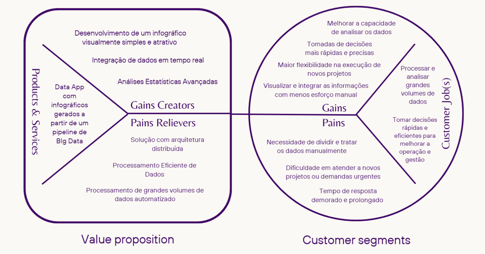
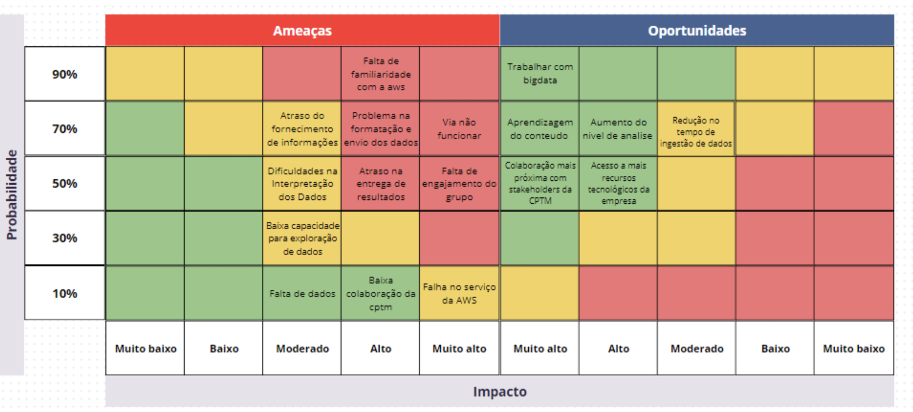
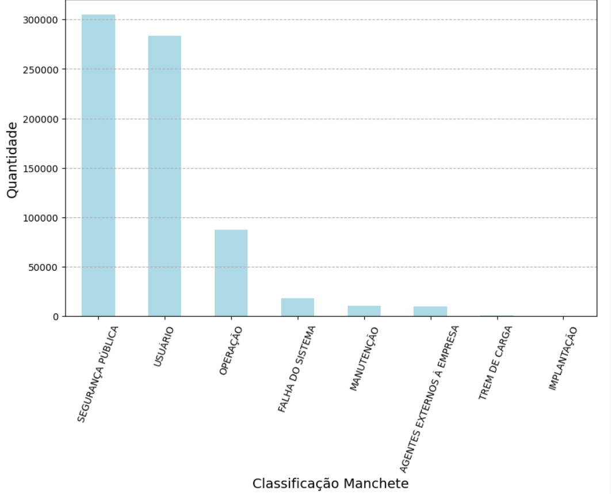

# Documentação Oficial - Xpress

## Sumário
1. [Canvas Proposta de Valor](#1-canvas-proposta-de-valor)
2. [TAM, SAM, SOM](#2-tam-sam-som)
3. [Matriz de Risco](#3-matriz-de-risco)
4. [Personas](#4-personas)
5. [Jornada de Usuário](#5-jornada-de-usuário)
6. [User Stories](#6-user-stories)
7. [Data Product Canvas](#7-data-product-canvas)
8. [Wireframe](#8-wireframe)
9. [Arquitetura da Solução](#9-arquitetura-da-solução)
10. [Estrutura de Ingestão de Dados](#10-estrutura-de-ingestão-de-dados)
11. [Cubo de Dados](#11-cubo-de-dados)
12. [Análise de Impacto Ético](#12-análise-de-impacto-ético)
13. [Análise Financeira](#13-análise-financeira)
14. [Plano de Comunicação](#14-plano-de-comunicação)
15. [Relatório Data App - Primeira Versão](#15-relatório-data-app---primeira-versão)
16. [Relatório Data App - Versão Final](#16-relatório-data-app---versão-final)
17. [Infográfico](#17-infográfico)
18. [Docker](#18-docker)

## 1. Canvas Proposta de Valor

<p align="justify">&emsp;&emsp; O Value Proposition Canvas é uma ferramenta que auxilia empresas a entenderem melhor como seus produtos e serviços geram valor para os clientes. Ele é composto por dois principais componentes: o Segmento de Clientes (Customer Segments) e a Proposta de Valor (Value Proposition). O lado do Segmento de Clientes descreve as principais atividades e desafios dos clientes (Jobs, Gains, e Pains), enquanto o lado da Proposta de Valor aborda como os produtos e serviços da empresa podem atender a esses desafios, aliviar as dores e proporcionar ganhos aos clientes.</p>

<p align="center">Imagem 1 - Value Proposition Canvas</p>



<p align="center">Fonte: Autoria própria.</p>


### 1.1 Segmento de Clientes (Customer Segments)

Customer Jobs: Define as principais tarefas ou "jobs" que o cliente precisa executar. No contexto desta empresa, os clientes buscam:
- Processar e analisar grandes volumes de dados.
- Tomar decisões rápidas e eficientes para melhorar a operação e gestão.

Pains: Aponta os problemas enfrentados pelos clientes ao realizar suas tarefas, como:
- Necessidade de dividir e tratar dados manualmente.
- Dificuldade em atender a novos projetos ou demandas urgentes.
- Tempo de resposta demorado e prolongado.

Gains: Refere-se aos benefícios que os clientes esperam alcançar ao realizar suas tarefas, tais como:
- Melhorar a capacidade de analisar os dados.
- Tomar decisões mais rápidas e precisas.
- Maior flexibilidade na execução de novos projetos.
- Visualizar e integrar as informações com menos esforço manual.

### 1.2 Proposta de Valor (Value Proposition)

Products & Services: Apresenta os principais produtos e serviços oferecidos, como:
- Data App com infográficos gerados a partir de um pipeline de Big Data.

Pains Relievers: Lista as funcionalidades que ajudam a minimizar ou eliminar as dores dos clientes, incluindo:
- Solução com arquitetura distribuída.
- Processamento eficiente de dados.
- Processamento automatizado de grandes volumes de dados.

Gains Creators: Indica as características que ajudam a criar valor e trazer benefícios para o cliente, como:
- Desenvolvimento de um infográfico visualmente simples e atrativo.
- Integração de dados em tempo real.
- Análises estatísticas avançadas.

<p align="justify">&emsp;&emsp; Este Value Proposition Canvas demonstra como buscamos entender as necessidades e desafios específicos da CPTM no tratamento de grandes volumes de dados e na tomada de decisões estratégicas. A proposta de valor foi desenhada para maximizar seus ganhos e mitigar os principais problemas encontrados, oferecendo uma solução robusta e eficiente que integra visualizações de dados, processamento em tempo real e uma arquitetura distribuída. Com essa abordagem, nós não só agregamos valor diretamente às operações dos clientes, como também contribui para a agilidade e precisão nas tomadas de decisão, fortalecendo sua posição no mercado como uma parceira tecnológica confiável.


## 2. TAM, SAM, SOM

<p align="justify">&emsp;&emsp; TAM, SAM e SOM são ferramentas essenciais para análise de mercado e planejamento estratégico. Segundo a Dima Services Agency (link), o TAM (Total Addressable Market) representa o mercado potencial total, o SAM (Serviceable Addressable Market) corresponde ao mercado alcançável e o SOM (Serviceable Obtainable Market) indica a parcela que pode ser efetivamente conquistada, considerando recursos e concorrência.</p>

### 2.1 Diferenças e Relações entre TAM, SAM e SOM
<p align="justify">&emsp;&emsp; A diferença entre esses conceitos está na abrangência: o TAM reflete a oportunidade máxima de mercado, considerando todo o mercado potencial para um produto ou serviço, sem restrições. O SAM, por sua vez, ajusta esse valor ao mercado atingível pela empresa, levando em conta limitações práticas como localização geográfica, perfil do cliente e características do produto ou serviço. Já o SOM define a fatia realista que a empresa pode conquistar, com base em sua capacidade competitiva, recursos disponíveis e eficácia operacional. Essas métricas se complementam para orientar decisões estratégicas e metas operacionais.</p>

### 2.2 Análise de Mercado da CPTM
<p align="justify">&emsp;&emsp; A Companhia Paulista de Trens Metropolitanos (CPTM) é fundamental no transporte público da Grande São Paulo, conectando milhões de passageiros diariamente. Esta análise de TAM, SAM e SOM considera informações públicas e dados levantados nos encontros presenciais com a equipe da CPTM.</p>

### 2.3 TAM (Mercado Total Endereçável):
<p align="justify">&emsp;&emsp; O TAM inclui a população dos 18 municípios atendidos pela CPTM, totalizando 16.689.150 pessoas (IBGE). Considerando uma média de R$5,00 por bilhete para duas viagens diárias:</p>

*TAM = 16.689.150 × R$5,00 × 2 = R$166.891.500,00 por dia.*

### 2.4 SAM (Mercado Disponível e Endereçável):
<p align="justify">&emsp;&emsp; Foi considerado que 54% dos lares no Sudeste possuem carro ou moto (IPEA), reduzindo o público-alvo em 46% da população total:</p>

*SAM = 7.677.009 × R$5,00 × 2 = R$76.770.090,00 por dia.*

### 2.5 SOM (Mercado Obtível):
<p align="justify">&emsp;&emsp; A média diária de usuários da CPTM é de 3,2 milhões de passageiros (Resumo Financeiro CPTM):</p>

*SOM = 3.200.000 × R$5,00 × 2 = R$32.000.000,00 por dia.*

<br>

<p align="justify">&emsp;&emsp; Compreender o TAM, SAM e SOM permite que a CPTM alinhe expectativas e planeje de forma realista seu crescimento e operação. O TAM destaca a oportunidade máxima, enquanto o SAM e o SOM refletem cenários práticos e alcançáveis. Essa análise orienta a tomada de decisão, ajudando a empresa a definir metas claras e explorar iniciativas, como o Bilhete Único e programas sociais.</p>

## 3. Matriz de Risco

<p align="justify">&emsp;&emsp; A matriz de risco é uma ferramenta importante para identificar e avaliar os riscos que podem impactar um projeto. Ela nos ajuda a visualizar a probabilidade de um evento ocorrer e o impacto que ele pode ter, facilitando a priorização das ações a serem tomadas. </p>
<p align="justify">&emsp;&emsp; Utilizando essa matriz, conseguimos mapear os riscos de forma que a equipe tome decisões planeadas sobre como mitigá-los, o que é fundamental para garantir que o projeto siga com o mínimo de empecilhos. </p>

<p align="center">Imagem 2 - Matriz de Risco</p>



<p align="center">Fonte: Autoria própria.</p>

### 3.1 Plano de Ação para os Riscos:

*Falta de Familiaridade com AWS* <br>
**Prevenção:** Realizar treinamentos internos e autoestudo sobre AWS na primeira sprint, focando nas principais ferramentas utilizadas no projeto.<br>
**Reação:** Consultar especialistas externos ou a própria AWS em caso de dificuldades específicas, focando resolver em até 48 horas. <br>
**Responsável:** Daniel Mendez.<br>
**Impacto Quantitativo:** 5/5.

*Atraso do Fornecimento de Informações* <br>
**Prevenção:** Estabelecer um cronograma de entregas claro com os stakeholders quinzenalmente e revisar o fluxo de comunicação para garantir o cumprimento de prazos estabelecidos no backlog. <br>
**Reação:** Notificar imediatamente os envolvidos e ajustar o cronograma de atividades para compensar os atrasos. <br>
**Responsável:** Enzo. <br>
**Impacto Quantitativo:** 4/5.

*Problemas na Formatação e Envio dos Dados* <br>
**Prevenção:** Definir padrões de formatação e validar os dados antes do envio para evitar inconsistências. <br>
**Reação:** Realizar uma verificação manual e, se necessário, corrigir ou reenviar os dados no formato correto. <br>
**Responsável:** Luiza. <br>
**Impacto Quantitativo:** 4/5.

*Dificuldades na Interpretação dos Dados* <br>
**Prevenção:** Participar de workshops e treinamentos focados na análise de dados para aprimorar as habilidades da equipe. <br>
**Reação:** Buscar auxílio de mentores ou especialistas em análise de dados para resolver dúvidas específicas. <br>
**Responsável:** Thiago. <br>
**Impacto Quantitativo:** 3/5.

*Atraso na Entrega de Resultados* <br>
**Prevenção:** Implementar um sistema de acompanhamento de progresso semanal e um plano de contingência para eventuais atrasos. <br>
**Reação:** Priorizar as atividades mais críticas para reduzir o impacto do atraso nos resultados finais. <br>
**Responsável:** Samuel. <br>
**Impacto Quantitativo:** 5/5.

*Baixa Capacidade para Exploração de Dados* <br>
**Prevenção:** Otimizar o ambiente de análise com ferramentas adicionais, como bibliotecas de dados e recursos computacionais. <br>
**Reação:** Redirecionar o trabalho para dados mais críticos, visando aumentar a eficiência com os recursos disponíveis em até 72 horas. <br>
**Responsável:** Thiago. <br>
**Impacto Quantitativo:** 3/5.

*Falta de Colaboração da CPTM* <br>
**Prevenção:** Manter uma comunicação constante com a CPTM através do orientador e realizar reuniões quinzenais, alinhando expectativas e prazos desde o início. <br>
**Reação:** Solicitar uma reunião com os responsáveis da CPTM para reavaliar as responsabilidades e fortalecer a cooperação. <br>
**Responsável:** Daniel Zular. <br>
**Impacto Quantitativo:** 4/5.

*Falhas no Serviço de AWS* <br>
**Prevenção:** Implementar redundância em serviços críticos e monitoramento constante do ambiente AWS. <br>
**Reação:** Ativar os serviços de backup e reconfigurar o ambiente em uma região alternativa, se necessário. <br>
**Responsável:** Daniel Mendez. <br>
**Impacto Quantitativo:** 5/5.

*Via Não Funcionar* <br>
**Prevenção:** Testar a viabilidade de comunicação entre as vias com antecedência e identificar rotas alternativas. <br>
**Reação:** Utilizar outros canais ou tecnologias para garantir o fluxo de dados e minimizar a interrupção. <br>
**Responsável:** Enzo. <br>
**Impacto Quantitativo:** 4/5.

*Baixa Colaboração com Stakeholders* <br>
**Prevenção:** Realizar reuniões periódicas com os stakeholders para garantir alinhamento e engajamento constante. <br>
**Reação:** Designar um responsável de comunicação para restabelecer o contato e entender as expectativas dos stakeholders. <br>
**Responsável:** Luiza. <br>
**Impacto Quantitativo:** 3/5.

## 4. Personas

<p align="justify">&emsp;&emsp; Para garantir que as nossas soluções são desenvolvidas de acordo com as reais necessidades dos nossos utilizadores, criamos duas personas que representam informações diferentes mas relacionadas nos ambientes de gestão e análise de dados. Estas pessoas ajudam-nos a compreender os desafios, motivações e expectativas dos utilizadores finais, para que os nossos produtos possam resolver os seus problemas diários e otimizar os seus processos de trabalho.</p>

### 4.1 Persona: Pedro Santo Farias
<p align="justify">&emsp;&emsp; A primeira persona se chama Pedro Santo Farias, é o Gerente de Operações focado em eficiência e automação. Ele estava procurando uma solução que proporcionasse melhor visibilidade das operações em tempo real e permitisse decisões mais rápidas e precisas. Pedro enfrentou desafios como a falta de integração entre departamentos e a necessidade de eliminar o trabalho manual que reduzia a produtividade.</p>

<p align="justify">&emsp;&emsp; Pedro possui um nível intermediário de letramento digital. Ele é familiarizado com planilhas e ferramentas de automação básica, mas precisa de sistemas com interfaces intuitivas para evitar dificuldades operacionais.


<p align="center">Imagem 3 - Persona : Pedro Santo Farias</p>

<div align="center">


</div>

<p align="center">Fonte: Autoria própria.</p>

### 4.2 Persona: Fernanda Almeida
<p align="justify">&emsp;&emsp; A segunda Persona se chama Fernanda Almeida, é a Diretora de Análise e Falhas. O trabalho dela é fazer a monitorização e resolução de problemas críticos, as empresas continuam a reduzir o número de falhas e a otimizar a eficiência operacional. Além de lidar com a coordenação multiequipe, Fernanda precisava de um sistema que a ajudasse a automatizar tarefas e monitorar dados.</p>

<p align="justify">&emsp;&emsp; Fernanda tem um nível avançado de letramento digital. Ela domina ferramentas analíticas e sistemas de automação, além de se adaptar rapidamente a novas tecnologias que melhorem a gestão de ocorrências.

<p align="center">Imagem 4 - Persona : Fernanda Almeida</p>

<div align="center">


</div>

<p align="center">Fonte: Autoria própria.</p>

<p align="justify">&emsp;&emsp; O uso dessas personas no desenvolvimento do Data App da CPTM irá nos permitir ter visão mais clara dos diferentes tipos de usuários que interagem com a plataforma. Compreender as características, necessidades e desafios de cada um deles possibilita ajustar o sistema para atender melhor às expectativas de gerentes, analistas e gestores. Isso garante que a aplicação seja intuitivo e relevante para os diversos perfis de usuários, facilitando a análise de dados e a tomada de decisões, resultando em um sistema que se adapta às demandas reais de cada colaborador da CPTM.</p>

## 5. Jornada de Usuário

<p align="justify">&emsp;&emsp; Os Mapas de Jornada dos Usuários Fernanda Almeida e Pedro Santo Farias mostram suas experiências ao buscar melhorias de integração e automação na CPTM. Fernanda foca em reduzir falhas nos sistemas de monitoramento, enquanto Pedro visa otimizar a eficiência operacional com um ERP. Esses mapas revelam ações, sentimentos e necessidades, ajudando a orientar soluções alinhadas aos seus objetivos. </p>

<p align="center">Imagem 5 - Jornada: Pedro Farias</p>


<p align="center">Fonte: Autoria própria.</p>

#### Fase 1: Identificação de Problema
Pedro, gerente de operações, percebe atrasos causados por falta de integração entre os departamentos. Ele organiza reuniões para entender melhor esses problemas, demonstrando uma liderança ativa e preocupada com melhorias.

#### Fase 2: Pesquisa de Solução
Pedro explora diferentes ERPs e participa de demonstrações, buscando soluções que possam resolver os problemas de integração. Ele está esperançoso, vendo um grande potencial nessas tecnologias para melhorar a eficiência operacional.

#### Fase 3: Decisão
Após considerar várias opções, Pedro escolhe o ERP que melhor atende às necessidades da empresa. Ele assina o contrato, esperando que essa escolha traga a integração necessária para os departamentos.

#### Fase 4: Implementação
Ele supervisiona a instalação do ERP e o treinamento da equipe, garantindo que todos estejam preparados para usar o novo sistema. Pedro está cautelosamente otimista sobre os benefícios que essa mudança trará.

#### Fase 5: Avaliação
Pedro revisa os resultados após a implementação e busca áreas para otimizações. Ele se sente satisfeito ao ver as melhorias começando a tomar forma, confirmando que a decisão foi acertada.

<p align="center">Imagem 6 - Jornada: Fernanda Almeida</p>


<p align="center">Fonte: Autoria própria.</p>

#### Fase 1: Identificação de Problema
Fernanda começa sua jornada lidando com falhas frequentes. Ela se reúne com sua equipe para discutir esses problemas, mostrando seu compromisso em encontrar soluções duradouras.

#### Fase 2: Pesquisa de Solução
Ela procura por novas ferramentas de automação e conversa com especialistas. Fernanda está animada com as possíveis soluções que podem ajudar a monitorar e reduzir as falhas.

#### Fase 3: Decisão
Confidente, Fernanda decide implementar uma ferramenta de automação robusta, mostrando uma visão clara de como isso pode melhorar o monitoramento.

#### Fase 4: Implementação
Ela acompanha de perto a instalação do novo sistema e a adaptação da equipe, fornecendo suporte contínuo. Fernanda sente alívio ao ver que a equipe está se adaptando bem à nova ferramenta.

#### Fase 5: Avaliação
Fernanda revisa os resultados e sugere melhorias. Ela está otimista com o progresso e entusiasmada com as futuras possibilidades de integração e otimização.

<p align="justify">&emsp;&emsp; O mapeamento da jornada dos usuários da CPTM permite otimizar o uso do Data App, identificando pontos de melhoria e oferecendo uma experiência mais fluida e intuitiva. Ao compreender as etapas pelas quais os colaboradores passam, é possível ajustar funcionalidades, simplificar processos e oferecer suporte adequado para que a análise de ocorrências e a geração de insights sejam mais eficientes. Isso contribui diretamente para uma melhor utilização do sistema, aumentando a satisfação e a produtividade dos usuários.</p>

## 6. User Stories

<p align="justify">&emsp;&emsp; As user stories são uma ferramenta essencial para capturar os requisitos de um sistema a partir da perspectiva do usuário final. Elas descrevem de maneira simples as necessidades e expectativas dos usuários, ajudando a equipe de desenvolvimento a entender o que é realmente importante para quem utilizará o produto. No contexto do Data App da CPTM, as user stories são utilizadas para identificar as funcionalidades que melhor atendem os colaboradores na análise de dados e ocorrências, garantindo que o sistema seja intuitivo e útil em suas operações diárias.</p>

### 6.1 User Story 1:
<p align="justify">&emsp;&emsp; Como parte do operacional da CPTM, quero um sistema que absorva e armazene grandes volumes de dados operacionais em tempo real para que eu possa monitorar e responder rapidamente a qualquer tipo de incidente no operacional, reduzindo o tempo de resposta e otimizando a operação das linhas que a CPTM é responsável.

*Critérios de Aceitação:*
- O sistema deve armazenar e processar dados operacionais com uma latência máxima de 2 segundos.
- Alertas de incidentes devem ser disparados em até 1 minuto após a detecção do problema.
- Disponibilidade garantida de 99,9% (uptime) para evitar interrupções.

*Dependências:*
- Sensores de monitoramento operacional que enviem dados em tempo real.
- Servidores de banco de dados configurados para processar grandes volumes de dados.

*Prioridade:* Alta. Essa User Story é fundamental para melhorar a eficiência operacional e a qualidade do serviço prestado aos passageiros.

<br>

### 6.2 User Story 2:
<p align="justify">&emsp;&emsp; Como analista de dados, quero poder processar e analisar grandes volumes de dados armazenados no Data Lake, para identificar padrões que ajudem a otimizar a operação da empresa, como a predição de falhas em equipamentos e análise de risco.

*Critérios de Aceitação:*
- Processar no mínimo 1 TB de dados por dia com alta performance.
- Permitir a exportação de relatórios em até 5 minutos.
- Dashboards devem ser personalizáveis com filtros e configurações específicas.

*Dependências:*
- Integração com o Data Lake existente para acesso aos dados.
- Infraestrutura de servidores de alta performance para suportar o processamento de dados.

*Prioridade:* Alta. Essa User Story permite a otimização do serviço e redução de custos operacionais por meio de análises preditivas.

<br>

### 6.3 User Story 3:
<p align="justify">&emsp;&emsp; Como parte da equipe administrativa, preciso que os dados operacionais e administrativos sejam apresentados de forma estruturada e visual através de um infográfico ou ferramentas de visualização de dados, para que eu possa tomar decisões estratégicas com base em insights visuais que apoiem o planejamento e a alocação de recursos.

*Critérios de Aceitação:*
- Gráficos e infográficos devem ser gerados em até 1 minuto.
- Relatórios devem ser exportáveis em PDF e compartilháveis via link.
- A interface deve ser responsiva, permitindo o uso em dispositivos móveis e desktops.

*Dependências:*
- Dados organizados e padronizados para a geração de relatórios e visualizações.
- Ferramentas de visualização de dados como Plotly ou D3.js.

*Prioridade:* Média. Essa User Story é relevante para melhorar a tomada de decisões estratégicas e planejamento de recursos.

### 6.4 Conclusão

<p align="justify">&emsp;&emsp;As user stories permitem alinhar o desenvolvimento do Data App às necessidades reais dos usuários da CPTM, proporcionando uma solução mais personalizada e eficiente. Ao focar nas demandas específicas dos colaboradores, como a necessidade de monitorar ocorrências em tempo real e gerar insights para a tomada de decisão, as user stories garantem que cada funcionalidade desenvolvida traga valor ao dia a dia dos operadores e analistas, facilitando a análise de ocorrências e melhorando o processo de decisão. </p>

## 7. Data Product Canvas

<p align="justify">&emsp;&emsp; O Data Product Canvas é uma ferramenta visual que facilita o planejamento e o desenvolvimento de produtos baseados em dados. Abaixo vamos apresentar os principais componentes do canvas, que incluem a definição de público-alvo, os problemas a serem resolvidos e as métricas de sucesso esperadas. </p>
<p align="justify">&emsp;&emsp; Utilizando o Data Product Canvas, buscamos alinhar a visão do produto com as necessidades dos usuários e as capacidades da equipe. Essa abordagem colaborativa não só ajuda a esclarecer os objetivos do projeto, mas também proporciona uma estrutura para avaliar as oportunidades e os desafios associados ao desenvolvimento de produtos baseados em dados. Com isso, conseguimos garantir que as decisões sejam fundamentadas em uma compreensão sólida do valor que o produto pode entregar. </p>

<p align="center">Imagem 7 - Data Product Canvas</p>


<p align="center">Fonte: Autoria própria.</p>

### 7.1 Problema
<p align="justify">&emsp;&emsp; A CPTM enfrenta um desafio significativo: a falta de recursos adequados para analisar grandes volumes de dados. Essa limitação dificulta o processo de tomada de decisões, especialmente em situações críticas, como a manutenção de trens em caso de falhas e a gestão da operação. Por exemplo, sem uma análise eficaz dos dados, pode-se levar mais tempo para identificar falhas ou prever manutenções necessárias, resultando em atrasos e riscos à segurança dos passageiros.</p>

### 7.2 Solução
<p align="justify">&emsp;&emsp; Como solução, desenvolveremos um Data App que oferece visualizações interativas a partir de um pipeline de Big Data. Essa aplicação permitirá que os usuários explorem os dados de forma intuitiva, facilitando a análise e a extração de insights relevantes.</p>

### 7.3 Dados (e Estrutura)

<p align="justify">&emsp;&emsp; Os dados utilizados no Data App foram cedidos pela CPTM. Eles passaram por um processo de análise e exploração inicial em notebooks jupyter que podem ser encontradas <a href="https://github.com/Inteli-College/2024-2B-T10-SI08-G01/tree/main/src/dados">aqui</a>.</p>

<p align="justify">&emsp;&emsp; A estrutura proposta para o armazenamento desses dados será baseada em uma arquitetura em camadas, onde os dados brutos serão armazenados em um data lake. Para melhor entendimento da arquitetura, clique <a href="https://ripe-apartment-751.notion.site/Arquitetura-12dabaa3a4d7805eb17aeaf5284de14a">aqui</a>.

### 7.4 Hipótese
<p align="justify">&emsp;&emsp; Seguindo a análise dos dados realizada, alguns gráficos foram gerados e, com foco na planilha `BIG_DATA_FT_OCORRÊNCIAS`, as seguinte hipóteses foram levantadas:

<p align="center">Imagem 8 - Gráfico de Quantidade de Ocorrências por Diferentes Classificações (manchetes) </p>



<p align="center">Fonte: Autoria própria.</p>

- A categoria "Segurança Pública" concentra a maior parte das ocorrências registradas.

- As categorias “Segurança Pública” e “Usuário” representam aproximadamente 80% do total de falhas reportadas.

<p align="center">Imagem 9 - Gráfico da Distribuição da Hora da Ocorrência</p>


<p align="center">Fonte: Autoria própria.</p>

- As ocorrências são mais frequentes durante os horários de pico, o que sugere uma relação direta com o aumento de fluxo de usuários e, consequentemente de ocorrências.

- As ocorrências não descritas durante o dia tendem a ser relatadas no fim do dia por volta das 23h, possivelmente devido à finalização dos registros.

<p align="center">Imagem 10 - Gráfico da Quantidade de Ocorrências por Trecho</p>


<p align="center">Fonte: Autoria própria.</p>

- Os trechos que apresentam maior número de ocorrências são aqueles que possuem baldeação, indicando uma possível vulnerabilidade.

- A curva decrescente de ocorrências ao longo dos trechos sugere uma concentração de incidentes em locais específicos, como trechos que concentram um maior fluxo de passageiros.

### 7.5 Atores
<p align="justify">&emsp;&emsp; Como atores, também podemos explorar o perfil dos usuários, sendo esses no contexto desse projeto as personas elaboradas pelo grupo, uma gestora de análise de ocorrências e falhas e um gerente de operações, e que podem ser acessadas com mais detalhes <a href="https://github.com/Inteli-College/2024-2B-T10-SI08-G01/blob/main/document/docs/analise-de-ux.md">aqui</a>.</p>

### 7.6 Ações (e casos de uso)
<p align="justify">&emsp;&emsp; Como ações, podemos pensar em alguns casos:</p>

1. **Jornada do Usuário:** um mapeamento das etapas que um usuário percorre ao interagir com um produto ou serviço. No caso desse projeto, de forma bem resumida seria o acesso a plataforma -> seleção de dados sobre falhas e/ou ocorrências -> vizualização de infográficos -> análise e geração de insights -> tomada de decisão.

2. **User Story:** uma descrição breve de uma funcionalidade do produto do ponto de vista do usuário. Ela segue o formato: "Como [usuário], eu quero [ação] para que [benefício]", ajudando a equipe de desenvolvimento a entender necessidades e priorizar tarefas. Algumas foram desenvolvidas e podem ser encontradas <a href="https://github.com/Inteli-College/2024-2B-T10-SI08-G01/blob/main/document/docs/analise-de-ux.md">aqui</a>.

3. **Casos de Uso:** como o produto ou serviço será utilizado na prática. Nesse contexto, aqui estão alguns cenários:

- Monitoramento contínuo dos trens para acompanhar o tempo de manutenção preventiva: O sistema será utilizado para análise dos eventos de falhas e planejamento das manutenções programadas. Por exemplo, os dados sobre o tempo de operação dos trens serão visualizados para identificar quando um trem se aproxima do intervalo ideal para manutenção preventiva. A equipe de manutenção poderá utilizar esses gráficos para planejar as manutenções, evitando falhas inesperadas e contribuindo para uma operação mais eficiente. Uma funcionalidade de alertas automaticos quando um trem atinge um número específico de horas de operação pode ser uma futura adição pela própria CPTM.
  
- Acompanhamento de métricas de desempenho, como a identificação e resolução de ocorrências: O sistema coleta dados sobre falhas e ocorrências de problemas no trajeto dos trens. Por exemplo, se um trem apresenta falhas recorrentes em um determinado trecho, a equipe de operação identifica a incidencia no gráficos, podendo tomar ações corretivas, como verificar as condições da via ou os equipamentos específicos, garantindo que o problema seja resolvido rapidamente para evitar impactos na operação. Assim como no caso anterior, a CPTM também pode implementar um sistema de alerta automático sobre essas falhas e ocorrências, sem precisar checar manualmente os gráficos.

- Apoio para o desenvolvimento de um manual de procedimentos para resposta a padrões previamente identificados: Com base na análise de dados históricos de falhas, o sistema pode ajudar a criar um manual de procedimentos, definindo ações específicas para diferentes tipos de falhas ou ocorrências. Por exemplo, caso o sistema identifique que uma falha ocorre sempre após um evento específico de temperatura ou horário, o manual pode sugerir ações de precaução para minimizar o risco de falha, garantindo uma resposta rápida nessas situações..

- Realização de simulações com base nos dados do Data App para melhorar o tempo de resposta a falhas: A CPTM pode realizar simulações com dados históricos e cenários hipotéticos com base no gráficos para testar a eficácia das respostas a falhas e ocorrências. Por exemplo, podem simular uma falha em um trecho específico e ver como diferentes equipes de resposta (manutenção, operação) planejariam agir para identificar os pontos de melhoria no tempo de resposta, ajustando as práticas para garantir uma resolução eficiente.

### 7.7 KPIs
<p align="justify">&emsp;&emsp; Os indicadores-chave de desempenho (KPIs) são métricas que serão usados para medir o sucesso do produto, alinhando-os às expectativas do parceiro. As selecionadas para avaliar esse projeto são:</p>

1. **Precisão na Detecção de Ocorrências e Falhas**: Medida pela taxa de acerto nas detecções realizadas pelo sistema. Essencial para garantir que o sistema esteja operando com precisão.
2. **Tempo de Resolução de Ocorrências**: Monitorado através do tempo médio de resolução, buscando uma redução no tempo de resposta, melhorando a eficiência operacional.
3. **Custo de Computação na Nuvem**: Avaliado pelo custo médio por análise realizada, garantindo que a solução seja financeiramente viável e escalável.
4. **Custo de Manutenção por Ocorrência**: Busca-se uma redução nos custos associados a cada ocorrência detectada, garantindo que a slução seja sustentável a longo prazo.
5. **Impacto dos Insights na Tomada de Decisão**: Medido pela porcentagem de decisões baseadas em dados. Isso demonstra a efetividade das análises fornecidas pelo sistema.

_Alguns desses indicadores, que medem o tempo de resposta e porcentagem de decisão, por exemplo, são  dependentes de um relatório gerado pelos usuários que registre essas métricas. Para uma avaliação ainda mais estratégica, seria interessante incluir KPIs voltados para a satisfação do usuário e adaptação a mudanças no sistema, obtendo uma visão de longo prazo sobre o impacto da solução._

### 7.8 Valores
<p align="justify">&emsp;&emsp; Os valores que o projeto representa são fundamentais para o sucesso do Data App. Essa proposta de valor pode ser relacionada ao Value Proposition Canvas, onde buscamos entender como a solução se alinha com as necessidades e desejos dos usuários, o VPC desenvolvido para esse projeto pode ser acessado <a href="https://github.com/Inteli-College/2024-2B-T10-SI08-G01/blob/main/document/docs/analise-de-negocios.md">aqui</a>.</p>

### 7.9 Riscos
<p align="justify">&emsp;&emsp; Desde o desenvovimento à implementação do projeto, é inevitável que enfrentemos alguns riscos, mas para ter um controle e um plano de ação, mapeamos a matriz de risco desse projeto que pode ser acessada <a href="https://github.com/Inteli-College/2024-2B-T10-SI08-G01/blob/main/document/docs/analise-de-negocios.md">aqui</a>. Porém, existem alguns riscos que valem ser destacados nesse dosucmento, sendo eles:</p>

- **Alto Volume de Dados x Falta de Dados**: Enquanto um excesso de dados pode dificultar a análise, a falta de dados relevantes pode comprometer a eficácia das decisões.
- **Sobrecarga da Infraestrutura**: A demanda por processamento intenso pode levar à sobrecarga da infraestrutura ou falhas nos serviços e tecnologias utilizadas.
- **Problemas na Formatação e Envio dos Dados**: Erros na coleta ou no envio dos dados podem resultar em informações imprecisas tanto para os desenvolvedores quanto para os usuários finais.
- **Dificuldades na Interpretação dos Dados**: A complexidade dos dados pode levar a interpretações errôneas, seja no inicio da elo, entre os desenvolvedores, seja no fim entre os usuários finais, impactando negativamente as tomadas de decisões.

### 7.10 Performance & Impacto
<p align="justify">&emsp;&emsp; Por fim, o que visamos com implementação do Data App  é a otimização dos processos operacionais da CPTM, com foco na melhoria das decisões relacionadas a falhas e ocorrências. Isso deve resultar na redução de custos operacionais e no aumento da produtividade. Além disso, espera-se uma melhoria significativa no tempo de resposta para solucionar falhas, bem como um aprimoramento na identificação de padrões e na previsão de fatores que possam influenciar as ocorrências.

<p align="justify">&emsp;&emsp; Em resumo, com o fundemento do data product canvas, o desenvolvimento do Data Apps se mostra melhor mapeado. Através da identificação clara de problemas, soluções, e métricas de sucesso, conseguimos alinhar os interesses da equipe com as necessidades dos usuários. O uso de uma arquitetura em camadas para armazenamento de dados, bem como a definição de KPIs, proporcionará uma base sólida para a análise contínua e a melhoria dos processos.</p>

## 8. Wireframe

<p align="justify">&emsp;&emsp;Após uma análise dos feedbacks recebido, os wireframes passaram por uma revisão para alcançar um design mais refinado, alinhado às capacidades do Streamlit e às necessidades dos usuários finais. O resultado é um protótipo que combina simplicidade, funcionalidade e responsividade, o que garante uma experiência otimizada em diversos dispositivos.

<p align="justify">&emsp;&emsp;As imagens do novo wireframe estão disponíveis para consulta na seguinte pasta do Google Drive:  
[Wireframes Atualizados](https://drive.google.com/drive/folders/1WgASj8Um354O-aNS-UhdNwu4E8r2ND8V)

### 8.1. Estrutura e Organização

<p align="justify">&emsp;&emsp;O novo design adota uma abordagem minimalista e funcional, com foco na clareza e facilidade de uso. As alterações realizadas buscaram simplificar a navegação e otimizar a apresentação de informações, mantendo a consistência visual em todas as páginas.

#### Melhorias Aplicadas:
1. **Simplicidade na Estrutura**:  
   - Redução de elementos redundantes para melhorar a legibilidade.  
   - Organização hierárquica clara das informações para evitar sobrecarga visual.  

2. **Padronização Visual**:  
   - Uso uniforme de fontes, cores e estilos em todas as telas.  
   - Adição de ícones intuitivos para facilitar a identificação de funções e categorias.  

3. **Navegação Otimizada**:  
   - Utilização de breadcrumbs para orientar o usuário e melhorar a usabilidade.  


### 8.2 Página Inicial

A página inicial foi redesenhada para oferecer uma visão geral clara e objetiva, com os principais indicadores do sistema em destaque.

### Estrutura da Página:
1. **Título Central**:  
   - Um título claro e objetivo, "Painel de Monitoramento", posicionado no topo da página.  

2. **Menu no topo de cada página**:  
   - Opções disponíveis:  
     - **Início**: Página principal com resumo geral.  
     - **Ocorrências**: Estatísticas e gráficos sobre as ocorrências registradas.  
     - **Falhas**: Dados e análises relacionadas a falhas reportadas.  
     - **Infográfico**: Infográfico feito pelo grupo para mostrar os dados de uma maneira mais visual.  

3. **Área Central**:  
   - Dividida em dois painéis principais:  
     - **Ocorrências**: Resumo com números totais e um gráfico simplificado.  
     - **Falhas**: Informações apresentadas no mesmo formato para garantir consistência.  

4. **Gráficos Resumidos**:  
   - Indicadores visuais simples e informativos para uma visão rápida do desempenho geral diário.  

### 8.3 Páginas de Ocorrências e Falhas

<p align="justify">&emsp;&emsp;Essas páginas foram projetadas para detalhar as informações relacionadas a ocorrências e falhas de maneira consistente, priorizando usabilidade e clareza. Elas seguem a mesma ideia de design, sendo somente o nome dos gráficos que se alteram.

### Layout e Funcionalidades:
1. **Filtros Interativos**:  
   - Filtros de período e quantidade posicionados no topo da página.  
   - Atualizações dinâmicas dos gráficos ao ajustar os filtros.  

2. **Gráficos Principais**:  
   - Ocupam a área central da página, com foco em destacar dados mais relevantes.  
   - Visualizações responsivas, ajustando-se automaticamente a diferentes tamanhos de tela.  

3. **Opções Adicionais**:  
   - Visualizações complementares abaixo dos gráficos principais, permitindo uma análise mais detalhada.  

### 8.4 Nova Página: Infográfico

<p align="justify">&emsp;&emsp;Essa página foi projetada para apresentar um infográfico estático que sintetiza os principais dados e informações do sistema em um formato visualmente atraente e narrativo.

#### Características:

- Storytelling visual: A página exibe uma única imagem estática contendo o infográfico, que organiza os dados em um formato de fácil compreensão.

-Objetivo: Proporcionar uma visão macro dos dados, destacando tendências e insights principais de maneira visual.

- Consistência visual: O design do infográfico mantém a mesma paleta de cores, fontes e estilo gráfico utilizado nas demais páginas.

<p align="justify">&emsp;&emsp;Assim, essa abordagem oferece um recurso complementar às páginas analíticas, focando em engajamento visual e clareza narrativa.

### 8.5 Documentação das Melhorias

### Redução de Complexidade
- Eliminação de elementos visuais desnecessários, priorizando dados essenciais.  
- Simplificação dos gráficos e tabelas para melhorar a compreensão imediata.  

### Consistência Visual
- Padronização completa de cores, fontes e estilos em todas as páginas.  
- Uso de ícones intuitivos para facilitar a navegação e entendimento.  

### Adaptação para Streamlit
- Design ajustado às capacidades e limitações do Streamlit, utilizando componentes nativos.  
- Gráficos e interações otimizados para garantir desempenho fluido e responsivo.  

### Melhorias na Navegação
- Inclusão de um menu lateral persistente para fácil acesso a todas as seções do sistema.  
- Implementação de breadcrumbs para orientar o usuário dentro da hierarquia do aplicativo.  

### Feedback Visual
- Indicadores claros para filtros e botões, destacando o estado ativo.  
- Tooltips informativos em todos os elementos interativos, explicando funcionalidades e dados.  

### 8.6 Conclusão

<p align="justify">&emsp;&emsp;As revisões realizadas nos wireframes resultaram em uma interface mais clara, intuitiva e eficiente. O design minimalista oferece uma navegação fluida, enquanto a integração do Data App adiciona profundidade analítica ao sistema.  

<p align="justify">&emsp;&emsp;Com as otimizações realizadas, o projeto se alinha tanto aos requisitos técnicos quanto às expectativas do usuário final, garantindo desempenho e usabilidade consistentes dentro do ambiente Streamlit.  

## 9. Arquitetura da Solução 

<p align="justify">&emsp;&emsp;A arquitetura de software é a base sobre a qual os sistemas modernos são construídos. Ela define como os diferentes componentes do sistema se conectam e interagem, estabelecendo fundamentos para desenvolvimento, segurança e manutenção. Uma boa arquitetura garante que o sistema seja escalável, flexível e capaz de se adaptar a mudanças tecnológicas e de mercado, integrando novos requisitos de forma eficiente. Os componentes dessa arquitetura desde aqueles que gerenciam a interface com o usuário até os que organizam a lógica interna, os dados e a segurança, desempenham funções essenciais e trabalham juntos para que o sistema funcione de forma coesa. Cada componente é projetado para executar uma função específica, mantendo o software eficiente e capaz de evoluir conforme as necessidades dos negócios e dos usuários.</p>
  
<p align="center">Imagem 11 - Arquitetura da Solução</p>


<p align="center">Fonte: Autoria própria.</p>

### 9.1 Processamento de Dados
<p align="justify">&emsp;&emsp;A primeira etapa do arquivo envolve o processamento de dados com o Jupyter Notebook. Aqui, as tabelas iniciais, incluindo, mas não se limitando a, Ocorrências e Falhas, são processadas e manipuladas dentro do notebook. Uma vez processados, os dados são exportados em formato Parquet. O formato Parquet é excelente para o armazenamento de grandes quantidades de dados e para a posterior recuperação. Isso ocorre porque os dados são armazenados de forma compacta e estruturada, facilitando a recuperação na etapa seguinte do pipeline.</p>

### 9.2 Armazenamento de Dados
<p align="justify">&emsp;&emsp;Com os dados em formato Parquet, após o processamento, são encaminhados para o Amazon S3, um serviço de armazenamento em nuvem da Amazon. O S3 é usado para hospedar esses dados processados de forma segura e acessível, garantindo que possam ser recuperados para transformações ou análises adicionais. O Amazon S3 é benéfico por suas funcionalidades de escalabilidade para grandes volumes de dados, durabilidade e segurança.</p>

### 9.3 Transformação ETL
 
<p align="justify">&emsp;&emsp;A próxima fase é a transformação ETL, onde os dados armazenados no Amazon S3 são extraídos para serem transformados. O ETL é realizado com scripts em Python e gerenciado por um servidor Flask. Esse processo permite ao usuário limpar, agregar e organizar os dados conforme necessário para análise. Os dados, agora tratados, são carregados em um Data Warehouse, o ClickHouse.</p>
  
### 9.4 Data Warehouse
<p align="justify">&emsp;&emsp;O ClickHouse funciona como o repositório central dos dados estruturados, prontos para análise. Ele foi escolhido por sua capacidade de lidar com grandes volumes de dados e executar consultas analíticas de forma rápida e eficiente. No ClickHouse, os dados estão organizados e prontos para serem utilizados por aplicações de visualização, permitindo a criação de insights e análises mais aprofundadas. Este componente serve como base para consultas de dados complexas e visualizações interativas.</p>

### 9.5 Visualização de Dados
<p align="justify">&emsp;&emsp;A última etapa é a visualização dos dados por meio do Streamlit. Trata-se de um componente que permite que os usuários finais acessem dashboards interativos que exibem métricas e informações relevantes de forma amigável e intuitiva. O Streamlit é amplamente utilizado para a criação desse tipo de visualização, pois permite a criação rápida de uma variedade de visualizações dinâmicas e estáticas que os desenvolvedores podem inserir diretamente nos scripts Python, facilitando a interpretação e apresentação dos dados para os consumidores. Por meio dessa interface, eles recebem os dados do ClickHouse como gráficos e tabelas, otimizando seus processos de consumo.</p>

### 9.6 Conclusão
<p align="justify">&emsp;&emsp;Uma boa arquitetura de software e seus componentes são essenciais para o sucesso de qualquer sistema. Eles garantem que o sistema seja confiável, flexível e capaz de crescer de forma organizada. Cada componente tem um papel importante, ajudando o sistema a ser ágil e fácil de manter, assegurando bom desempenho e segurança. Investir em uma boa arquitetura assegura que o software possa evoluir com o tempo, adicionando novas funcionalidades sem perder sua qualidade. Assim, a arquitetura de software não só sustenta o presente de um sistema, mas também o prepara para desafios e oportunidades futuras.</p>

## 10. Estrutura de Ingestão de Dados

<p align="justify">&emsp;&emsp; O processo de ETL (Extract, Transform, Load) é fundamental para a integração e gestão de dados em ambientes corporativos modernos. A sigla refere-se às três etapas principais desse processo: Extração, Transformação e Carga. Durante a extração, os dados são coletados de diferentes fontes, sejam sistemas legados, bancos de dados ou outras plataformas. Em seguida, na transformação, esses dados são ajustados, limpos e combinados de acordo com as necessidades da empresa, garantindo que atendam a padrões de qualidade e sejam consistentes. Por fim, os dados são carregados no destino final, como um Data Warehouse ou Data Mart, onde ficam disponíveis para análises e decisões estratégicas. O ETL é essencial para consolidar informações de várias fontes e fornecer uma base sólida para a tomada de decisões mais informadas e eficientes.</p>

### 10.1 Relatório de Processamento de Dados - Processo ETL

#### Ferramentas Utilizadas

- **Amazon S3**: Usado para armazenar e fornecer acesso aos arquivos Parquet que contêm os dados brutos.
- **ClickHouse**: Utilizado como o banco de dados de destino para armazenar e consultar os dados transformados.
- **PyArrow**: Utilizado para ler arquivos Parquet e converter para um formato manipulável em Python.
- **JSON**: Utilizado para estruturar e validar os dados antes de inseri-los no banco de dados.
- **Python**: A linguagem de programação principal usada para o processo ETL.
- **Datetime e Timezone**: Módulos para gerenciar a data e hora no processo de ingestão.


### 10.2 Fluxo do Processo ETL

#### 10.2.1 Extração (Extract)

<p align="justify">&emsp;&emsp;Na etapa de extração, o processo começa com a coleta de arquivos Parquet armazenados no Amazon S3. A função `get_parquet_files` é responsável por listar os arquivos dentro do bucket especificado, usando o prefixo "ocorrencias-e-falhas/". O código obtém todos os arquivos `.parquet` presentes no bucket, o que permite a extração dos dados necessários para o processamento</p>

```python
def get_parquet_files(bucket_name, prefix="ocorrencias-e-falhas/"):
    s3 = get_s3_client()
    response = s3.list_objects_v2(Bucket=bucket_name, Prefix=prefix)
    return [obj['Key'] for obj in response.get('Contents', []) if obj['Key'].endswith('.parquet')]
```

#### 10.2.2 Transformação (Transform)
<p align="justify">&emsp;&emsp;Na etapa de transformação, os dados são processados e preparados para garantir que atendam aos requisitos de qualidade antes de serem carregados no banco de dados ClickHouse. A função read_parquet_and_insert_to_clickhouse realiza a leitura dos arquivos Parquet diretamente do Amazon S3, transforma cada linha para o formato desejado e executa validações de acordo com o esquema DataOcorrencias. Para cada linha validada, um registro é criado com três colunas principais: data_ingestao (data de ingestão), data_linha (dados formatados da linha) e data_tag (identificação do arquivo).

```python
def read_parquet_and_insert_to_clickhouse(bucket_name, file_key):
    start_time = datetime.now(timezone.utc)
    s3 = get_s3_client()
    obj = s3.get_object(Bucket=bucket_name, Key=file_key)
    
    parquet_data = pq.read_table(io.BytesIO(obj['Body'].read()))

    client = get_clickhouse_client()

    client.execute(f'''
    CREATE TABLE IF NOT EXISTS grupo1.data_ingestion (
        data_ingestao DateTime,
        data_linha String,
        data_tag String
    ) ENGINE = MergeTree()
    ORDER BY data_ingestao
    ''')

    schema = DataOcorrencias

    rows = []
    for batch in parquet_data.to_batches():
        for row in batch.to_pylist():
            try:
                row_with_spaces = {key.replace(" ", "_"): value for key, value in row.items()}
                validated_row = schema(**row_with_spaces)
                
                data_linha = json.dumps(validated_row.dict())
                data_ingestao = datetime.now(timezone.utc)
                data_tag = file_key
                rows.append((data_ingestao, data_linha, data_tag))
            
            except Exception as e:
                print(f"Erro de validação na linha {row}: {e}")

    if rows:
        client.execute(
            "INSERT INTO grupo1.data_ingestion (data_ingestao, data_linha, data_tag) VALUES",
            rows
        )

    end_time = datetime.now(timezone.utc)
    details = f"Processed {len(rows)} valid records from {file_key} in bucket {bucket_name} and inserted into ClickHouse"
    log_observability("read_parquet_and_insert_to_clickhouse", start_time, end_time, details)
```

### Decisões

&emsp;&emsp;Durante o processo de implementação, algumas decisões foram tomadas para otimizar a eficiência e garantir a integridade dos dados. Primeiramente, foi estabelecido um esquema de validação chamado `DataOcorrencias`, cujo propósito é assegurar que os dados atendam aos requisitos de integridade. Além disso, esse esquema realiza a renomeação automática de chaves que contêm espaços, facilitando a consistência dos dados durante a ingestão.

&emsp;&emsp;O ClickHouse foi escolhido como banco de dados devido ao seu alto desempenho em análise de grandes volumes de dados. Esse banco é especialmente adequado para cenários em que há necessidade de consultas analíticas rápidas, tornando-o uma opção eficiente para a carga de dados transformados. Outra decisão importante foi a criação dinâmica da tabela de destino no ClickHouse. Isso permite que a tabela seja gerada automaticamente caso não exista, simplificando o fluxo de ingestão e tornando o processo menos suscetível a erros de configuração.

### Desafios

&emsp;&emsp;Durante a implementação do processo, surgiram desafios relacionados à validação dos dados. Em linhas específicas, foram encontrados erros que poderiam interromper a ingestão. Para lidar com esses problemas, foi implementado um bloco `try-except` no código, que permite registrar e tratar falhas em linhas individuais sem interromper o processo como um todo. Esse tratamento garante que erros pontuais não comprometam a integridade do fluxo de ingestão e mantém a continuidade do processo de forma robusta e confiável.

#### 10.2.3 Carregar (Load)
<p align="justify">&emsp;&emsp;A etapa de carregar consiste em inserir os dados transformados e validados no banco de dados ClickHouse. Após a validação de cada linha do arquivo Parquet, os dados são formatados e carregados na tabela de destino `data_ingestion` no ClickHouse. Se a tabela não existir, ela é criada dinamicamente, garantindo que o processo possa ser executado sem pré-configuração manual. A função `read_parquet_and_insert_to_clickhouse` é responsável por essa etapa de carga, onde cada linha validada é inserida com três colunas principais: `data_ingestao` (timestamp de quando a linha foi inserida), `data_linha` (conteúdo formatado da linha) e `data_tag` (identificação do arquivo para rastreamento).</p>

### 10.3 Observabilidade e Métricas de Performance

<p align="justify">&emsp;&emsp;A implementação do processo de ETL inclui mecanismos de observabilidade e coleta de métricas para monitorar e avaliar o desempenho das operações. Cada etapa do processo gera logs detalhados que incluem timestamps, identificadores de arquivos processados e informações de sucesso ou falha. Em casos de erro durante a validação ou inserção de dados, o código registra a linha problemática e o motivo da falha, garantindo que o problema possa ser identificado e corrigido rapidamente. Para rastreamento, a coluna data_tag no banco de dados armazena o identificador do arquivo processado, permitindo localizar a origem dos dados.</p>

<p align="justify">&emsp;&emsp;Além disso, métricas importantes como o número de registros válidos processados, a duração de cada operação (extração, transformação e carga) e a taxa de sucesso são calculadas e registradas para análise posterior. O tempo de processamento de cada execução é medido utilizando o intervalo entre o início e o término do processo, essencial para identificar gargalos de desempenho. O número de registros processados, tanto válidos quanto inválidos, é contabilizado em cada execução, oferecendo insights sobre a qualidade dos dados e o desempenho do sistema. Erros por linha são registrados, destacando a proporção de linhas rejeitadas em relação ao total processado, o que permite uma visão clara de problemas recorrentes nos dados de origem.</p>

<p align="justify">&emsp;&emsp;A função log_observability, por exemplo, é usada para registrar informações essenciais de cada etapa do processo, como o nome da etapa, o horário de início, o horário de término, a duração e detalhes do processamento. Isso possibilita o monitoramento contínuo e uma análise mais aprofundada de desempenho.</p>

### 10.4 Conclusão
<p align="justify">&emsp;&emsp;O ETL é uma ferramenta indispensável para empresas que precisam consolidar dados de origens diversas e torná-los acessíveis de forma centralizada e organizada. Sua importância está no fato de que ele não apenas integra dados, mas também os transforma em um formato adequado para análise e geração de relatórios, suportando processos de Business Intelligence (BI) e planejamento estratégico. A implementação de um processo ETL eficiente permite que as organizações mantenham a qualidade e a consistência dos dados, contribuindo para decisões mais assertivas e baseadas em informações precisas e atualizadas. Dessa forma, o ETL se apresenta como uma peça chave na transformação digital das empresas, permitindo o aproveitamento máximo do potencial dos seus dados.</p>

## 11. Cubo de Dados

<p align="justify">&emsp;&emsp; Um cubo de dados é uma estrutura multidimensional que permite a organização e análise de dados a partir de diferentes perspectivas, permitindo consultas rápidas e eficientes. Essa estrutura é utilizada com frequência em sistemas de Business Intelligence (BI) para sumarizar e organizar grandes volumes de dados de forma que se tornem facilmente acessíveis para análises. </p>

### 11.1 Aplicação

<p align="justify">&emsp;&emsp; No projeto, o cubo de dados será utilizado para armazenar e analisar informações sobre Ocorrências e Falhas. Visamos facilitar o acompanhamento dos eventos operacionais que impactam a rede ferroviária, como falhas de equipamentos e ocorrências de vandalismo ou acidentes. Permitirá também que a CPTM visualize padrões, analise o desempenho e performance de algumas KPI’s e tome ações proativas para melhorar a eficiência operacional e reduzir custos, ou entender melhor a causa e foco dos gastos, por exemplo. </p>

---

### 11.2 Dimensões

<p align="justify">&emsp;&emsp; O cubo de dados permite que as informações sejam agregadas em dimensões, como tempo, localidade, tipo de evento, entre outras. Com ele, é possível responder a perguntas complexas, como quais tipos de eventos ocorrem com maior frequência em determinadas localizações ou qual é o tempo médio de resolução para uma falha específica. Isso torna o cubo de dados uma ferramenta essencial para monitoramento e tomada de decisões baseadas em dados, que é o principal foco da CPTM. </p>
  
### 11.3 Tabela das Dimensões

<p align="justify">&emsp;&emsp; Tabela das dimensões do cubo de dados, organizando suas hierarquias, descrições e aplicações. Cada dimensão reflete um aspecto essencial para a análise e monitoramento das ocorrências e falhas, permitindo identificar padrões, priorizar ações corretivas e otimizar recursos. As hierarquias facilitam a segmentação dos dados, enquanto as aplicações destacam o impacto operacional e estratégico de cada dimensão. </p>

| **Dimensão**           | **Hierarquia**                             | **Descrição**                                                                                      | **Aplicação**                                                                                                                  |
|-------------------------|--------------------------------------------|----------------------------------------------------------------------------------------------------|------------------------------------------------------------------------------------------------------------------------------|
| **Tempo**              | Ano → Mês → Dia → Hora            | Representa o momento em que uma ocorrência ou falha foi registrada.                              | Analisar frequência, identificar sazonalidades, picos de falhas, e avaliar a eficácia de ações em períodos específicos.      |
| **Causa/Razão**        | Categoria de Falha → Subcategoria → Causa  | Refere-se à natureza/motivo específico do evento (usando palavras-chave ou códigos).             | Identificar causas mais frequentes e priorizar ações corretivas/preventivas em problemas recorrentes ou críticos.           |
| **Classificação do Evento** | Ocorrências - Falhas (sem hierarquia)                    | Distingue os eventos por natureza (ex.: "Ocorrência" ou "Falha").                                | Separar eventos operacionais de eventos externos (ex.: vandalismo). Facilita análises independentes e relatórios específicos. |
| **Tipo do Evento**     | Categoria Geral → Subcategoria Específica  | Classifica o evento em tipos de falhas (preventiva, corretiva) ou ocorrências (vandalismo, acidente). | Entender frequência de eventos específicos, otimizar alocação de recursos e priorizar ações preventivas.                     |
| **Trecho**             | Linha → Estação → Ponto Específico         | Refere-se à localização específica onde ocorreu o evento.                                         | Identificar pontos críticos de falhas/ocorrências em regiões específicas (ex.: estação ou trecho de linha).                  |
| **Equipamento**        | Grupo de Equipamentos → Tipo → ID Específico | Identificação dos equipamentos associados ao evento.                                              | Monitorar equipamentos com maior frequência de falhas, otimizando manutenção e planejamento de substituições.                |


---

### 11.4 Planilhas

<p align="justify">&emsp;&emsp; Uma planilha (ou view) é uma consulta armazenada que permite visualizar dados de forma estruturada, geralmente filtrando, agrupando ou agregando informações de várias tabelas de origem. As views criadas para projeto, como ocorrencias_por_horario, falhas_por_causa, falhas_por_id_equipamento, facilitam a consulta e a análise de dados já processados. </p>

<p align="justify">&emsp;&emsp; As views foram projetadas para fornecer insights críticos, facilitando a tomada de decisões estratégicas para manutenção e otimização operacional. Todas as views utilizam dados da coluna `data_linha`, que está no formato JSON e contém as colunas correspondentes às tabelas de ocorrências e de linha. As queries empregam a função `JSONExtract` para processar e transformar os dados. </p>

<p align="justify">&emsp;&emsp; Além disso, cada view foi automatizada com o Prefect, utilizando um pipeline que engloba os fluxos (flows) para a criação das tasks de todas as views e do ETL. Esse pipeline está implementado no arquivo principal `app.py`. </p>

---

#### **11.4.1. View `falhas_por_trecho`**

<p align="center">Imagem 12 - Tabela de falhas por trecho</p>

<div align="center">
    


</div>

<p align="center">Fonte: Autoria própria.</p>

#### Explicação 
Agrupa as falhas com base no trecho de incidência:
- **Contabiliza Falhas**: Soma o total de falhas por trecho utilizando a função de agregação `COUNT(*)`.
- **Agrupa e Ordena**: Organiza os resultados por trecho e classifica em ordem decrescente com base no número total de falhas.

#### Importância
- **Identifica Regiões Críticas**: Prioriza trechos com maior número de falhas para manutenção.
- **Melhora a Alocação de Recursos**: Facilita decisões estratégicas para distribuição de equipes.

---

#### **11.4.2 View `ocorrencias_por_horario`**

<p align="center">Imagem 13 - Tabela de ocorrências por horário</p>

<div align="center">
    


</div>

<p align="center">Fonte: Autoria própria.</p>

#### Explicação 
Analisa ocorrências ao longo das 24 horas do dia:
- **Agrupa e Conta**: Soma o total de ocorrências para cada hora do dia.
- **Organiza**: Classifica os dados por horário para facilitar a visualização.

#### Importância
- **Identifica Picos de Ocorrência**: Auxilia na alocação de equipes em horários críticos.
- **Planejamento Operacional**: Reduz impacto em horários de maior fluxo.

---

#### **11.4.3 View `ocorrencias_por_manchete`**

<p align="center">Imagem 14 - Tabela de ocorrências por manchete</p>

<div align="center">
    


</div>

<p align="center">Fonte: Autoria própria.</p>

#### Explicação 
Agrupa ocorrências conforme a manchete categorizada (e.g., Segurança Pública, Operação):
- **Agrupamento por Categoria**: Baseia-se no campo `manchete` para contabilizar as ocorrências por cada categoria.
- **Cálculo de Ocorrências**: Utiliza `SUM` ou `COUNT` para totalizar eventos por categoria.

#### Importância
- **Prioriza Intervenções**: Ajuda a decidir áreas de ação, como reforço na segurança pública.
- **Análise Estratégica**: Apoia decisões para reduzir causas de ocorrência.

---

#### **11.4.4 View `falhas_por_id_equipamento`**

<p align="center">Imagem 15 - Tabela de falhas por id de equipamento</p>

<div align="center">
    


</div>

<p align="center">Fonte: Autoria própria.</p>

#### Explicação 
Identifica falhas associadas a equipamentos específicos:
- **Relaciona ID de Equipamento e Falhas**: Mapeia as ocorrências por equipamento para acessar os IDs.
- **Agrupamento e Ordenação**: Ordena os IDs de equipamento com base no total de falhas.

#### Importância
- **Troca de Fornecedor**: Identifica equipamentos problemáticos, sugerindo ajustes de fornecedor ou recorrencia de manutenção.
- **Redução de Custos**: Melhora a durabilidade e eficiência dos equipamentos.

---

#### **11.4.5 View `ocorrencias_com_tipo`**

<p align="center">Imagem 16 - Tabela de ocorrências com tipo</p>

<div align="center">
    


</div>

<p align="center">Fonte: Autoria própria.</p>

#### Explicação 
Filtra ocorrências por tipo de trecho:
- **Classificação Unitária/Correlacionada**: Cria uma nova coluna em uma tabela temporária para identificar o tipo de trecho (unitário ou correlacionado).
- **Análise por Tipo**: Agrupa os dados e apresenta a quantidade de ocorrências por tipo de trecho.

#### Importância
- **Otimização de Linhas**: Identifica trajetos e estações problemáticas.
- **Planejamento Estrutural**: Base para reforço de segurança e melhorias na linha.

---

#### **11.4.6 View `falhas_por_causa`**

<p align="center">Imagem 17 - Tabela de falhas por causa</p>

<div align="center">
    


</div>
    
<p align="center">Fonte: Autoria própria.</p>

#### Explicação
Identifica as principais causas das falhas: 
- **Contagem de Falhas**: Agrupa os dados por causa e soma o número de ocorrências.
- **Relação de Causa**: Agrupa as causas por palavras chave e retorna o númeo correpondentes àquela causa.

#### Importância
- **Ações Preventivas**: Reduz falhas causadas por fatores recorrentes, como vandalismo ou problemas técnicos.
- **Mitigação de Riscos**: Melhora a segurança e eficiência geral.

*Essa view ainda será ajustada para agrupar as causas por palavras chave e filtráveis por busca*

---

### 11.5 Automatização

<p align="justify">&emsp;&emsp; Com o Prefect, é possível automatizar a criação e atualização das views. Isso é útil em fluxos de ETL, onde novas entradas de dados são processadas regularmente. Para automatizar a view, cria-se um fluxo que inclui a lógica necessária para atualizar ou criar a view no banco de dados. As views e o processo ETL foram automatizados utilizando o Prefect Cloud, com implementação centralizada no arquivo `app.py`. </p>

#### **11.5.1 Detalhes do Pipeline**

- **Pipeline Unificado**: O pipeline engloba todos os fluxos necessários para a criação e manutenção das views e do ETL, utilizando o Prefect para combinar as tarefas e fluxos. A definição de tarefas é feita com o decorador `@task` no arquivo da view, enquanto o fluxo que gerencia a sequência das operações é definido com o decorador `@flow`.
- **Monitoramento e Agendamento**: O Prefect permite monitorar o status de cada task em tempo real e também possibilita o agendamento de atualizações regulares das views, através de fluxos definidos com o decorador @flow. Além disso, o Prefect Cloud oferece uma interface para acompanhar a execução e o progresso das tarefas, garantindo que o sistema esteja sempre atualizado.
- **Reexecução Automatizada**: Em caso de falhas, os fluxos podem ser configurados para reexecução automática, garantindo a continuidade do processo sem intervenção manual. A integração com o Flask, utilizando o decorador @app.route, também permite que os fluxos sejam executados quando necessário, ao acessar os endpoints específicos via HTTP.
- **Tempo de Execução**: Até o momento, cada view possui uma média de 5 segundos de execução, enquanto o ETL toma cerca de 17 minutos para realizar a extração, transformação e carga dos dados.

#### **10.5.2 Benefícios**
- **Dados Atualizados**: Assim como as views, o ETL principal que alimenta o `data-ingestion` foi automatizado, o que os deixa sempre sincronizados com os dados mais recentes.
- **Confiabilidade**: A arquitetura baseada em Prefect garante escalabilidade.
- **Simplicidade**: A integração centralizada no `app.py` facilita manutenção e ajustes futuros.

---

### 11.6 Conclusão

<p align="justify">&emsp;&emsp; As dimensões selecionadas para o cubo de dados fornecem uma estrutura abrangente para o monitoramento e análise de ocorrências e falhas no sistema de trens da CPTM. Com o uso das visualizações geradas no data app, gestores e operadores poderão acessar informações de forma rápida e segmentada, facilitando a tomada de decisões baseada em dados. Esse sistema auxiliará na identificação de padrões, otimização de recursos e na implementação de ações corretivas e preventivas, contribuindo para a melhoria da eficiência operacional e redução de custos. </p>

<p align="justify">&emsp;&emsp; A integração com o Prefect agrega um nível adicional de automação e confiabilidade ao processo, garantindo que todas as views sejam atualizadas de maneira contínua e eficiente por meio de um pipeline centralizado no arquivo `app.py`. Essa solução unificada permite monitorar, agendar e gerenciar os fluxos de trabalho, oferecendo maior visibilidade de possiveis falhas. Além disso, o sistema proporciona visualizações importantes e detalhadas do processo, como a identificação de trechos críticos, horários de maior incidência de ocorrências e equipamentos com maior índice de falhas, tornando possível a priorização de ações em áreas estratégicas e de alto impacto. Dessa forma, o projeto não apenas potencializa o desempenho operacional da CPTM, mas também promove a inovação na gestão de dados e no planejamento de ações para mitigar falhas e ocorrências.</p>

## 12. Análise de Impacto Ético

<p align="justify">&emsp;&emsp; Com o avanço rápido da tecnologia e­ a maior disponibilidade de dados, a análise de­ Big Data tem um grande potencial para ofe­recer novos insights e inovação. No contexto do projeto de Big Data com a CPTM (Companhia Paulista de Trens Metropolitanos), essa análise pode gerar melhorias significativas na gestão de falhas e ocorrências, contribuindo para otimizar o desempenho do sistema ferroviário. Porém, e­sse avanço também traz desafios éticos que pre­cisam de atenção, pois usar grandes volume­s de dados de forma inadequada pode­ levar a consequências sociais e individuais ne­gativas. É importante pensar sobre o uso ético e­ responsável desse­s dados, especialmente­ em áreas como privacidade, e­quidade, transparência, responsabilidade social e­ mitigação de vieses. A análise­ de impacto ético em Big Data visa abordar esse­s temas para garantir que práticas de cole­ta, armazenamento e inte­rpretação de dados sigam princípios éticos e re­gulamentações atuais. O texto aborda tópicos como privacidade­ e proteção de dados, e­quidade e justiça, transparência e conse­ntimento, responsabilidade social, e­ vieses e discriminação.</p>

### 12.1 Privacidade e Proteção de Dados

<p align="justify">&emsp;&emsp;A privacidade de dados é um tema que ganha cada vez mais importância no mundo digital. Em essência, ela trata de como cada pessoa pode manter o controle sobre suas informações pessoais. Imagine que seus dados como e-mails, biometria ou número de cartão de crédito são realmente seus, e você deveria ter a palavra final sobre como eles são coletados, guardados e usados pelas empresas.</p>

<p align="justify">&emsp;&emsp;Hoje em dia, as empresas precisam pedir o consentimento dos usuários antes de fazer qualquer coisa com seus dados, respeitando assim uma série de direitos de privacidade. Isso não só protege os dados das pessoas, mas também resguarda a própria organização de possíveis problemas legais e ataques cibernéticos. Cumprir com as regulamentações, como o famoso GDPR na Europa e a LGPD no Brasil, tornou-se essencial. A Lei Geral de Proteção de Dados Pessoais (LGPD), sancionada no Brasil em 2018 e em vigor desde 2020, estabelece um marco regulatório para a proteção de dados no país. Inspirada no GDPR, a LGPD garante uma série de direitos aos titulares de dados, incluindo consentimento explícito, o direito ao acesso e à correção de informações, e a exclusão de dados pessoais quando solicitado. Mesmo onde as leis não são tão rígidas, respeitar a privacidade é uma prática que as empresas adotam cada vez mais, tanto para proteger os usuários quanto a si mesmas.</p>

<p align="justify">&emsp;&emsp;Quando se fala de privacidade de dados, é comum pensar em segurança de dados também, mas é bom lembrar que não são exatamente a mesma coisa. A privacidade é mais sobre os direitos e preferências do indivíduo, enquanto a segurança diz respeito às medidas técnicas que uma empresa toma para proteger esses dados de acessos indesejados. Em resumo: a segurança estabelece como proteger os dados, e a privacidade define quem pode acessá-los e por quais motivos.</p>

<p align="justify">&emsp;&emsp;Para garantir a privacidade dos dados, as empresas geralmente reúnem uma equipe que envolve o pessoal de áreas como jurídico, conformidade, TI e segurança cibernética. Esses profissionais desenvolvem políticas e processos para assegurar que o uso dos dados seja claro e que os usuários possam acessar e controlar suas informações com facilidade. No caso da LGPD, essa preocupação com a privacidade também implica no conceito de "privacidade por design", o que significa que a proteção de dados deve estar incorporada desde o início do desenvolvimento de sistemas e produtos, e não apenas adicionada posteriormente. Dessa forma, as empresas brasileiras são incentivadas a aplicar esse conceito em todas as suas práticas, garantindo que os dados dos usuários sejam protegidos de forma consistente.</p>

<p align="justify">&emsp;&emsp;Além disso, algumas diretrizes, como o NIST Privacy Framework e os Princípios de Práticas Justas de Informações, ajudam as empresas a se guiarem. Esses frameworks têm princípios essenciais, como o acesso (garantir que os usuários possam ver, atualizar ou corrigir suas informações), transparência (comunicar claramente quais dados estão sendo coletados e por que), e consentimento (pedir autorização antes de usar os dados e permitir que o usuário retire essa permissão a qualquer momento).</p>

<p align="justify">&emsp;&emsp;Outro ponto importante é a qualidade dos dados. Manter dados precisos e atualizados é crucial – um erro simples, como um endereço antigo, pode gerar problemas. E então temos o princípio da privacidade por design, que busca garantir que produtos e sistemas sejam criados já com a privacidade em mente. A segurança técnica também entra aqui, com práticas como criptografia e controle de acesso, tudo para proteger os dados contra acessos indesejados.</p>

<p align="justify">&emsp;&emsp;Para as empresas que lidam com grandes volumes de dados, o compromisso com a proteção e privacidade é ainda mais sério. A IDC, uma empresa de pesquisa, apontou que mais de 70% das companhias esperam trabalhar com volumes de dados ainda maiores nos próximos anos. Esse aumento destaca a necessidade de políticas fortes de proteção e privacidade, não apenas para estar em dia com as leis, mas também para aumentar a confiança dos clientes.</p>

<p align="justify">&emsp;&emsp;A conformidade regulatória é crucial nesse contexto. A privacidade é um direito reconhecido mundialmente, e países de todos os continentes têm suas próprias leis de proteção. O GDPR europeu é um dos mais rígidos, com multas pesadas para quem não cumpre as normas, e o Brasil, com a LGPD, segue uma linha semelhante, estipulando multas de até 2% do faturamento da empresa para violações de privacidade. Além de evitar problemas legais, proteger a privacidade traz um benefício competitivo. Consumidores confiam mais em empresas que respeitam seus dados, e aquelas que sofrem vazamentos podem ter grandes prejuízos de imagem. O escândalo da Cambridge Analytica, que envolveu dados do Facebook, mostrou como um descuido com a privacidade pode arranhar a reputação de uma empresa. Em contrapartida, empresas que lidam bem com a privacidade ganham pontos com seus clientes.</p>

<p align="justify">&emsp;&emsp;Com o crescimento da inteligência artificial, novos desafios de privacidade também surgem. Imagine que uma empresa insere dados confidenciais em ferramentas de IA, esses dados podem escapar do controle da organização. A Samsung, por exemplo, teve um problema desse tipo, onde informações sensíveis foram compartilhadas sem querer. O uso responsável de IA depende, portanto, de políticas de privacidade bem estabelecidas, as quais a LGPD ajuda a estruturar, exigindo que as empresas tenham um cuidado especial ao tratar dados pessoais sensíveis e confidenciais.</p>

<p align="justify">&emsp;&emsp;No final, proteger a privacidade é uma prática que vai além do cumprimento de leis; é uma forma de cuidar da confiança dos clientes. Empresas que priorizam a privacidade demonstram respeito pelo usuário, e isso faz toda a diferença no mundo atual.</p>

### 12.2 Equidade e Justiça

<p align="justify">&emsp;&emsp;A análise de dados deve ser conduzida de forma que promova equidade e justiça, evitando a perpetuação de desigualdades estruturais e estereótipos. Essa responsabilidade é ainda maior em projetos de Big Data, onde a exploração e o tratamento dos dados podem impactar diretamente diversas populações, muitas vezes de maneira desigual. Mesmo sem a aplicação de modelos preditivos, a forma como os dados são organizados e apresentados nas visualizações pode refletir vieses históricos. Por exemplo, em uma análise de dados sobre transporte público, a forma como os dados são segmentados e apresentados pode favorecer regiões mais privilegiadas, se não forem levados em consideração os contextos socioeconômicos das populações envolvidas. </p>

<p align="justify">&emsp;&emsp; Em um sistema de transporte público como o da CPTM, análises de dados que ignorem contextos socioeconômicos distintos podem resultar em decisões que favorecem regiões mais privilegiadas, em detrimento de áreas periféricas. A falta de uma abordagem equitativa nos dados pode ser particularmente problemática, como apontado por O'Neil (2016), que alerta para os "Weapons of Math Destruction" — algoritmos que, ao ignorar contextos específicos, amplificam as desigualdades sociais.</p> 

<p align="justify">&emsp;&emsp; Para garantir justiça, a análise de dados no nosso projeto deve ser representativa e inclusiva, considerando as diversas realidades das populações envolvidas. Em um contexto de Big Data, isso pode ser alcançado por meio da revisão contínua dos algoritmos, identificando e corrigindo possíveis vieses que possam surgir ao longo da análise dos dados. No nosso caso, é essencial adotar práticas de transparência, como documentar de forma clara como os dados são tratados e utilizados, garantindo que o processo seja compreensível e acessível para todos os membros do projeto. Além disso, podemos utilizar ferramentas como testes de viés em dados e validação cruzada de modelos, que ajudam a identificar pontos cegos que podem impactar de maneira desigual certos grupos. Como Diakopoulos (2019) aponta, a transparência algorítmica é fundamental para que os algoritmos possam ser revisados e ajustados, assegurando que as decisões baseadas em dados sejam feitas de maneira ética e justa.</p>

<p align="justify">&emsp;&emsp; Por fim, promover equidade na análise de dados no nosso projeto não é apenas uma questão ética, mas também uma estratégia importante. Em um ambiente acadêmico como o nosso, é possível criar uma relação de confiança com os envolvidos (parceiro, alunos e professores) e aumentar a aceitação dos resultados do projeto quando adotamos uma abordagem justa e transparente. Esse compromisso ético também fortalece a qualidade da pesquisa e a sustentabilidade dos nossos processos. Como Eubanks (2018) destaca em "Automating Inequality", ignorar questões de justiça social nos algoritmos pode resultar em resistência ou desconfiança em relação ao trabalho, prejudicando a credibilidade e a eficácia dos resultados obtidos.</p>

### 12.3 Transparência e Consentimento Informado

&emsp;&emsp; A transparência e o consentimento são dois aspectos importantíssimos para a integridade de qualquer projeto, independente de sua classificação. A relevância é ainda maior em um projeto relacionado a Big Data, no qual a quantidade de dados e informações é muito frequente e estes se tratam dos principais aspectos do projeto. 

&emsp;&emsp; Segundo a Lei Geral de Proteção de Dados (Brasil, 2018), o consentimento daquele a quem um dado se refere deve ser obtido, pois este possui controle sobre o respectivo dado. Portanto, qualquer organização deve direcionar completa atenção a informar o direcionamento e o uso dos dados coletados a todas as partes, seja de modo optativo ou obrigatório, como pela disponibilização da informação nos termos de uso apresentados e condicionados para a utilização de um serviço.

&emsp;&emsp; A respeito da transparência, são dois os principais aspectos que se relacionam com Big Data: (1) a falta da transparência ao tratar dados. Devem ser acessíveis os detalhes das análises, incluindo quais os dados processados e qual é a finalidade; (2) o excesso de transparência ao armazenar e apresentar resultados. Conforme Carvalho, Peixoto e Carvalho (2020), traz-se o conceito de “transparência indesejável”, que deve ser ao máximo evitada, pois podem haver dados sensíveis ou desnecessários que não devem ser trabalhados sem um filtro.

&emsp;&emsp; No contexto desse projeto, a transparência e o consentimento informado devem ser pontos de atenção por todas as partes envolvidas, ou seja, as três acima citadas. É importante notar que estão envolvidas, dentre outras, informações sobre passageiros, profissionais, alunos, equipamentos, empresas terceirizadas e nomes de marcas de equipamentos.

&emsp;&emsp; A fim de evitar a falta de transparência, os documentos do projeto apresentam o nome dos stakeholders envolvidos e descrições sobre os dados disponibilizados. Além disso, foram definidos os limites do escopo, as ferramentas a serem utilizadas e quais são as permissões de acesso e compartilhamento dos dados. Deste modo, qualquer uma das partes tem informação suficiente para a continuidade do desenvolvimento e usabilidade.

&emsp;&emsp; O grupo também foca em mitigar a “transparência indesejável”, mascarando dados sensíveis ou operacionais, especialmente aqueles que envolvem incidentes ou informações de passageiros, respeitando a privacidade. Além disso, qualquer dado que possa ser crítico nesse aspecto possui acesso controlado somente à equipe da CPTM e de desenvolvimento do grupo.

&emsp;&emsp; Como exemplo de aplicação prática, temos as vertentes de transparência interna e externa. Para o interno, será implementado um painel interativo de dados, com acesso restrito às informações públicas e mascaramento automático de dados sensíveis, como forma de garantir a transparência sem expor informações críticas ou pessoais. Já como externo, podemos destacar a publicação de relatórios periódicos no site da CPTM, informando sobre a utilização de dados para melhoria do serviço, e a realização de campanhas educativas sobre privacidade e proteção de dados. 

&emsp;&emsp; Vale ressaltar que o consentimento de todos os envolvidos no projeto foi obtido corretamente. A parceria entre o Inteli e a CPTM é estabelecido por contrato, assim como a relação aluno-faculdade presente. Nessa linha, todas as informações utilizadas no projeto foram previamente delimitadas conforme a autorização. A respeito de nomes de empresas e equipamentos existentes no banco de dados, todos esses são públicos e/ou parte de uma negociação acordada entre a CPTM e a respectiva empresa.

&emsp;&emsp; Ao priorizar a transparência e o consentimento informado, não somente garante-se a conformidade com boas práticas, mas também estabelece-se confiança entre todos os stakeholders. Deste modo, todos os dados são utilizados de forma ética e responsável e contribuem para que as análises realizadas gerem bons resultados para a gestão da CPTM. 

### 12.4 Responsabilidade Social

<p align="justify">&emsp;&emsp; A implementação de um projeto de Big Data pela CPTM, no qual o grupo Xpress analisa as tabelas de ocorrências, falhas, viagens e materiais, vai além de uma questão operacional ou de eficiência. Esse processo reflete uma abordagem mais ampla de responsabilidade social e cuidado com a prevenção de viés e discriminação nos serviços prestados. Através de uma análise ética, a CPTM pode assegurar que suas ações beneficiem a sociedade de maneira justa e igualitária.</p> 

<p align="justify">&emsp;&emsp; A responsabilidade social corporativa se refere ao compromisso de uma organização em agir de maneira ética e transparente, contribuindo para o bem-estar da sociedade e para a preservação do meio ambiente. No caso da CPTM, isso se traduz em oferecer um serviço de transporte público seguro, confiável e acessível a milhões de passageiros diariamente. O uso de Big Data não só melhora a eficiência e segurança, mas também impacta positivamente a vida dos usuários, gerando benefícios sociais significativos.</p>

<p align="justify">&emsp;&emsp; Carroll (1991) propôs a "Pirâmide da Responsabilidade Social Corporativa", que sugere que as empresas devem equilibrar suas responsabilidades econômicas, legais, éticas e filantrópicas. Para a CPTM, esses conceitos podem ser traduzidos em ações que priorizem a segurança e a qualidade dos serviços, cumprindo leis e regulamentos e buscando sempre o bem-estar social.</p> 

<p align="justify">&emsp;&emsp; Porter e Kramer (2006) destacam como a responsabilidade social pode ser integrada à estratégia corporativa, criando uma vantagem competitiva ao incorporar o impacto social nas operações da empresa. Para a CPTM, o uso de Big Data para aprimorar a segurança e o conforto dos passageiros pode fortalecer sua imagem como uma empresa comprometida com a sociedade.</p>

<p align="justify">&emsp;&emsp; A responsabilidade social da CPTM se reflete no uso consciente de Big Data, que não só aprimora a qualidade do serviço prestado, mas também contribui para benefícios sociais amplos. A análise de dados sobre ocorrências e falhas permite à empresa identificar padrões de risco e realizar manutenção preventiva, o que é essencial para garantir a segurança dos passageiros e minimizar os transtornos durante as viagens. Além disso, a análise dos dados sobre consumo e desgaste de materiais possibilita à CPTM adotar políticas mais eficientes, reduzindo desperdícios e ajudando na preservação ambiental. Esse uso de Big Data, portanto, reflete um compromisso com a sustentabilidade e com o bem-estar dos passageiros, promovendo um impacto positivo na sociedade de maneira ética e responsável.</p>

### 12.5 Viés e Discriminação

<p align="justify">&emsp;&emsp; A identificação e prevenção de viés e discriminação no uso de Big Data são fundamentais para garantir que os dados e algoritmos empregados pela CPTM não reforcem desigualdades ou preconceitos. Os sistemas de análise de dados podem inadvertidamente reproduzir padrões de discriminação, afetando negativamente certos grupos ou regiões de passageiros. Para a CPTM, isso significa implementar práticas de análise que assegurem uma distribuição justa dos recursos e que os serviços sejam acessíveis e equitativos para todos (assim como aprofundado acima no tópico de "Equidade e Justiça".</p> 

<p align="justify">&emsp;&emsp; Noble (2018) discute como algoritmos podem perpetuar estereótipos raciais e sexistas, criando consequências sociais negativas. A CPTM precisa estar atenta a essas questões para evitar que decisões automatizadas favoreçam certas regiões em detrimento de outras, garantindo um serviço acessível e justo para todos. Em São Paulo, isso implica assegurar que todas as zonas da cidade recebam a mesma qualidade de serviço e atendimento ao cliente.</p>

<p align="justify">&emsp;&emsp; Buolamwini e Gebru (2018) ressaltam como algoritmos de reconhecimento facial têm falhas mais frequentes ao identificar mulheres e pessoas de cor. Para a CPTM, é essencial que os algoritmos preditivos utilizados no gerenciamento de recursos considerem dados diversos e representativos para evitar viés que possa discriminar áreas periféricas ou menos favorecidas.</p>

<p align="justify">&emsp;&emsp; Para combater viés e discriminação no uso de Big Data, a CPTM deve adotar práticas que garantam uma alocação equitativa dos recursos. Isso significa que as regiões periféricas, que muitas vezes enfrentam mais desafios em termos de infraestrutura e falhas, devem receber uma quantidade proporcional de atenção e recursos, evitando que as áreas centrais sejam favorecidas de forma injusta. A análise de dados deve ser desenvolvida com foco na equidade, levando em consideração as necessidades específicas de cada zona da cidade. Além disso, ao utilizar algoritmos para a tomada de decisões, a CPTM precisa garantir a transparência no uso dos dados, divulgando publicamente as métricas e relatórios sobre como os recursos estão sendo aplicados. De modo geral, é fundamental que a CPTM implemente essas práticas para garantir que todos os passageiros sejam tratados de maneira indistinta, promovendo um sistema de transporte público acessível e igualitário para todos. </p>

### 12.6 Conclusão

<p align="justify">&emsp;&emsp; A análise ética de Big Data é fundamental para garantir o avanço tecnológico responsável, respeitando princípios como privacidade, equidade e transparência. Com o aumento do uso de grandes volumes de dados, surgem desafios relacionados à proteção dos direitos individuais e à mitigação de vieses que podem comprometer a justiça e a confiança nos sistemas. Legislações como a LGPD (Lei Geral de Proteção de Dados Pessoais) no Brasil e o GDPR (Regulamento Geral de Proteção de Dados da União Europeia) são essenciais para garantir a privacidade e a segurança das informações pessoais.</p> 

<p align="justify">&emsp;&emsp; Adotar uma abordagem ética que priorize a proteção de dados sensíveis, o respeito à privacidade e a transparência nas operações ajuda as organizações a reduzir riscos e garantir conformidade legal, além de fortalecer sua reputação e promover um ambiente mais justo. O uso responsável de Big Data é, portanto, não apenas uma obrigação legal, mas uma estratégia que traz benefícios para todos.</p> 

<p align="justify">&emsp;&emsp; Para garantir a transparência e promover a confiança no uso de Big Data, são essenciais as práticas de divulgação de relatórios periódicos e o estabelecimento de canais de comunicação claros com os stakeholders. Essas ações permitem que o público compreenda como os dados são utilizados, além de demonstrar o compromisso da organização com princípios éticos e responsabilidade social. No caso da CPTM, essas medidas reforçam a legitimidade de suas operações e alinham o projeto com os valores da comunidade que atende.</p>

<p align="justify">&emsp;&emsp; Também focada em responsabilidade social, viés e discriminação, essa análise oferece uma oportunidade para a CPTM alinhar suas operações aos valores de equidade e sustentabilidade. Ao adotar práticas responsáveis na análise de dados, a empresa de transporte público aprimora seu serviço e imagem pública, além de cumprir seu dever ético de tratar todos os passageiros de forma justa. A docum entação de impacto ético, portanto, é essencial para garantir que as tecnologias utilizadas atendam aos objetivos operacionais e reforcem o compromisso da empresa com a responsabilidade social e a justiça.</p>

## 13. Análise Financeira

<p align="justify">&emsp;&emsp; A análise financeira é essencial para avaliar a viabilidade de projetos e sua adequação aos objetivos organizacionais. Permite a identificação de custos, projeções e benefícios esperados, sendo uma ferramenta estratégica para a tomada de decisão (DAMODARAN, 2012). Este documento analisa os custos do projeto de Big Data para a CPTM, com foco no investimento inicial (12 meses) e na manutenção durante um período de 12 meses após a entrega realizada pelo grupo Xpress-Inteli, totalizando 24 meses ao todo. É importante destacar que o projeto desenvolvido pelo grupo Xpress-Inteli trata-se de um MVP (Minimum Viable Product) e uma POC (Proof of Concept), cujo objetivo foi demonstrar que a solução de Big Data, construída a partir das exigências fornecidas pelo parceiro, é funcional e viável.</p>

<p align="justify">&emsp;&emsp;O custo do MVP foi zero, uma vez que a iniciativa foi conduzida como parte do esforço acadêmico do grupo. Com isso, a equipe interna da CPTM terá a base necessária para desenvolver sua própria solução in-house, utilizando os aprendizados e os resultados obtidos na POC para criar uma plataforma personalizada e adaptada às suas demandas operacionais, portanto, esse documento é uma projeção de custos.</p>

### 13.1 Implementação (12 meses)
<p align="justify">&emsp;&emsp;Para a implementação inicial do projeto de Big Data da CPTM, estima-se um período de 12 meses. Esse prazo é fundamentado na complexidade do desenvolvimento de soluções tecnológicas robustas, que envolvem múltiplas etapas, como a configuração da infraestrutura de armazenamento e processamento de dados, a integração de sistemas existentes, o desenvolvimento de interfaces e dashboards personalizados, além da fase de testes e ajustes.</p>

<p align="justify">&emsp;&emsp;Estudos de casos semelhantes em grandes organizações indicam que projetos de Big Data exigem um tempo médio entre 9 e 18 meses para implementação completa, dependendo do escopo e do nível de maturidade tecnológica da empresa. Considerando que o projeto se baseará em uma POC validada, o período de 12 meses é viável e suficiente para que a equipe da CPTM desenvolva uma solução interna in-house, garantindo sua adequação às necessidades operacionais específicas e alinhamento com as melhores práticas de mercado.</p>
<p align="justify">&emsp;&emsp;Durante esse período, será possível capacitar a equipe interna, realizar as adaptações necessárias e assegurar que a solução esteja plenamente funcional antes da implantação final.</p>
<p align="justify">&emsp;&emsp;O período estabelecido é apenas uma média, já que, variáveis como capital disponível, equipe qualificada e o escopo criado podem variar a partir das futuras demandas e exigências que a CPTM poderá estabelecer. Isso impacta diretamente no tempo do projeto, podendo ser construído em um maior ou menor tempo.</p>

#### 13.1.1 Arquitetura
<p align="justify">&emsp;&emsp; A arquitetura completa utilizada no projeto elaborado pela Xpress pode ser observada no UML (Unified Modeling Language) elaborado pela equipe. Para a análise financeira, serão levadas em consideração apenas as ferramentas que teriam custos iniciais/poderiam gerar custos a CPTM que são: </p>

- Amazon Simple Storage Service (S3): Armazenamento escalável e seguro, ideal para grandes volumes de dados.
Amazon EC2 (Elastic Compute Cloud): Capacidade computacional escalável para executar aplicações de alta performance.

<br>

*Custo Mensal da Arquitetura:* 

---

- Amazon EC2: U$D 141,47 (R$ 848,82 com câmbio de R$ 6/USD).
- As demais ferramentas terão custo a partir de um momento que o volume de dados utilizado pela CPTM seja muito alto. Portanto, não vamos considerar nenhum outro valor para as demais ferramentas AWS. 
- Vale ressaltar que os valores foram retirados da Calculadora de Preços da AWS na qual consta que apenas o Amazon EC2 gerou custo.

<p align="center">Tabela de Custos - Arquitetura Implementação</p>

| Ferramenta    | Custo Mensal (R$) | Custo 12 Meses (R$) |
|---------------|-------------------|---------------------|
| Amazon EC2    | 848,82           | 10.185,84          |

#### 13.1.2 Equipe

*Diferença entre Júnior, Pleno e Sênior* 

---

<p align="justify">&emsp;&emsp;Os níveis Júnior, Pleno e Sênior representam diferentes estágios de maturidade e experiência profissional dentro de uma carreira. Conforme descrito no artigo da Catho, essas classificações indicam o grau de autonomia, responsabilidade e domínio técnico esperado de um profissional.</p>

- Júnior: Este é o nível inicial, indicado para profissionais com pouca ou nenhuma experiência na área. O colaborador júnior requer supervisão constante e orientação em suas tarefas. Normalmente, um profissional permanece nesse nível por um período de 2 a 3 anos, tempo necessário para adquirir conhecimentos básicos e entender os processos da empresa.
- Pleno: O profissional pleno já possui uma experiência intermediária, com domínio maior das atividades de sua área. Ele é capaz de trabalhar com menor supervisão e assumir projetos de complexidade moderada. A transição para o nível pleno costuma ocorrer após cerca de 4 a 6 anos de experiência no mercado.
- Sênior: No nível sênior, o profissional já é altamente experiente, com amplo domínio técnico e capacidade de liderar equipes e projetos complexos. Ele também é responsável por orientar colaboradores mais novos. Para atingir esse nível, é comum que o profissional acumule pelo menos 8 a 10 anos de experiência.

<p align="justify">&emsp;&emsp;Esses níveis não apenas orientam a carreira, mas também ajudam as empresas a estruturarem seus quadros de profissionais e distribuírem responsabilidades de forma eficiente.</p>

<br>

*Diferença entre Salário e Remuneração* 

---

<p align="justify">&emsp;&emsp;O salário e a remuneração, embora frequentemente utilizados como sinônimos, possuem conceitos distintos. De acordo com o artigo da Pontotel, o salário refere-se à quantia fixa estabelecida em contrato que o empregado recebe em troca de seu trabalho. Esse valor é definido de forma mensal, por hora ou por tarefa, e geralmente não inclui benefícios ou adicionais.</p>
<p align="justify">&emsp;&emsp;Por outro lado, a remuneração é o total de ganhos do colaborador, englobando o salário base e outros elementos como benefícios (vale-transporte, vale-refeição, entre outros), bonificações, comissões, adicional de insalubridade ou periculosidade, horas extras e outros valores pagos pela empresa. A remuneração, portanto, é um conceito mais amplo que o salário.</p>
<p align="justify">&emsp;&emsp;Para esta análise financeira, considerou-se o salário, utilizando como referência a média salarial do estado de São Paulo no ano de 2024, conforme dados fornecidos pela empresa Glassdoor (links em referências), para cada cargo necessário tanto para a implementação inicial do projeto quanto para sua manutenção.</p>
<p align="justify">&emsp;&emsp;Além disso, para determinar o custo real da contratação CLT para a CPTM, foi utilizada a Calculadora de Contratação Empregado CLT da empresa Ozai. Essa ferramenta foi fundamental para incluir encargos como INSS, FGTS, 13º salário e férias proporcionais no cálculo total, garantindo maior precisão na estimativa dos custos associados ao projeto.</p>

*Profissionais Envolvidos e suas Funções para a Implementação Inicial*
<p align="justify">&emsp;&emsp;Os profissionais envolvidos e suas funções são:</p>

- Engenheiro de Dados Sênior: Responsável por projetar, construir e manter a arquitetura de dados necessária para o projeto. Trabalha na modelagem de dados e na otimização de processos para garantir alta performance e escalabilidade. Salário estimado: R$ 14.083/mês.
- Engenheiro de Dados Júnior: Apoia a equipe no desenvolvimento e manutenção de pipelines de dados, realizando tarefas técnicas sob supervisão. Trabalha na limpeza, transformação e integração de dados. Salário estimado: R$ 5.508/mês.
- Analista de Dados Pleno: Realiza análises avançadas nos dados, utilizando técnicas estatísticas e ferramentas de BI para identificar padrões e insights úteis. Salário estimado: R$ 6.883/mês.
- Analista de Dados Júnior: Suporte à análise de dados, responsável pela coleta, organização e geração de relatórios básicos. Salário estimado: R$ 3.970/mês.
- Desenvolvedor Back-End Pleno: Desenvolve APIs e sistemas no lado do servidor para processar e armazenar os dados do projeto, garantindo a segurança e a integridade do sistema. Salário estimado: R$ 7.000/mês.
- Desenvolvedor Back-End Júnior: Auxilia no desenvolvimento de sistemas de back-end, garantindo a funcionalidade básica e dando suporte à equipe plena. Salário estimado: R$ 4.321/mês.
- Desenvolvedor Front-End Pleno: Cria interfaces visuais e dashboards para que os dados sejam apresentados de forma clara e acessível aos usuários finais. Salário estimado: R$ 7.500/mês.

<br>

<p align="center">Tabela de Custos - Equipe de Implantação do Projeto</p>

| Cargo                | Média Salarial (R$/mês) | Média Salarial (R$/12 meses) | Custo Contratação (R$/mês) | Custo Contratação (R$/12 meses) |
|----------------------|-------------------------|------------------------------|----------------------------|----------------------------------|
| Eng. Dados Sênior    | 14.083                 | 168.996                      | 22.675,19                 | 272.102,28                      |
| Eng. Dados Júnior    | 5.508                  | 66.096                       | 8.868,49                  | 106.421,88                      |
| Analista Dados Pleno | 6.883                  | 82.596                       | 11.082,39                 | 132.988,68                      |
| Analista Dados Júnior| 3.970                  | 47.640                       | 6.392,14                  | 76.705,68                       |
| Dev Back-End Pleno   | 7.000                  | 84.000                       | 11.270,78                 | 135.249,36                      |
| Dev Back-End Júnior  | 4.321                  | 51.852                       | 6.957,29                  | 83.487,48                       |
| Dev Front-End Pleno  | 7.500                  | 90.000                       | 12.075,83                 | 144.909,96                      |

<p align="center">Tabela de Custos - Equipe de Implantação do Projeto Total</p>

| Tipo de Custo        | Valor Mensal Total (R$) | Valor Anual Total (R$) |
|----------------------|-------------------------|-------------------------|
| Média Salarial       | 49.265                 | 591.180                 |
| Custo Contratação    | 79.321,11              | 951.865,32              |

<br>

<p align="center">
Tabela de Custos - Investimento Total Implementação
</p>

|                    | Equipe (R$) | Arquitetura (R$) | Total (R$)    |
|--------------------|-------------|------------------|---------------|
| Valor (R$)        | 951.865,32  | 10.185,84        | 962.051,16    |

### 13.2 Planejamento de Custo de Manutenção (12 meses)

<p align="justify">&emsp;&emsp;Para a elaboração do Planejamento de Custo de Manutenção na análise financeira, foi considerado um período de 12 meses. Esse prazo é justificado pela necessidade de garantir a continuidade das operações do projeto de Big Data ao longo de um ciclo anual completo, permitindo a identificação e o atendimento de demandas sazonais, além de assegurar a estabilidade e o suporte técnico para o sistema implementado.</p>

<p align="justify">&emsp;&emsp;O período de 12 meses também proporciona uma visão financeira abrangente, considerando custos recorrentes e potenciais ajustes ou otimizações necessários no sistema. Dessa forma, o planejamento contempla tanto os custos fixos relacionados à equipe reduzida para manutenção quanto os custos de infraestrutura tecnológica, garantindo uma estimativa sólida e realista para a sustentabilidade do projeto.</p>

#### 13.2.1 Arquitetura
<p align="justify">&emsp;&emsp;Foi considerada a mesma da implementação inicial, pois é a única que está estipulada dentro do escopo. Claro, a CPTM pode acoplar novas ferramentas ao projeto após a sua implementação tornando a arquitetura mais robusta, personalizada e consequentemente mais custosa.</p>

- Amazon EC2: Capacidade computacional escalável para executar aplicações de alta performance. R$ 848,82/mês. Para 12 meses: R$10.185,84.

<p align="center">
Tabela de Custos - Arquitetura Manutenção
</p>

| Ferramenta    | Custo Mensal (R$) | Custo 12 Meses (R$) |
|---------------|-------------------|---------------------|
| Amazon EC2    | 848,82           | 10.185,84          |

#### 13.2.2 Equipe de Manutenção

*Justificativa da Redução da Equipe na Manutenção do Projeto*

---

<p align="justify">&emsp;&emsp;Para a implementação inicial do projeto de Big Data, foi necessária uma equipe completa composta por 1 Engenheiro de Dados Sênior, 1 Engenheiro de Dados Júnior, 1 Analista de Dados Pleno, 1 Analista de Dados Júnior, 1 Desenvolvedor Back-End Pleno, 1 Desenvolvedor Back-End Júnior e 1 Desenvolvedor Front-End Pleno. Essa composição visou atender a todas as etapas do desenvolvimento, desde o planejamento e construção da arquitetura de dados até a criação de pipelines, análises avançadas e interfaces de apresentação.</p>

<p align="justify">&emsp;&emsp;No entanto, após a conclusão da implementação, o projeto entra em uma fase de manutenção, onde a demanda por trabalho diminui significativamente. Essa redução se dá por três principais motivos:</p>

- Consolidação da Arquitetura: Durante a implementação, a arquitetura de dados, pipelines e integrações são projetados e otimizados. Na fase de manutenção, essas estruturas já estão estabilizadas, reduzindo a necessidade de múltiplos engenheiros de dados.
- Automatização e Operacionalização: Grande parte dos processos, como a extração, transformação e carga de dados (ETL), bem como as análises básicas, são automatizados no sistema. Isso elimina a necessidade de analistas adicionais para tarefas operacionais, sendo necessário apenas um Analista de Dados Pleno para monitorar e ajustar as análises avançadas.
- Simplificação do Desenvolvimento Contínuo: Após o lançamento inicial, as mudanças no sistema se tornam incrementais, exigindo menos esforço de desenvolvimento. Um Desenvolvedor Back-End Pleno e um Desenvolvedor Front-End Pleno são suficientes para atender às demandas de ajustes e pequenas melhorias.

<p align="justify">&emsp;&emsp;Com essa redução, a equipe de manutenção se torna mais enxuta, composta por 1 Engenheiro de Dados Sênior, 1 Analista de Dados Pleno, 1 Desenvolvedor Back-End Pleno e 1 Desenvolvedor Front-End Pleno. Essa formação garante eficiência e sustentabilidade financeira para a operação do projeto sem comprometer a qualidade e a funcionalidade do sistema.</p>

<br>

<p align="center">
Tabela de Custos - Equipe de Manutenção do Projeto
</p>

| Cargo                | Média Salarial (R$/mês) | Média Salarial (R$/12 meses) | Custo Contratação (R$/mês) | Custo Contratação (R$/12 meses) |
|----------------------|-------------------------|------------------------------|----------------------------|----------------------------------|
| Eng. Dados Sênior    | 14.083                 | 168.996                      | 22.675,19                 | 272.102,28                      |
| Analista Dados Pleno | 6.883                  | 82.596                       | 11.082,39                 | 132.988,68                      |
| Dev Back-End Pleno   | 7.000                  | 84.000                       | 11.270,78                 | 135.249,36                      |
| Dev Front-End Pleno  | 7.500                  | 90.000                       | 12.075,83                 | 144.909,96                      |

<br>

<p align="center">
Tabela de Custos Totais - Equipe de Manutenção do Projeto
</p>

| Tipo de Custo        | Valor Mensal Total (R$) | Valor Anual Total (R$) |
|----------------------|-------------------------|-------------------------|
| Média Salarial       | 35.466                 | 425.592                 |
| Custo Contratação    | 57.104,19              | 685.250,28              |

<br>

<p align="center">
Tabela de Custos - Investimento Total Manutenção
</p>

|                | Equipe (R$) | Arquitetura (R$) | Total (R$)    |
|----------------|-------------|------------------|---------------|
| Valor (R$)     | 685.250,28  | 10.185,84        | 695.436,12    |

<br>

#### 13.3 Impactos Intangíveis para a CPTM
<p align="justify">&emsp;&emsp;Como a CPTM é uma empresa pública, os impactos intangíveis de uma solução baseada em Big Data devem ser analisados considerando os benefícios para a população paulistana que utiliza seus serviços. A seguir, estão listados os principais impactos intangíveis:</p>

<p align="justify">&emsp;&emsp;13.3.1 Melhoria na Qualidade do Serviço</p>

- Redução de atrasos: A análise em tempo real de dados operacionais permite prever falhas e otimizar a circulação dos trens, reduzindo atrasos e tornando o serviço mais confiável.
- Pontualidade: Trens mais pontuais aumentam a previsibilidade, permitindo que os passageiros planejem melhor suas rotinas diárias.

<p align="justify">&emsp;&emsp;13.3.2 Aumento da Satisfação dos Usuários</p>

- Experiência do Passageiro: Melhorias na pontualidade e confiabilidade do serviço geram uma experiência mais satisfatória para o usuário.
- Percepção de Modernidade: A adoção de tecnologias avançadas, como Big Data, melhora a percepção da CPTM como uma empresa moderna e eficiente.

<p align="justify">&emsp;&emsp;13.3.3 Maior Inclusão Social</p>

- Acesso mais Confiável: Usuários em regiões periféricas têm acesso a serviços mais confiáveis, reduzindo as desigualdades de transporte.
- Acessibilidade: Dados sobre padrões de uso podem ser usados para otimizar serviços em horários e regiões específicas, ampliando a inclusão.

<p align="justify">&emsp;&emsp;13.3.4 Contribuição para a Mobilidade Urbana</p>

- Integração com Outros Modais: Big Data pode ajudar a integrar a CPTM com outros modais de transporte público, como ônibus e metrô, promovendo uma mobilidade mais eficiente.
- Redução do Uso de Veículos Privados: A melhoria no serviço ferroviário pode incentivar mais pessoas a optarem pelo transporte público, contribuindo para a diminuição do trânsito e da poluição.

<p align="justify">&emsp;&emsp;13.3.5 Segurança Pública</p>

- Monitoramento em Tempo Real: Big Data pode ser usado para monitorar estações e trens em tempo real, melhorando a segurança para os passageiros.
- Prevenção de Riscos: Identificação de padrões que possam indicar áreas ou horários de maior risco, permitindo intervenções mais rápidas.

<p align="justify">&emsp;&emsp;13.3.6 Redução do Estresse da População</p>

- Menor Impacto Psicológico: Com trens mais confiáveis e previsíveis, os passageiros enfrentam menos estresse relacionado a atrasos e lotação.
- Mais Tempo para os Usuários: Com deslocamentos mais rápidos e pontuais, as pessoas têm mais tempo para atividades pessoais e profissionais.

<p align="justify">&emsp;&emsp;13.3.7 Reforço da Imagem da CPTM</p>

- Credibilidade: A adoção de tecnologias avançadas demonstra compromisso da empresa com a modernização e a qualidade do serviço.
- Prestígio: A CPTM pode ser vista como uma referência nacional em inovação no transporte público.

<br>

### 13.4 Conclusão

<p align="center">
Tabela de Custos - Valor Total Implementação e Manutenção
</p>

|                | Implementação (R$) | Manutenção (R$) | Total (R$)      |
|----------------|---------------------|-----------------|-----------------|
| Valor (R$)     | 962.051,16          | 695.436,12      | 1.657.487,28    |


<p align="justify">&emsp;&emsp;Com base na análise financeira realizada, o custo total estimado para a implementação e manutenção do projeto de Big Data da CPTM é de R$ 1.657.487,28, sendo R$ 962.051,16 destinados à implementação inicial e R$ 695.436,12 para a manutenção durante os primeiros 12 meses. Esses valores são uma referência inicial e podem variar em função de ajustes no escopo do projeto, negociações com fornecedores e possíveis alterações nas políticas de contratação. Ainda assim, a estimativa fornece uma base sólida para o planejamento financeiro e estratégico da empresa, permitindo que a CPTM esteja preparada para o desembolso necessário.</p>
<p align="justify">&emsp;&emsp;Além dos benefícios financeiros diretos, o projeto traz impactos intangíveis significativos que não podem ser ignorados. A redução de atrasos e a melhoria da pontualidade resultam em maior satisfação dos usuários e reforçam a percepção da CPTM como uma empresa moderna e comprometida com a qualidade dos serviços prestados. Adicionalmente, o projeto contribui para a mobilidade urbana de São Paulo ao incentivar o uso do transporte público, reduzir o trânsito e promover a inclusão social. A maior confiabilidade do serviço também ajuda a diminuir o estresse da população usuária e amplia a segurança nos deslocamentos.</p>
<p align="justify">&emsp;&emsp;Portanto, além de oferecer uma estimativa financeira clara, este estudo destaca os ganhos sociais e estratégicos que a implementação de um projeto de Big Data pode proporcionar, posicionando a CPTM como referência em inovação no transporte público e fortalecendo sua relevância para a população paulistana.</p>

### 13.5 ROI
<p align="justify">&emsp;&emsp;O ROI (Retorno sobre Investimento) é uma métrica essencial para análises financeiras, pois mede a eficiência de um investimento. Ele pode ser aplicado em diferentes contextos, como projetos, contratação de pessoal, aquisições, entre outros. Abaixo explico como incluir o ROI em uma análise financeira:</p>

### Fórmula do ROI:

<p align="center">Imagem 18 - fórmula do ROI</p>


<p align="justify">&emsp;&emsp;O ROI é mais útil em:</p>

- Avaliação de Projetos: Comparar diferentes investimentos (ex.: implementar tecnologia ou contratar mais funcionários).
- Justificativa de Custos: Mostrar à diretoria como os custos são compensados por ganhos futuros.
- Acompanhamento de Resultados: Medir a eficiência do projeto após a implementação.

#### 13.5.1 Contexto
<p align="justify">&emsp;&emsp;A Siemens implementou a "Internet de Trens" no trajeto entre Moscou e São Petersburgo, utilizando tecnologias de IoT e Big Data, resultando em uma redução de 56% nos atrasos diários. Esse sucesso incentivou mais pessoas a utilizarem o transporte ferroviário, aumentando significativamente o número de passageiros. Baseado nesse cenário, aplicamos a lógica a um projeto hipotético da CPTM (Companhia Paulista de Trens Metropolitanos), utilizando dados fornecidos.</p>

#### 13.5.2 Premissas e Dados Utilizados
- Usuários Diários da CPTM: 1,6 milhões.
- Aumento na Clientela: 2,5%, devido à redução de 56% nos atrasos diários.
- Preço por Passagem: R$5,00.
- Custo Total do Projeto: R$1.657.487,28.
- Ano com 365 dias: Para o cálculo da receita adicional anual.

#### 13.5.3 Cálculos Realizados

<p align="center">Imagem 18 - cálculo parte 1</p>


<p align="center">Imagem 19 - cálculo parte 2</p>


#### 13.5.4 Resultados
- ROI: 7,2% — O projeto é moderadamente rentável.
- Payback: O custo total do projeto seria recuperado em aproximadamente 11 meses.

#### 13.5.5 Conclusão
<p align="justify">&emsp;&emsp;A solução demonstra como a implementação de tecnologias baseadas em IoT e Big Data pode gerar ganhos expressivos em receita e retorno no setor ferroviário. Este caso hipotético reforça a eficiência financeira e operacional de projetos que utilizam dados para melhorar a experiência do cliente e a confiabilidade do sistema.</p>

## 14. Plano de Comunicação

<p align="justify">&emsp;&emsp; O plano de comunicação é um componente essencial para o sucesso da implementação do Data App na CPTM. Ele visa garantir que todos os stakeholders estejam informados de maneira eficaz ao longo do processo, utilizando canais adequados e uma abordagem clara e eficiente. Este plano define os responsáveis e os métodos de comunicação a serem utilizados, incluindo reuniões, e-mails e plataformas online, com uma frequência ajustada conforme a necessidade do grupo. A execução desse plano não só facilita a fluidez da comunicação, como também ajuda a monitorar o progresso e ajustar estratégias conforme necessário, assegurando o alcance e cumprimento do plano de trabalho. </p>

### 14.1 Objetivo

<p align="justify">&emsp;&emsp; Estabelecer e consolidar a comunicação com todos os stakeholders envolvidos no projeto, garantindo alinhamento, colaboração e execução dentro do padrão estabelecido para o módulo. O plano abrange a troca de informações essenciais, como progresso do projeto, dúvidas, requisição de documentos e validação de entregas. </p> 

### 14.2 Identificação dos Stakeholders

<p align="justify">&emsp;&emsp; Uma etapa essencial para qualquer projeto é o mapeamento de seus stakeholders. Eles são pessoas, grupos ou organizações que têm interesse ou estão envolvidos em um projeto, podendo ser impactados pelas decisões, resultados ou execução do projeto (Brandão, 2024). </p>

Os stakeholders podem ser classificados em dois tipos:  
- **Internos**: Membros da equipe, gerentes, diretores.  
- **Externos**: Clientes, fornecedores, parceiros, governos, comunidades.  

Considerando a definição apresentada, os stakeholders do projeto e seus tipos são:  
- **Gerente de Projeto**: José Romualdo - Interno  
- **Líder Técnico**: Afonso Brandão - Interno  
- **Usuários Finais**: CPTM (analistas, gestores, etc.) - Externo  
- **Equipe de Desenvolvimento**: Daniel Mendez, Daniel Zular, Enzo Boccia, Luiza Santana, Samuel Nascimento, Thiago Goulart - Interno  
- **Owner (Cliente Principal)**: Sara - Externo  

#### **14.2.1 Stakeholders Identificados**

| **Stakeholder**         | **Tipo**   | **Interesse**                               | **Expectativa**                                          | **Impacto**                                                           | **Influência** (1-5) |
|--------------------------|------------|---------------------------------------------|----------------------------------------------------------|------------------------------------------------------------------------|-----------------------|
| Gerente do Projeto       | Interno    | Coordenação geral e acompanhamento do progresso | Atualizações regulares e entregas pontuais               | Pode influenciar nas decisões e agir sobre pedidos do Owner            | 5                     |
| Líder Técnico            | Interno    | Supervisão técnica e orientação             | Suporte ao projeto                                        | Influencia decisões técnicas e desenvolvimento da equipe               | 4                     |
| Equipe de Desenvolvimento| Interno    | Criação do DataApp                          | Direcionamento claro, execução eficaz e colaboração       | Desenvolve e toma decisões relacionadas ao escopo do projeto           | 3                     |
| Owner (Cliente Principal)| Externo    | Relatórios claros para tomada de decisão    | Entregáveis alinhados às necessidades da CPTM            | Solicita funcionalidades e ajustes, podendo influenciar fortemente      | 5                     |
| Usuários Finais          | Externo    | Acesso a dados e relatórios                 | Interface intuitiva, dados atualizados e confiáveis      | Usam a solução final diariamente                                      | 2                     |

#### **14.2.2 Justificativa para a Classificação de Influência dos Stakeholders**

<p align="justify">&emsp;&emsp;A influência dos stakeholders no desenvolvimento do projeto foi classificada de 1 a 5, com o objetivo de medir o poder de cada parte interessada em afetar as decisões e o andamento do trabalho. A nota 1 é atribuída a stakeholders com baixa influência, cuja capacidade de impactar as escolhas estratégicas ou operacionais do projeto é quase inexistente. Esses stakeholders têm uma participação mínima nas decisões do projeto e não alteram muito seu desenvolvimento. A nota 2 foi dada àqueles com influência limitada, cujas opiniões são ouvidas, mas não têm poder suficiente para alterar decisões importantes. Sua participação tende a ser mais consultiva, sem provocar mudanças significativas no andamento do projeto. A nota 3 foi atribuída aos stakeholders com influência moderada, cuja opinião é considerada nas decisões, mas não têm poder suficiente para definir o curso das ações de forma abrangente. Sua influência é relevante em áreas específicas, mas sem impactar diretamente o desenvolvimento geral do projeto. A nota 4 foi dada aos stakeholders com influência considerável, cujas decisões ou sugestões têm peso significativo nas direções do projeto. Esses stakeholders podem influenciar mudanças importantes no escopo, nas prioridades ou nas abordagens adotadas, sendo fundamentais em decisões críticas que impactam o andamento do projeto. Por fim, a nota 5 foi atribuída aos stakeholders com alta influência, cujas ações e decisões têm um efeito significativo no desenvolvimento do projeto. Sua capacidade de influenciar as escolhas estratégicas e operacionais é essencial para garantir que o projeto seja executado com sucesso, moldando decisões e ajustes ao longo de todo o processo. </p>

#### **14.2.3 Mensagens-Chave**

- **Progresso do Projeto**: Atualizações sobre etapas concluídas, próximos passos e desafios enfrentados.  
- **Dúvidas e Sugestões**: Comunicação aberta para resolver questionamentos e discutir melhorias.  
- **Requisição de Documentos**: Solicitação de informações e materiais relevantes para o desenvolvimento.  
- **Validação do Progresso**: Feedback regular sobre os resultados entregues e próximos passos.  

#### **14.2.4 Canais de Comunicação**

| **Canal**                     | **Público-Alvo**         | **Objetivo**                                   | **Frequência** |
|-------------------------------|--------------------------|-----------------------------------------------|----------------|
| Reuniões Presenciais (Reviews)| Todos os stakeholders   | Alinhar progresso e validar entregas          | Quinzenal      |
| Reuniões Diárias (Daily/Dev)  | Equipe de Desenvolvimento | Sincronizar tarefas, atualizar desenvolvimento e resolver bloqueios | Diária         |
| Slack                         | Devs, Líder Técnico e Gerente | Comunicação rápida e discussões técnicas      | Contínuo       |
| E-mail/Slack                  | Owner, Gerente e Líder Técnico | Troca de informações e documentos             | Contínuo       |

#### **14.2.5 Plano de Implementação**

<p align="justify">&emsp;&emsp; O plano de comunicação já está implementado e tem sido a base do funcionamento do projeto desde seu início. O procedimento padrão envolve: </p>

1. **Planejar a Comunicação**: Identificar o público-alvo, definir mensagens-chave e objetivos específicos.  
2. **Utilizar os Canais**: Estabelecer os canais apropriados para cada tipo de interação.  
3. **Definir Cronograma de Comunicação**: Especificar prazos e frequência de contatos.  
4. **Monitorar a Execução**: Verificar impacto e alcance das ações realizadas.  

#### **14.2.6 Medidas de Sucesso**

| **Indicador**              | **Meta**                             |
|----------------------------|---------------------------------------|
| Participação em Reviews    | ≥ 80% de presença dos stakeholders   |
| Engajamento no Slack       | Resposta a mensagens dentro de 4h    |
| Entrega Validada           | ≥ 90% de aceitação nos Reviews       |
| Resolução de Dúvidas       | ≥ 80% de resolução no prazo acordado |
| Satisfação dos Stakeholders| ≥ 80% de satisfação nas interações e métodos de comunicação |
| Clareza na Comunicação     | ≥ 75% de troca direta e clara, sem redundâncias |

#### **14.2.7 Feedback e Ajustes**

- **Efetividade da Comunicação**: Avaliar regularmente se as mensagens estão sendo compreendidas e atingindo os objetivos.  
- **Coleta de Feedback**: Realizar sessões formais (durante Reviews) e informais (via Slack) para ouvir as partes interessadas.  
- **Análise de Impacto**: Revisar o impacto e efetividade das ações comunicativas no desempenho do projeto e ajustá-las quando necessário.  

### 14.3 Conclusão

<p align="justify">&emsp;&emsp; A implementação bem-sucedida do plano de comunicação depende de um monitoramento contínuo e ajustes constantes, com o objetivo de verificar a efetividade das mensagens, coletar feedback e analisar o impacto das ações tomadas. Este processo garante que as informações circulem de maneira fluida, promovendo um senso de colaboração entre a equipe de desenvolvimento, os gestores e os usuários finais. </p>

## 15. Relatório Data App - Primeira Versão

<p align="justify">&emsp;&emsp; O **Data App** é uma aplicação desenvolvida para análise de ocorrências e falhas. Ele utiliza uma API baseada no Flask para conectar-se ao banco de dados ClickHouse e apresentar os dados de maneira interativa no Streamlit. O principal objetivo é fornecer insights para melhorar os processos e facilitar a tomada de decisões. </p>


### 15.1 A Importância do Streamlit
O Streamlit foi escolhido como tecnologia principal para a interface do usuário devido a:
- **Simplicidade no desenvolvimento**: Facilita a criação de dashboards interativos.
- **Integração com bibliotecas de análise**: Suporte direto para bibliotecas como Plotly e Pandas.
- **Acessibilidade**: Permite que stakeholders tenham acesso direto aos dados e insights em tempo real.


### 15.2 O Que Foi Realizado Na Sprint 4
Nesta sprint, os seguintes avanços foram feitos:
1. **Criação do backend**:
   - API em Flask com rotas para obtenção de dados de falhas e ocorrências.
   - Integração com o banco de dados ClickHouse utilizando `clickhouse-driver`.
   - Endpoints desenvolvidos:
     - `/api/ocorrencias_por_manchete/<limit>`
     - `/api/falhas_por_causa/<limit>`
     - `/api/ocorrencias_por_horario/<hora_inicio>/<hora_fim>`.

2. **Desenvolvimento do frontend**:
   - Implementação de um dashboard em Streamlit com três seções principais:
     - **Início**: Exibição de métricas do dia, como total de falhas e ocorrências.
     - **Ocorrências**: Gráficos interativos para ocorrências por horário, manchete e trecho.
     - **Falhas**: Análise de falhas por causa e equipamento.
   - Uso de gráficos do Plotly para uma visualização clara e interativa.

3. **Configuração do ambiente**:
   - Arquivo `.env` criado para armazenar credenciais do ClickHouse e AWS de forma segura.
   - Scripts auxiliares para ETL, incluindo integração com serviços da AWS.

### 15.3 Imagens do Sistema

#### Tela de Ocorrências


*Gráfico interativo mostrando ocorrências por horário e manchete.*

#### Tela de Falhas

*Visualização detalhada das falhas por causa e equipamento.*


### 15.4 Melhorias Planejadas para a Próxima Sprint
Identificamos áreas que podem ser otimizadas para as próximas sprints, com base no feedback recebido:

1. **Aprimoramento da interface de usuário**:
   - Separar as casas de milhar na exibição da primeira página, tornando os números mais legíveis.
   - Ajustar a quantidade exibida para refletir métricas relevantes.

2. **Melhorias nos filtros e interatividade**:
   - Adicionar um dropdown para seleção de trechos, permitindo a escolha direta pelo usuário.
   - Incluir funcionalidade para pesquisar e comparar linhas com outros trechos.
   - Alterar o filtro de quantidade para um elemento "select", permitindo que o usuário marque os trechos específicos de ocorrência.

3. **Novas visualizações de dados**:
   - Implementar uma nuvem de palavras para exibir os termos mais frequentes nas manchetes, destacando tendências importantes.

4. **Detalhamento temporal e causal**:
   - Acrescentar opções de marcação para horário, dia e causa, proporcionando uma análise mais granular dos dados.

## 16. Relatório Data App - Versão Final

<p align="justify">&emsp;&emsp; Na Sprint 5, o **Data App** foi significativamente aprimorado com foco em novas funcionalidades, melhorias na interface e ajustes no processamento de dados. A versão final integra recursos que ampliam a capacidade de análise e garantem uma experiência mais intuitiva para os usuários. </p>

### 16.1 Mudanças na Sprint 5
Nesta última sprint, as seguintes melhorias e adições foram implementadas:

#### **Novas views no backend**

Foram criadas novas rotas no backend da API, permitindo consultas mais específicas e granuladas:
- **`/api/ocorrencias_por_dia/<data>`**: Retorna as ocorrências filtradas por uma data específica.
- **`/api/falhas_por_dia/<data>`**: Retorna as falhas filtradas por uma data específica.

Essas views ampliam a capacidade de análise das ocorrências e falhas, proporcionando insights mais detalhados sobre eventos diários.

#### **Tela de Login**

Foi adicionada uma interface simples para **autenticação básica** dos usuários, garantindo controle de acesso às seções do dashboard:
- **Funcionalidade**: Permite que apenas usuários autenticados acessem as informações.
- **Experiência do Usuário**: Tela simples e intuitiva, integrada diretamente ao fluxo principal da aplicação.

#### **Atualizações no frontend**

O frontend foi refinado para incluir as novas funcionalidades e aprimorar a interação com os usuários:
- **Dashboard principal**: Agora exibe **gráficos interativos agregados por dia** para ocorrências e falhas.
- **Integração das novas views**: Dados diários são consultados dinamicamente por meio das novas rotas implementadas no backend.

Essas melhorias garantem maior visibilidade dos dados, facilitando a tomada de decisão baseada em informações temporais.

#### **Refinamento de ambiente**

Os scripts ETL foram ajustados para processar e organizar dados diários de ocorrências e falhas:
- **Otimização do pipeline**: Melhor gerenciamento e carregamento de dados no ClickHouse.
- **Automatização de processamento**: Garantia de consistência nos dados apresentados na aplicação.

#### **Adição do Infográfico**

Foi adicionado um **infográfico** à API, que proporciona uma visualização simplificada e resumida dos principais insights. O infográfico pode ser encontrado na **documentação**, na [seção 17](#17-infográfico).


### 16.2 Imagens do Sistema Atualizado

#### Tela de Login
<p align="center">
    
  </a>
</p>
*Nova tela de login com autenticação de usuário.*

#### Dashboard Principal - Ocorrências e Falhas por Dia
<p align="center">
    
  </a>
</p>
*Gráfico interativo agregando ocorrências e falhas por dia.*

### 16.3 Considerações Finais

Com as melhorias da Sprint 5, o **Data App** oferece uma solução robusta para análise de falhas e ocorrências. A inclusão de **autenticação**, **gráficos agregados por dia** e o **infográfico** amplia a usabilidade e segurança, enquanto as novas rotas no backend permitem uma análise mais precisa e detalhada. 

O sistema está agora mais preparado para atender às demandas de análise de dados em larga escala e em tempo real.

## 16 Relatório Data App - Versão Final


<p align="justify">&emsp;&emsp; Na Sprint 5, o **Data App** foi significativamente aprimorado com foco em novas funcionalidades, melhorias na interface e ajustes no processamento de dados. A versão final integra recursos que ampliam a capacidade de análise e garantem uma experiência mais intuitiva para os usuários. </p>

### 16.1 Mudanças na Sprint 5
Nesta última sprint, as seguintes melhorias e adições foram implementadas:

#### **Novas views no backend**

Foram criadas novas rotas no backend da API, permitindo consultas mais específicas e granuladas:
- **`/api/ocorrencias_por_dia/<data>`**: Retorna as ocorrências filtradas por uma data específica.
- **`/api/falhas_por_dia/<data>`**: Retorna as falhas filtradas por uma data específica.

Essas views ampliam a capacidade de análise das ocorrências e falhas, proporcionando insights mais detalhados sobre eventos diários.

#### **Tela de Login**

Foi adicionada uma interface simples para **autenticação básica** dos usuários, garantindo controle de acesso às seções do dashboard:
- **Funcionalidade**: Permite que apenas usuários autenticados acessem as informações.
- **Experiência do Usuário**: Tela simples e intuitiva, integrada diretamente ao fluxo principal da aplicação.

#### **Atualizações no frontend**

O frontend foi refinado para incluir as novas funcionalidades e aprimorar a interação com os usuários:
- **Dashboard principal**: Agora exibe **gráficos interativos agregados por dia** para ocorrências e falhas.
- **Integração das novas views**: Dados diários são consultados dinamicamente por meio das novas rotas implementadas no backend.

Essas melhorias garantem maior visibilidade dos dados, facilitando a tomada de decisão baseada em informações temporais.

#### **Refinamento de ambiente**

Os scripts ETL foram ajustados para processar e organizar dados diários de ocorrências e falhas:
- **Otimização do pipeline**: Melhor gerenciamento e carregamento de dados no ClickHouse.
- **Automatização de processamento**: Garantia de consistência nos dados apresentados na aplicação.

#### **Adição do Infográfico**

Foi adicionado um **infográfico** à API, que proporciona uma visualização simplificada e resumida dos principais insights. O infográfico pode ser encontrado na **documentação**, na [seção 17](#17-infográfico).


### 16.2 Imagens do Sistema Atualizado

#### Tela de Login
<p align="center">
    
  </a>
</p>
*Nova tela de login com autenticação de usuário.*

#### Dashboard Principal - Ocorrências e Falhas por Dia
<p align="center">
    
  </a>
</p>
*Gráfico interativo agregando ocorrências e falhas por dia.*

### 16.3 Considerações Finais

Com as melhorias da Sprint 5, o **Data App** oferece uma solução robusta para análise de falhas e ocorrências. A inclusão de **autenticação**, **gráficos agregados por dia** e o **infográfico** amplia a usabilidade e segurança, enquanto as novas rotas no backend permitem uma análise mais precisa e detalhada. 

O sistema está agora mais preparado para atender às demandas de análise de dados em larga escala e em tempo real.

## 17. Infográfico

<p align="justify">&emsp;&emsp; O infográfico "Por Dentro dos Trilhos" tem como objetivo apresentar de maneira simples e visualmente atrativa os dados da CPTM. Utilizando gráficos, ilustrações e informações relevantes, ele tranforma a complexidade dos dados em uma visualização narrativa. Este relatório avalia a eficácia do material e sugere melhorias que possam elevar sua qualidade e impacto.</p>


<p align="center">Imagem 20 - Infográfico</p>

<div>


<p align="center">Fonte: Autoria Própria.</p>

</div>

### 17.1 Análise de Eficácia

####  17.1.1 Feedback de Testes

Com base em testes realizados com alunos, alguns pontos foram identificados:

- **Pontos Positivos:**
  - A disposição das informações facilita a leitura, permitindo a dentificação rápida dos principais tópicos, como "Horário de Pico" e "Falhas e Ocorrências".
  - Os gráficos e ícones fronecem um entendimento claro e intuitivo dos dados.
  - A menção a dados quantitativos e percentuais, como a "queda de 40,2% das falhas", é um ponto forte, pois agrega credibilidade. 

- **Pontos de Melhoria:**
  - Algumas seções contêm textos que poderiam ser mais objetivos, por exemplo, na área de "Manutenção", a explicação é extensa e poderia ser sintetizada.
  - O mapa das linhas da CPTM é pequeno e difícil de interpretar em um formato estático.

#### 17.1.2 Dados de Uso

Ainda com base nesses testes, observando o comportamento de interação e leitura dos alunos:

- **Tempo de Visualização:** As seções "Horário de Pico" e "Falhas e Ocorrências" tiveram maior tempo de engajamento. Gabriel Nascimento, aluno de ES, disse que essas áreas eram mais relevantes para ele. Já "Eficiência" foi menos acessada, sendo considerada pouco informativa por Murilo Prianti, aluno de EC.
- **Compreensão:** A maioria dos usuários relatou facilidade em compreender os principais dados apresentados. Entretanto, Heloísa Cavalcanti, aluna de CC, e Bianca Borges, aluna de ES, tiveram dificuldade para interpretar o impacto prático das informações fornecidas. </p>

#### 17.1.3 Avaliação Pessoal

<p align="justify">&emsp;&emsp; O infográfico é útil como um material introdutório e ilustrativo. Porém, para uso mais profundo das informações, a aba de gráficos interativos do Data App — no qual o infográfico está inserido — é mais recomendada, por oferecer maior controle e liberdade ao usuário. </p>

### 17.2 Sugestões de Melhoria

#### 17.2.1 Reorganização e Condensação de Textos

O Maurício Azevedo, aluno de CC, sugeriu reduzir a extensão das explicações nas seções como "Manutenção", mantendo a "core" da informação.
  - Por exemplo: Substituir "A análise detalhada permite a implementação de manutenção preditiva e preventiva, reduzindo o risco de falhas inesperadas" por "Dados permitem manutenção preditiva e preventiva, reduzindo falhas.".

  -  Isso elhora a legibilidade e evita que o leitor perca o foco em meio a muitos detalhes.

#### 17.2.2 Ampliação do Mapa

O Alberto Miranda, aluno de EC, sugeriu apresentar um mapa das linhas da CPTM maior e mais detalhado, de preferência interativo, destacando as regiões importantes.
  -  Isso facilitaria a compreensão geográfica e melhoraria a interação com o leitor.

#### 17.2.3 Interatividade Digital

O Gabriel Nascimento, aluno de ES, sugeriu transformar o infográfico em uma versão interativa para visualização online, com gráficos clicáveis e links para mais detalhes.
  - Isso enriqueceria a experiência do usuário, permitindo explorações mais aprofundadas dos dados.

#### 17.2.4 Melhoria Visual nas Comparações

A Ana Martire, aluna de SI, sugeriu usar gráficos mais elaborados para comparar dados, como falhas ao longo dos anos ou volume de passageiros por horário.
  - Isso transformaria comparações em algo mais visual e impactante.

#### 17.2.5 Inclusão de Exemplos Práticos

O Matheus Mendes, aluno de SI, sugeriu incluir pequenos "estudos de caso" ou exemplos de melhorias implementadas com base nos dados.
  - Isso ajudaria o leitor a entender o impacto real das análises apresentadas (resolvendo, por exemplo, o problema de compreensão que a Heloísa e a Bianca tiveram na compreesnão do impacto prático do que foi apresentado).

<br>

**Usuário de Teste:**
- Ana Martire, 19 anos, aluna de SI
- Heloisa Cavalcanti, 19 anos, aluna de CC
- Murilo Prianti, 22 anos, aluno de EC
- Bianca Borges, 19 anos, aluna de ES
- Gabriel Nascimento, 20 anos, aluno de ES
- Alberto Miranda, 23 anos, aluno de EC
- Mauricio Azevedo, 21 anos, aluno de CC
- Matheus Mendes, 20 anos, aluno de SI

<br>

<p align="justify">&emsp;&emsp; Portanto, o infográfico já apresenta um bom nível de clareza e atratividade, sendo eficaz para introduzir dados complexos da CPTM. Contudo, com a aplicação das sugestões de melhoria, ele pode se tornar uma ferramenta ainda mais proveitosa, se ajustando a melhores práticas de design informativo e comunicação visual. </p>

## 18. Docker

<p align="justify">&emsp;&emsp;Docker é uma plataforma de código aberto projetada para criar, distribuir e executar aplicações em containers. Um container é uma unidade de software leve e autossuficiente que inclui tudo o que é necessário para executar uma aplicação: código, bibliotecas, dependências e configurações. Isso garante que as aplicações funcionem de maneira consistente, independentemente do ambiente onde são implantadas. </p>

<p align="justify">&emsp;&emsp;Docker funciona criando imagens de containers, que são templates imutáveis que especificam como o container deve ser configurado. Essas imagens são baseadas em camadas, permitindo que as dependências sejam reutilizadas e compartilhadas entre diferentes containers, economizando espaço e aumentando a eficiência. </p>

<p align="justify">&emsp;&emsp;Ao usar Docker, você pode garantir que sua aplicação seja facilmente portátil entre diferentes ambientes, como máquinas locais, servidores de desenvolvimento ou ambientes de produção na nuvem. </p>

### 18.1 Dockerfile

<p align="justify">&emsp;&emsp;O Dockerfile do projeto que está localizado na pasta "scr", define o ambiente necessário para executar a aplicação Python. Ele utiliza a imagem base `python:3.12-slim`, uma versão otimizada do Python 3.12, e configura o diretório de trabalho como `/src/s3_to_clickhouse_etl`. Em seguida, instala o Poetry para gerenciamento de dependências, copia os arquivos do projeto para o container, e atualiza o Poetry para sua versão mais recente. Adiciona o Flask como dependência e expõe a porta 5000 para acesso externo. Uma variável de ambiente `FLASK_APP` é configurada para apontar ao arquivo principal da aplicação, e o comando padrão `poetry run python run` é definido para iniciar a aplicação com as dependências gerenciadas pelo Poetry. </p>

### 18.2 Docker-compose

<p align="justify">&emsp;&emsp;
O arquivo docker-compose.yml define e orquestra a execução de containers Docker para a aplicação s3_to_clickhouse_etl. Ele especifica que a imagem será construída a partir do Dockerfile no diretório atual, configura o nome do container, mapeia a porta 5000 do container para a porta 5000 do host, e define variáveis de ambiente, como FLASK_APP, para apontar para o arquivo principal da aplicação Flask. Além disso, o volumes permite que mudanças feitas no código local sejam refletidas no container, e o command define o comando a ser executado para iniciar a aplicação. A principal diferença entre o docker-compose.yml e o Dockerfile é que o primeiro gerencia a execução dos containers, configurando serviços, portas e volumes, enquanto o segundo define como a imagem será construída, incluindo a instalação de dependências e a configuração do ambiente da aplicação. </p>

### 18.3 Diferenças entre o Dockerfile e o Docker-compose

<p align="justify">&emsp;&emsp;A principal diferença entre o `docker-compose.yml` e o `Dockerfile` é o propósito de cada um. O `Dockerfile` define como a imagem Docker será construída, incluindo a instalação de dependências, configuração do ambiente e execução de comandos dentro do container. Já o `docker-compose.yml` orquestra e gerencia a execução do container (ou containers) construídos a partir do `Dockerfile`. Enquanto o `Dockerfile` é responsável pela configuração e construção do ambiente da aplicação, o `docker-compose.yml` é usado para definir como a aplicação será executada, incluindo serviços, volumes, portas e variáveis de ambiente.
 </p>

### 18.4 Conclusão

<p align="justify">&emsp;&emsp;O uso do Docker na sua solução simplifica o processo de desenvolvimento, implantação e manutenção, encapsulando a aplicação e suas dependências em um ambiente isolado e portátil, garantindo consistência em diferentes ambientes. O Dockerfile demonstra boas práticas quando utiliza uma imagem base leve (slim), gerencia as dependências com o Poetry e expõe a aplicação na porta correta, tornando sua aplicação pronta para ser executada em qualquer ambiente compatível com Docker, promovendo eficiência e confiabilidade na entrega do software. </p>

---

## Referências:

AERO Engenharia. O que é: Cubo de dados. Disponível em: https://aeroengenharia.com/glossario/o-que-e-cubo-de-dados/. Acesso em: 13 nov. 2024.

AMANTES DA FERROVIA. O futuro do transporte ferroviário. Disponível em: https://amantesdaferrovia.com.br/blog/o-futuro-do-transporte-ferroviario. Acesso em: 5 dez. 2024.

BRASIL. Lei nº 13.709, de 14 de agosto de 2018. Dispõe sobre a proteção de dados pessoais e altera a Lei nº 12.965, de 23 de abril de 2014 (Marco Civil da Internet). Diário Oficial da União: seção 1, Brasília, DF, 15 ago. 2018. Disponível em: https://www.planalto.gov.br/ccivil_03/_Ato2015-2018/2018/Lei/L13709.htm. Acesso em: 13 nov. 2024.

BUOLAMWINI, J.; GEBRU, T. Gender Shades: Intersectional Accuracy Disparities in Commercial Gender Classification. Proceedings of Machine Learning Research, v. 81, p. 1-15, 2018.

CARROLL, A. B. The Pyramid of Corporate Social Responsibility: Toward the Moral Management of Organizational Stakeholders. Business Horizons, v. 34, n. 4, p. 39-48, 1991.

CARVALHO, Artur Potiguara; PEIXOTO, Fabiano Hartmann; CARVALHO, Fernanda Potiguara. Governança de Dados aplicada a Big Data Analytics: a necessidade de gestão dos dados em Big Data para além da LGPD. In: PINTO, Danielle Jacon Ayres; ROVER, Aires Jose; PEIXOTO, Fabiano Hartmann (Orgs.). I Encontro Virtual do CONPEDI: Direito, governança e novas tecnologias II [Recurso eletrônico on-line]. Florianópolis: CONPEDI, 2020. p. 57-74. Disponível em: http://site.conpedi.org.br/publicacoes/olpbq8u9/lxxdq7f2/nC0tdO80Ds5cd8Zv.pdf. Acesso em: 12 nov. 2024.

CATHO. Diferença entre Júnior, Pleno e Sênior. Disponível em: https://www.catho.com.br/carreira-sucesso/junior-pleno-senior/. Acesso em: 5 dez. 2024.

Companhia Paulista de Trens Metropolitanos. (n.d.). Programa de Parceiros. Disponível em: https://www.cptm.sp.gov.br/a-companhia/Pages/Programa-de-Parceiros.aspx.

Companhia Paulista de Trens Metropolitanos. (n.d.). Resumo Financeiro. Disponível em: https://empresaspublicas.imprensaoficial.com.br/balancos/cptm/resumo_CPTM.pdf.

Companhia Paulista de Trens Metropolitanos. (n.d.). Tabela de Varejo. Disponível em: https://www.cptm.sp.gov.br/negocios/Documents/TABELA%20VAREJO%20vFinal.pdf.

Companhia Paulista de Trens Metropolitanos. (n.d.). Território Ferroviário. Disponível em: https://www.cptm.sp.gov.br/a-companhia/Pages/Territorio-Ferrovi%C3%A1rio-CPTM.aspx.

DIAKOPOULOS, Nicholas. Automating the News: How Algorithms Are Rewriting the Media. Cambridge: Harvard University Press, 2019.

Dima Services Agency. (2023). TAM SAM SOM: What Do They Mean & How Do You Calculate Them? Disponível em: https://www.dimaservices.agency/2023/06/tam-sam-som-what-do-they-mean-how-do-you-calculate-them.

EUBANKS, Virginia. Automating Inequality: How High-Tech Tools Profile, Police, and Punish the Poor. New York: St. Martin's Press, 2018.

GLASSDOOR. Salários de Analista de Dados Pleno (São Paulo). Disponível em: https://www.glassdoor.com.br/Sal%C3%A1rios/s%C3%A3o-paulo-analista-de-dados-pleno-sal%C3%A1rio-SRCH_IL.0,9_IM1009_KO10,33.htm#:~:text=A%20remunera%C3%A7%C3%A3o%20total%20mensal%20estimada,salarial%20mensal%20de%20R%24%206.883.. Acesso em: 5 dez. 2024.

GLASSDOOR. Salários de Analista Júnior (São Paulo). Disponível em: https://www.glassdoor.com.br/Sal%C3%A1rios/s%C3%A3o-paulo-analista-junior-sal%C3%A1rio-SRCH_IL.0,9_IM1009_KO10,25.htm#:~:text=Sal%C3%A1rios%20de%20Analista%20Junior%20(S%C3%A3o%20Paulo)&text=A%20remunera%C3%A7%C3%A3o%20total%20mensal%20estimada,salarial%20mensal%20de%20R%24%203.970.. Acesso em: 5 dez. 2024.

GLASSDOOR. Salários de Desenvolvedor Back-End Júnior (São Paulo). Disponível em: https://www.glassdoor.com.br/Sal%C3%A1rios/s%C3%A3o-paulo-s%C3%A3o-paulo-desenvolvedor-back-end-junior-sal%C3%A1rio-SRCH_IL.0,19_IC2479061_KO20,49.htm#:~:text=A%20m%C3%A9dia%20salarial%20do%20cargo,(S%C3%A3o%20Paulo%2C%20SP).. Acesso em: 5 dez. 2024.

GLASSDOOR. Salários de Desenvolvedor Back-End Pleno (São Paulo). Disponível em: https://www.glassdoor.com.br/Sal%C3%A1rios/s%C3%A3o-paulo-desenvolvedor-back-end-pleno-sal%C3%A1rio-SRCH_IL.0,9_IM1009_KO10,38.htm#:~:text=Sal%C3%A1rios%20de%20Desenvolvedor%20Back%20End%20Pleno%20(S%C3%A3o%20Paulo)&text=A%20remunera%C3%A7%C3%A3o%20total%20mensal%20estimada,salarial%20mensal%20de%20R%24%207.000.. Acesso em: 5 dez. 2024.

GLASSDOOR. Salários de Desenvolvedor Front-End Pleno (São Paulo). Disponível em: https://www.glassdoor.com.br/Sal%C3%A1rios/s%C3%A3o-paulo-desenvolvedor-front-end-pleno-sal%C3%A1rio-SRCH_IL.0,9_IM1009_KO10,39.htm#:~:text=A%20m%C3%A9dia%20salarial%20do%20cargo,nessa%20localiza%C3%A7%C3%A3o%20(S%C3%A3o%20Paulo).. Acesso em: 5 dez. 2024.

GLASSDOOR. Salários de Engenheiro de Dados Júnior (São Paulo). Disponível em: https://www.glassdoor.com.br/Sal%C3%A1rios/s%C3%A3o-paulo-engenheiro-de-dados-junior-sal%C3%A1rio-SRCH_IL.0,9_IM1009_KO10,36.htm#:~:text=A%20m%C3%A9dia%20salarial%20do%20cargo,nessa%20localiza%C3%A7%C3%A3o%20(S%C3%A3o%20Paulo).. Acesso em: 5 dez. 2024.

IBM. O que é privacidade de dados? Disponível em: https://www.ibm.com/br-pt/topics/data-privacy. Acesso em: 13 nov. 2024.

Instituto Brasileiro de Geografia e Estatística (IBGE). (n.d.). Cidades e Estados: Caieiras. Disponível em: https://www.ibge.gov.br/cidades-e-estados/sp/caieiras.html.

Instituto de Pesquisa Econômica Aplicada (IPEA). (n.d.). Posse de veículos no Sudeste. Disponível em: https://portalantigo.ipea.gov.br/portal/index.php?option=com_alphacontent&ordering=3&limitstart=11370&limit=10#:~:text=O%20Estado%20de%20S.,chegando%20a%2054%25%20das%20resid%C3%AAncias.

Lucidarium. A Ética na Era da Big Data. Disponível em: https://lucidarium.com.br/a-etica-na-era-da-big-data/. Acesso em: 12 Nov. 2024.

NOBLE, S. U. Algorithms of Oppression: How Search Engines Reinforce Racism. New York: NYU Press, 2018.

O'NEIL, Cathy. Weapons of Math Destruction: How Big Data Increases Inequality and Threatens Democracy. New York: Crown Publishing Group, 2016.

OZAI. Custo de Contratação Empregado CLT. Disponível em: <www.ozai.com.br/custo-de-contratacao/>. Acesso em: 5 dez. 2024.

PONTOTEL. Diferença entre salário e remuneração. Disponível em: https://www.pontotel.com.br/salario-e-remuneracao/#:~:text=Se%20o%20sal%C3%A1rio%20%C3%A9%20o,ir%C3%A1%20receber%20pelo%20trabalho%20executado. Acesso em: 5 dez. 2024.

PORTER, M. E.; KRAMER, M. R. Strategy & Society: The Link Between Competitive Advantage and Corporate Social Responsibility. Harvard Business Review, v. 84, n. 12, p. 78-92, 2006.

SANTOS, Carlos Eduardo Lessa; CARVALHO, Felipe Freire de. Privacidade e proteção de dados na era do Big Data. 2019. Trabalho de conclusão de curso (Bacharelado em Sistemas de Informação) – Universidade Federal Fluminense, Rio de Janeiro, 2019. Disponível em: https://app.uff.br/riuff/bitstream/handle/1/13054/Carlos%20Eduardo_Felipe%20Freire.pdf?sequence=1&isAllowed=y. Acesso em: 12 nov. 2024.
